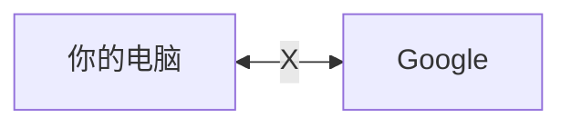
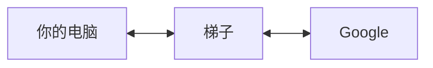
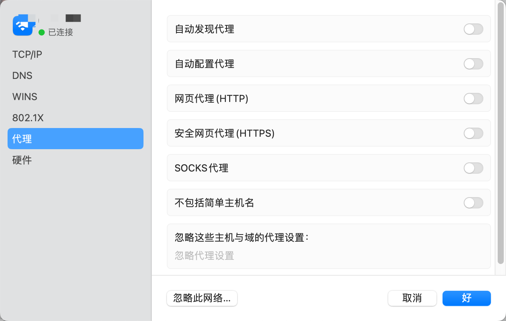
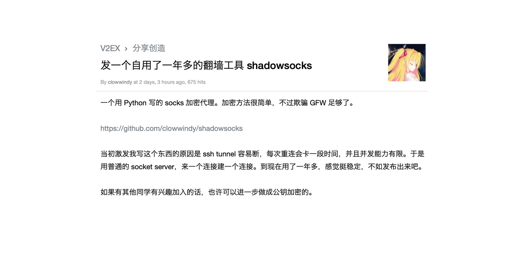

# 常见的梯子协议[^protols]及客户端[^client]

!!! warning "免责声明"
    <s>懒得写了，总之就是免责。</s> 
    
    本文纯粹学习笔记，内容均转载自网络，无不良引导。
    
    外链有风险，点击需谨慎。

## 梯子的基本原理
正常情况下，你的电脑和Google的服务器无法通信：

<figure markdown>

</figure>
而梯子（代理服务器）其实就是一个中间人、传话筒，你和梯子可以通信，梯子可以和Google通信，这样约等于你就可以访问Google了：

<figure markdown>

</figure>

而SOCKS5协议就可以帮你和中间人通信。

## SOCKS协议

打开电脑的网络设置，你就能找到代理服务器的相关选项：

<figure markdown>

{width=400}

</figure>

这里面就有**SOCKS代理**、HTTP代理、HTTPS代理。

??? cite "维基百科：什么是SOCKS代理"
    SOCKS是一种网络传输协议，名字取自Sockets，主要用于客户端与外网服务器之间通讯的中间传递。当防火墙后的客户端要访问外部的服务器时，就跟SOCKS代理服务器连接。这个代理服务器控制客户端访问外网的资格，允许的话，就将客户端的请求发往外部的服务器。

    这个协议最初由David Koblas开发，而后由NEC的Ying-Da Lee将其扩展到SOCKS4。最新协议是SOCKS5，与前一版本相比，增加支持UDP、验证，以及IPv6。

    根据OSI模型，SOCKS是会话层的协议，位于表示层与传输层之间。*SOCKS协议不提供加密*。

??? cite "维基百科：SOCKS对比其他代理协议"
    - FTP代理服务器
        - 主要用于访问FTP服务器，一般有上传、下载功能。端口一般为20、21、2121等。
    - HTTP代理服务器
        - 主要用于访问网页，一般有内容过滤和缓存功能。端口一般为80、8080、3128等。
    - SSL/TLS代理（HTTPS代理）
        - 主要用于访问HTTPS网站。端口一般为443。
    - RTSP代理
        - 主要用于Real Player访问Real流媒体服务器，一般有缓存功能。端口一般为554。
    - Telnet代理
        - 主要用于Telnet远程控制（黑客入侵计算机时常用于隐藏身份）。端口一般为23。
    - POP3/SMTP代理
        - 主要用于POP3/SMTP方式收发邮件，一般有缓存功能。端口一般为110、25。
    - SOCKS代理
        - 只是单纯传递数据包，不关心具体协议和用法，所以速度快很多。端口一般为1080。

本文下面提到的所有梯子协议都是基于SOCKS代理协议的。

和VPN不同的是，SOCKS5类型的代理服务器在网络层级上是工作于应用层的会话层，很多流量都无法代理[^socks]，因从即便是开了所谓的全局，也不能给游戏加速，毕竟游戏的网络传输一般都是跑在传输层的。像 Ping 和 Trace 这些 ICMP 命令自然也是无法通过代理的。（当然也有方法可以用软件强制接管虚拟网卡达到真全局的目的，比如 SSTAP，tun2socks 等等）

## Shadowsocks

!!! cite "维基百科：Shadowsocks"
    Shadowsocks（简称SS）是一种**基于SOCKS5代理**方式的**加密传输协议**，也可以指实现这个协议的各种开发包。
    
    目前有各种版本使用Python、C、C++、C#、Go语言、Rust等编程语言开发，大部分主要实现（iOS平台的除外）采用Apache许可证、GPL、MIT许可证等多种自由软件许可协议开放源代码。Shadowsocks分为服务器端和客户端，在使用之前，需要先将服务器端程序部署到服务器上面，然后通过客户端连接并建立本地代理。

    在中国大陆，本工具广泛用于突破防火长城（GFW），以浏览被封锁、屏蔽或干扰的内容。2015年8月22日，Shadowsocks原作者Clowwindy称受到了中国警方的压力，宣布停止维护此计划（项目）并移除其GitHub个人页面所存储的源代码。
### Shadowsocks编年史[^ss]

- **2012年4月22日**，V2EX用户clowwindy分享了一个自己自用一年多的翻墙工具：Shadowsocks

    - 随后社区活跃起来，SS大热。

- **2015年8月20日**，clowwindy在GitHub发出如下一段话：

    > Two days ago the police came to me and wanted me to stop working on this. Today they asked me to delete all the code from GitHub. I have no choice but to obey.
    > 
    > I hope one day I’ll live in a country where I have freedom to write any code I like without fearing. I believe you guys will make great stuff with Network Extensions.
    > 
    > Cheers!

    - 当晚，clowwindy把他所维护的几个shadowsocks实现的代码仓库内的Issue面板全部关闭，所有帮助信息全部删除，所有的描述都改成了Something happened。另外，他还清空了该组织的membership，或者将所有成员全部转入隐私状态，不对外公开。

- **2015年8月21日**，传出clowwindy被请去喝茶的消息，他在 shadowsocks-windows 的 #305 issue 下回复道

    > I was invited for some tea yesterday. I won’t be able to continue developing this project.

    - 至此SS原作者退出。当然，SS相关的开源社区依然活跃。

这个故事好像和Linux有点类似，但是下场却大相径庭。

### Shadowsocks技术原理
从名字也可以看出来，Shadowsocks是基于SOCKS5代理协议实现的。“Shadow”的含义大概就是加密、隐秘之类的。

Shadowsocks的服务器和客户端软件会要求提供**密码和加密方式**，双方一致后才能成功连接。连接到服务器后，典型情况下客户端会在本机构建一个本地SOCKS5代理（但也有构建成VPN、透明代理等形式）。浏览网络时，客户端通过这个SOCKS5（或其他形式）代理收集网络流量，然后再经混淆加密发送到服务器端，以防网络流量被识别和拦截，反之亦然。

- Shadowsocks**使用自行设计的协议进行加密通信**。加密算法有AES-GCM、ChaCha20-Poly1305、2022-BLAKE3-AES-GCM等。
- 除建立TCP连接外无需握手，每次请求只转发一个连接，无需保持“一直连线”的状态，因此在移动设备上相对较为省电。
- 所有的流量都经过算法加密，允许自行选择加密算法。
- Shadowsocks通过异步I/O和事件驱动程序运行，响应速度快。
- 客户端覆盖多个主流操作系统和平台，包括Windows、macOS、Android、Linux和iOS系统和路由器（OpenWrt）等。

### SSR？
> 不是你们二次元手游的那个SSR。

ShadowsocksR（简称SSR）是网名为breakwa11的用户发起的Shadowsocks分支，在Shadowsocks的基础上增加了一些资料混淆方式，称修复了部分安全问题并可以提高QoS优先级。后来贡献者Librehat也为Shadowsocks补上了一些此类特性，甚至增加了类似Tor的可插拔传输层功能。

算是个Shadowsocks的升级版。

## Trojan

!!! cite "trojan official"
    Trojan is an unidentifiable mechanism for bypassing GFW. 

    On penetrating GFW, people assume that strong encryption and random obfuscation may cheat GFW’s filtration mechanism. However, trojan implements the direct opposite: **it imitates the most common protocol across the wall, HTTPS, to trick GFW into thinking that it is HTTPS.**

trojan这个名字很有意思。在英文语境里，trojan一般指代木马病毒（Trojan horse，特洛伊木马）。

> “木马”这一名称来源于希腊神话特洛伊战争的特洛伊木马。攻城的希腊联军佯装撤退后留下一只木马，特洛伊人将其当作战利品带回城内。当特洛伊人为胜利而庆祝时，从木马中出来了一队希腊军队，他们悄悄打开城门，放进了城外的军队，最终攻克了特洛伊城。

这个名字确实是和梯子🪜的功能有点契合的，蒙混过关、偷梁换柱、指鹿为马！

### Shadowsocks存在的问题[^trojan]

防火墙在早期仅仅只是对出境流量进行截获和审查，也即**被动检测**。Shadowsocks的加密协议设计使得传输的数据包本身几乎没有任何特征，看起来类似于完全随机的比特流，这在早期的确能有效绕过GFW。

目前的GFW已经开始采用**主动探测**的方式。具体来说，当GFW发现一个可疑的无法识别的连接时（大流量，随机字节流，高位端口等特征），将会主动连接这个服务器端口，重放之前捕获到的流量（或者经过一些精心修改后重放）。Shadowsocks服务器检测到不正常的连接，将连接断开。这种不正常的流量和断开连接的行为被视作可疑的Shadowsocks服务器的特征，于是该服务器被加入GFW的可疑名单中。这个名单不一定立即生效，而是在某些特殊的敏感时期，可疑名单中的服务器会遭到暂时或者永久的封锁。该可疑名单是否封锁，可能由人为因素决定。

如果你想了解更多，可以[参考这篇文章](https://gfw.report/blog/gfw_shadowsocks/zh.html)。

更有甚者，已经有人使用机器学习算法来识别异常流量：

!!! cite "维基百科：Shadowsocks流量识别"
    2017年9月21日，一篇名为《The Random Forest based Detection of Shadowsock's Traffic》的论文在IEEE发表，该论文介绍了通过随机森林算法检测Shadowsocks流量的方法，并自称可达到85％的检测精度，虽然该论文的有效性遭到网友质疑。但是使用机器学习来识别网络流量特征的做法被认为是可行的，而且还适用于任何网络代理协议而不仅仅局限于Shadowsocks。

### Trojan技术原理[^trojan]

与Shadowsocks相反，Trojan**不使用自定义的加密协议**来隐藏自身。相反，使用特征明显的TLS协议(TLS/SSL)，使得流量看起来与正常的HTTPS网站相同。TLS是一个成熟的加密体系，HTTPS即使用TLS承载HTTP流量。使用正确配置的加密TLS隧道，可以保证传输的：

- 保密性（GFW无法得知传输的内容）
- 完整性（一旦GFW试图篡改传输的密文，通讯双方都会发现）
- 不可抵赖（GFW无法伪造身份冒充服务端或者客户端）
- 前向安全（即使密钥泄露，GFW也无法解密先前的加密流量）

对于被动检测，Trojan协议的流量与HTTPS流量的特征和行为完全一致。而HTTPS流量占据了目前互联网流量的一半以上，且TLS握手成功后流量均为密文，几乎不存在可行方法从其中分辨出Trojan协议流量。

对于主动检测，当防火墙主动连接Trojan服务器进行检测时，**Trojan可以正确识别非Trojan协议的流量**。与Shadowsocks等代理不同的是，此时Trojan不会断开连接，而是**将这个连接代理到一个正常的Web服务器**。在GFW看来，该服务器的行为和一个普通的HTTPS网站行为完全相同，无法判断是否是一个Trojan代理节点。这也是Trojan推荐使用合法的域名、使用权威CA签名的HTTPS证书的原因: 这让你的服务器完全无法被GFW使用主动检测判定是一个Trojan服务器。

因此，就目前的情况来看，若要识别并阻断Trojan的连接，只能使用无差别封锁（封锁某个IP段，某一类证书，某一类域名，甚至阻断全国所有出境HTTPS连接）或发动大规模的中间人攻击（劫持所有TLS流量并劫持证书，审查内容）。

## VMess
VMess 是 V2Ray 原创的加密通讯协议。

### VMess的技术原理[^vmess]

#### 底层协议
VMess 是一个基于 TCP 的协议，所有数据使用 TCP 传输。

#### 通讯过程
VMess 是一个无状态协议，即客户端和服务器之间不需要握手即可直接传输数据，每一次数据传输对之前和之后的其它数据传输没有影响。 VMess 的客户端发起一次请求，服务器判断该请求是否来自一个合法的客户端。如验证通过，则转发该请求，并把获得的响应发回给客户端。 VMess 使用非对称格式，即客户端发出的请求和服务器端的响应使用了不同的格式。

### VMess的使用[^socks]
VMess （由于是无状态协议）十分依赖于系统时间，需要确保使用 V2Ray 的系统 UTC 时间误差在 90 秒之内，时区无关。

和之前的 Shadowsocks 和 trojan 不同的一点就是，V2Ray 是一个内核，他不是单独运行的，这是一个框架，对开发者来说更加自由。V2Ray 就像叠积木，一笔一划的慢慢逐步把梯子叠出来，对于技术力十分入门的小白来说可能不是太友好，而且 V2Ray 平台上的套娃严重，V2Ray 可以下面这样用：

- vmess
- vmess + tls
- vmess + websocket + tls
- vmess + websocket + tls + Nginx
- vmess + websocket + tls + Nginx + cloudfare（CDN）

从上至下，一层层套娃，套的越多越安全，当然速度也就越慢。如果真的从头搭建起来，那就真是令人头都大了，还好有大神开发一键脚本，有兴趣的朋友自行搜索。

## 常见的客户端[^client]

这些客户端基本是全协议都支持的。

| 客户端              | Windows | macOS | Linux | iOS | Android |
| ------------------- | ------- | ----- | ----- | --- | ------- | 
| **个人最爱** | Clash for Windows | ClashX | -- | Shadowrocket | Clash for Android|
| Clash for Android   |         |       |       |     | ✔       |
| Clash for Windows   | ✔       | ✔     | ✔     |     |         |
| ClashN              | ✔       |       |       |     |         |
| Clash Verge         | ✔       | ✔     | ✔     |     |         |
| ClashX              |         | ✔     |       |     |         |
| ClashX Pro          |         | ✔     |       |     |         |
| NekoBox for Android |         |       |       |     | ✔       |
| NekoRay             | ✔       |       | ✔     |     |         |
| Potatso Lite        |         |       |       | ✔   |         |
| Quantumult          |         |       |       | ✔   |         |
| Quantumult X        |         | ✔     |       | ✔   |         |
| Shadowrocket        |         |       |       | ✔   |         |
| sing-box            | ✔       | ✔     | ✔     | ✔   | ✔       |
| Stash               |         | ✔     |       | ✔   |         |
| Surfboard           |         |       |       |     | ✔       |
| Surge iOS           |         |       |       | ✔   |         |
| Surge Mac           |         | ✔     |       |     |         |
| v2rayN              | ✔       |       |       |     |         |
| v2rayNG             |         |       |       |     | ✔       |
| V2rayU              |         | ✔     |       |     |         |

此外还有SwitchyOmega这样的浏览器插件，可以在Chromium和Firefox中使用。

以及OpenClash、PassWall2、ShadowsocksR Plus+这样的软件，可以在路由器（OpenWRT）中使用。

[^socks]: TechFen's Blog: <https://www.techfens.com/posts/kexueshangwang.html>
[^ss]: [Shadowsocks的前世今生](https://shadowsockshelp.github.io/Shadowsocks/Shadowsocks-wiki.html)
[^client]: sing-box用户手册：<https://sing-box.org/all-proxy-client/>
[^protols]: v2fly用户手册：<https://www.v2fly.org/config/protocols/http.html>
[^trojan]: trojan-go用户手册：<https://p4gefau1t.github.io/trojan-go/basic/trojan/>
[^vmess]: v2ray官网：<https://www.v2ray.com/developer/protocols/vmess.html>