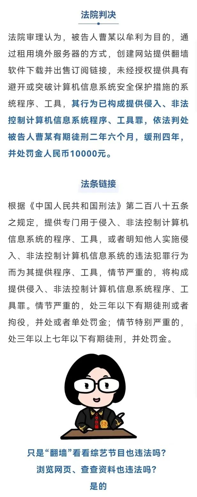
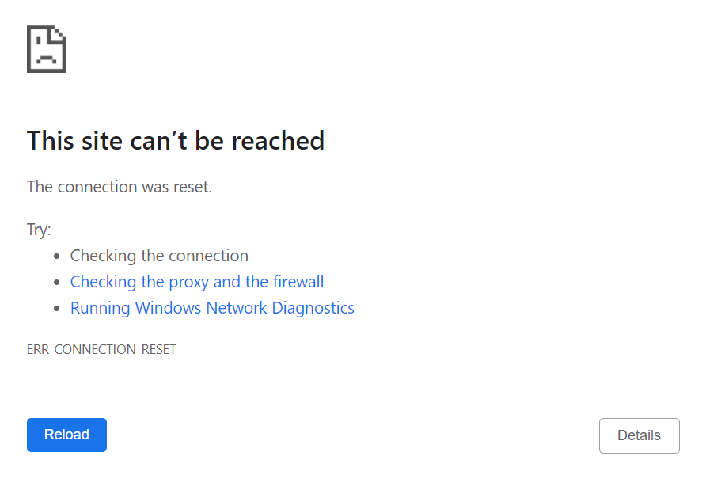
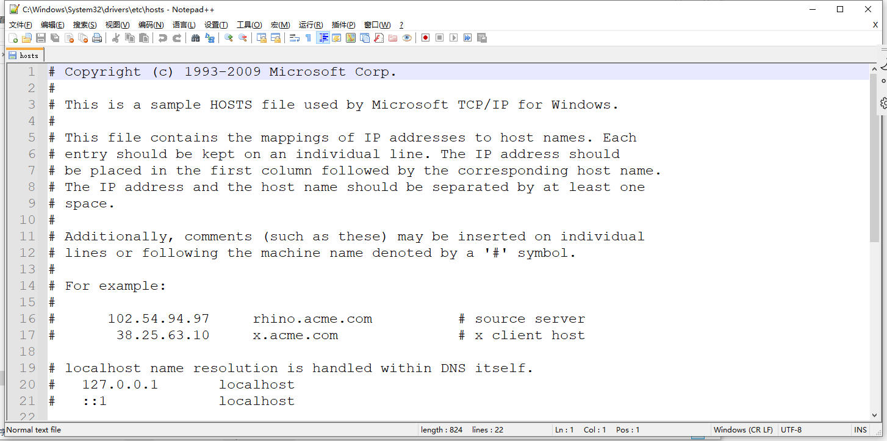
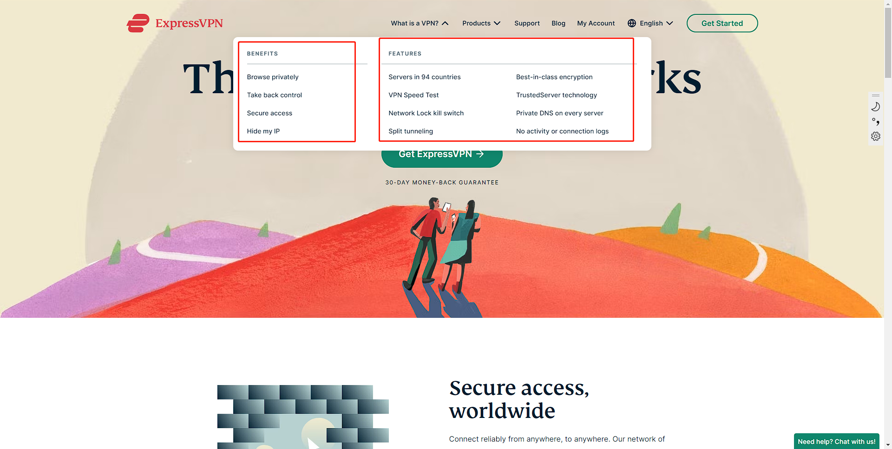

!!! cite "哲居华·沃硕德"
    墙与梯就像Tom and Jerry，你追我逃，不眠不休。

## 什么是墙？

墙又叫GFW（Great Firewall），这个叫法有点碰瓷长城的意思，但真说起来他们的作用确实有些类似: )

!!! cite "维基百科"
    防火长城（英语：Great Firewall，常用简称：GFW），中文也称中国国家防火墙，通常简称为墙、防火墙等，中国国家互联网信息办公室称为数据跨境安全网关 ，是中华人民共和国政府监控和过滤国际互联网出口内容的软硬件系统集合，用于通过技术手段，阻断不符合中国政府要求的互联网内容传输，一般认为由方滨兴主持设计。

简单来说就是墙导致很多网站你上不去，例如 <https://www.google.com>

宽泛的来说，墙就是网络审查。

## 墙只有中国才有吗？

当然不是，维基百科上有这样一张图展现了世界各国的网络审查状况。可见除去少数的欠发达地区，绝大多数国家都有自己的网络审查机制，即便是鼓吹自由的美利坚也是有网络审查的。网络安全作为国家安全的一部分，在当今时代的重要性不言而喻！

## 什么是梯子？

出于各种需求，比如合法的跨国电商、正常的跨国学术交流等等，我们很多时候需要越过GFW访问国外的服务器，这时候就需要梯子。

<figure markdown>
  
</figure>

!!! cite "维基百科"
    随着防火长城逐渐为人熟知，“墙”一词有时也被用作动词，“被墙”即指网站内容被防火长城所屏蔽。“翻墙”、“挂梯子”也被引申为突破网络审查浏览中国大陆境外被屏蔽的网站或使用服务的行为。

## 普法

举个栗子：

（江西赣州市中级人民法院发文，大学生贩卖“翻墙”软件牟利获刑）

<figure markdown>
  {width=400}
  <figcaption>要坐牢的啊！</figcaption>
</figure>

所以我写这篇推文纯粹是从技术的角度做一个分享、科普，绝非要宣扬翻墙的手段或者提供翻墙的工具。**先叠一点点甲**。

<figure markdown>
  
</figure>

## 回车之后
想要理解墙和梯子，需要一些计算机网络的基础知识。

当你在浏览器输入一个网址（例如www.google.com）、按下回车之后，都会发生哪些事情呢？

1. 浏览器沿着找到DNS服务器（Domain Name System Server，可以理解为引路人），问一下www.google.com的IP是多少。
2. 通过DNS告诉我们的IP地址，然后浏览器沿着网线找到Google的服务器，问它要一个网页文件。
3. Google沿着网线把网页文件发给我们，浏览器把这个文件打开，呈现在我们面前。

## 墙的技术手段

搞明白了上面的步骤，我们就很容易想到墙该怎么干了！

### DNS污染（或DNS劫持）

你去找DNS服务器的时候，墙想办法告诉让它你一个错误的答案（只要是国内合法提供服务的DNS服务商都会受到法律的监管，从而帮助墙进行拦截），没有了正确的IP地址，你就无法正确访问目标网站了。

### 封锁IP

即使你知道了正确的IP，如果墙知道这个IP是在黑名单里的（对于Facebook、Twitter等这类知名的被墙网站，大概都是被封了IP的），那么就可以直接把你的请求拦截下来（只要是国内合法提供服务的网络运营商都会收到法律的监管，从而帮助墙进行拦截）。

### TCP RST阻断

假设你侥幸沿着网线找到了Google，正和他商量着要什么内容，这个时候墙发现你在干什么了，也可以立即发起攻击，中断你的访问。在浏览器里的反馈就是：

<figure markdown>
  {width=550}
  <figcaption>connection is reset</figcaption>
</figure>

这种情况也非常常见！！

### 封锁特定端口

即便你已经找到Google，他也知道你要什么，已经打包好给你发送过来的路上，墙依然可以把它拦截下来。墙有这样一种封锁特定端口的手段，例如只让你访问www.google.com:8000，但是不让你访问www.google.com:7000。这样做的后果就是，你能发出去消息，但是收不到对方的回应。上行的数据包是可以被服务器收到的，而下行的数据包会被过滤掉。

### HTTPS间歇性丢包

能访问但是有不能完全访问，实际上对于Google的HTTPS服务，GFW不愿意让其完全不能访问[^github_post]。所以采取的办法是对于Google的某些IP的443端口采取间歇性丢包的措施。最明显的IP段是国内解析google域名常见的74.125.128.*。其原理应该类似于封端口，但是触发条件并不只是看IP和端口，加上了时间间隔这样一个条件。

## 梯子的技术手段

GFW的这些操作可谓是四两拨千斤，通过简单的一些技术手段就可以达到非常好的封锁效果。本质原因在于，GFW对网络服务的提供有绝对的话语权，毕竟网络运营商都是在国家的准许下营业的。

但也并非死路一条，从墙诞生至今，墙的技术不断更新迭代，翻墙的技术也一刻不停地在精华。所谓道高一尺，魔高一丈？？

### 使用境外网络服务

*这根本不是梯子，这是直接出国了，不用中国大陆的网络服务也就自然没有梯子了*

简单干脆有效，但是价格不菲。例如香港作为我国的特别行政区，和国内的网络监管机制有所不同，就有一些人通过某些方法向内地的人提供网络服务。再如马斯克的Starlink项目，用户可以直接通过他们的卫星上网。

### 更改hosts文件

*严格来说，这也不是梯子，但也不失为一种简单有效的规避GFW的方法*

这个方法经常出现在各种求助帖子中（特别近些年GitHub也不能正常访问了），回答往往是：“改个host就行了”。

这个方法针对的是GFW的第一个手段：污染DNS，既然DNS不会告诉我正确答案，那我就想办法跳过DNS直接去正确的IP，hosts文件的作用就是如此。

!!! cite "什么是hosts" 
	hosts是一个没有扩展名的系统文件，其基本作用就是将一些常用的网址域名与其对应的 IP 地址建立一个关联“ 数据库 ”。当用户在浏览器中输入一个需要登录的网址时，系统会首先自动从hosts文件中寻找对应的 IP 地址，一旦找到，系统就会立即打开对应网页，如果没有找到，则系统会将网址提交 DNS 域名解析服务器进行 IP 地址的解析。如此一来，只要在hosts文件中写好正确的IP，就可以避免DNS污染了。

在 MAC 系统中中，`hosts`文件的位置为：`~/private/etc`

在 Windows 系统中，`hosts`文件的位置为：`C:\Windows\System32\drivers\etc`，内容如下图所示，你可以按照文档内的指示来添加域名-IP对

当然，你也可以手动修改DNS服务器来规避DNS污染，例如：

- `1.1.1.1`：CloudFare的DNS服务器
- `8.8.8.8`：Google的DNS服务器

### 虚拟专用网络——VPN
> VPN全称Virtual Private Network，虚拟专用网络。常见加密协议有：SSTP、PPTP、L2TP/IPsec、IKEv2、WireGuard、openVPN等。

*VPN虽然只是梯子的一种，但是由于其知名度非常之高，已经成为梯子的代名词*

VPN起初或者说从始至终的正经用途就不是翻墙，但是它的加密通信确实能达到翻墙的目的。在商业公司中，VPN被广泛应用，因为很多企业需要这样的安全传输手段，也有很多国际化的企业需要和墙外进行通信。

大多数正经的VPN服务商，他们的口号往往是：“安全”，“私密”，“匿名”等等（翻墙从来不是VPN的目的，只是一个附带的作用），下图是知名的ExpressVPN的官网介绍：

需要注意的是，由于太过知名，VPN已经成为了梯子的代名词，所以就会有阿猫VPN、阿狗VPN等等，虽然也叫“VPN”，但是他们实质是并非虚拟专用网络。

### P2P流量代理

*peer to peer，人人为我，我为人人*

虽然有GFW的存在，但是我们与国外的大多数服务器还是可以正常通信的，如此一来就有这样一种操作：

每当我想访问被墙的网站时，我就去找我的外国好朋友，让他帮我把网页下载下来，然后发给我。

如此一来通过“外国好友”的中专，我就间接实现了翻墙，而如果我没有“外国朋友”，那么就可以通过P2P服务来随机配对一个“外国朋友”。

使用这种技术的最知名的产品莫非蓝灯（Lantern）：

虽然Lantern开发之初就是为了规避网络审查也就是翻墙而生的（因此在国内小有名气），但是它的开发者确是个外国人Adam Fisk

<figure markdown>
  {width=400}
</figure>

当然，再次提醒，此类软件或者服务大多是违法的，本文只是技术分享，不建议看到的各位去尝试，维基百科上有这样的事件：

!!! caution
    2019年初，有消息指出广东省警方对蓝灯用户，以“擅自建立、使用非法定信道进行国际联网”，违反《中华人民共和国计算机信息网络国际联网管理暂行规定》之依据进行处罚，罚款人民币一千元。该处罚在“广东公安执法信息公开平台”进行公示，同一平台同期出现了吸Drug的处罚，罚款金额仅为500元。

*被网友调侃翻墙比吸Drug还严重*，实在是不建议去尝试！！！

但是这种人人为我，我为人人的P2P互联网精神是值得推崇的。

### 私人代理服务器——机场

*XXX机场的老板被抓了/xxx机场的老板跑路了，这两种情况是机场最常见的下场*

#### 中转
和P2P代理非常类似，机场也是通过某种**中转**实现了翻墙，只不过前者是通过无私奉献的外国网友提供中转服务，后者则是某些不法分子**私营的代理服务器**提供中转服务（所以跑路和被抓也不足为奇）。有这样几种常见的机场的中转模式：

<figure markdown>

{width=400}

</figure>

- 红色就是直连线路
- 蓝色是中转线路
- 绿色是IPLC专线（International Private Leased Circuit）

#### 加密
此外和VPN也非常类似，机场的核心也是**加密通信**。如果流量不进行特殊的加密，GFW很容易就嗅探到流量的特征进而把代理服务器封掉。只不过和VPN比起来使用的算法要更简单一些，大多是开源的加密算法。这也就意味着理论上机场的速度要更快，因为VPN的复杂加密会显著降低网络的响应速度。

机场使用的加密算法通常有以下几种：

- SS（Shadowsocks），项目已凉，听说作者被请去喝茶了
- SSR（ShadowsocksR），SS的升级款
- Vmess
- Trojan

……

这几种方式各有各的特点，以后我们会详细介绍。

最后分享一个小作文，是SS作者的一篇悼文（当然，作者只是请去喝茶了，应该还是健在的）：

> 记念 ss，向一个伟大的创造告别
>
> stardust 2015年8月21日
>
> 毫无征兆地，Github 上 shadowsocks 项目 Wiki 被全部删除。那时的我天真地寄希望于作者只是厌倦于和无穷无尽的小白和 SSR 项目的抄袭，天真的以为这个项目还会以相对高的门槛运行下去。
>
> 之后就传出 clowwindy 被喝茶的消息，我震惊，我一直以为他是在墙外维护这些项目的，以至于我目瞪口呆许久不知道该用什么词来形容我对他的敬佩。
>
> 我早就知道 ss 这个神话总会有终结的这么一天，只是没有想到是今天，也没想到是以这样的形式。
>
> 我自认为不是愤青，甚至我曾经以为我不会谈论一个政治事件浪费我的人生，只是我在我的生活受到损害的时候才再次体会到，个人命运和国家是紧密相联的，身在一个国家，想和这个国家的政治无关，是不可能的。
>
> > 起初，他们追杀共产主义者，我不是共产主义者，我不说话；
> > 接着，他们追杀犹太人，我不是犹太人，我不说话；
> > 后来，他们追杀工会成员，我不是工会成员，我不说话；
> > 此后，他们追杀天主教徒，我是新教徒，我不说话；
> > 最后，他们奔我而来，再也没有人站出来为我说话了。
>
> 可是我实在无话可说。我只觉得所住的并非人间。ss 多年的开发进程，残存在Github 的编辑记录里，使我艰于呼吸视听，那里还能有什么言语？长歌当哭，是必须在痛定之后的。而此后几个所谓 SSR 支持者的阴险的论调，尤使我觉得悲哀。我已经出离愤怒了。我将深味这非人间的浓黑的悲凉；以我的最大哀痛显示于非人间，使它们快意于我的苦痛，就将这作为后死者的菲薄的祭品，奉献于逝者的灵前。
>
> ……
>
> 再见了，ss 的神话时代；
>
> 加油，clowwindy，祝你武运昌隆。
>
> 苟活者在淡红的血色中，会依稀看见微茫的希望；真的猛士，将更奋然而前行。
>
> 引用自博客 <https://www.starduster.me/author/stardust/>

## 写在最后

心血来潮写了这样一篇科普文，希望能帮助大家学到一些网络技术的知识。另外也希望大家能充分意识到**翻墙的非法性**（前文已有多处例证），以及**墙的合理性**：

1、我国的现实国情是许多人没有充分的判明是非的能力，就单纯国内的**局域网环境**都有如此多的人被网络上的言论支配，如果这样的人接触到环境更加复杂的国际互联网，相比会带来更大的社会问题。从这一方面来看，我相信随着国民素质的提高、民族自信的建立，国家也会逐步放松网络监管。

2、许多的国外科技公司在中国需要进行合理的监管、审查时，不予以配合，就比如Google、Twitter之流。国家安全甚至某种程度上会受到威胁，无奈之下只能把这样的服务商排除在外。从这一方面来看，我也相信随着中国互联网科技的崛起，有足够好的产品可以替代这些不守规矩的外厂，墙也会逐渐淡化。

从结果来看，当初实施严格的网络监管实在是高明之举。

[^github_post]: <https://github.com/evvil/Over-the-wall>