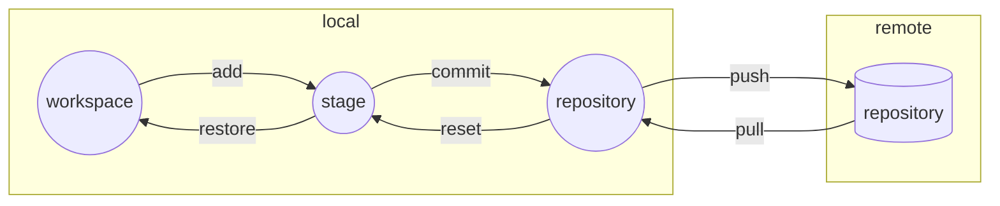

---
tags:
- git
---

# 单机git
> 使用git来管理私人项目，不涉及协作，是为单机git

??? question "什么是git"
    Git is a free and open source distributed version control system designed to handle everything from small to very large projects with speed and efficiency.
## 安装git
首先确保你的电脑上安装了[git](https://git-scm.com/)，你可以去官网下载，然后按照指示安装即可。

在命令行查看版本号确保git安装成功了：
<div class="console">

```console
$ git --version
git version 2.39.2 (Apple Git-143)
```

</div>

## git工作流

## 初始化仓库
使用下述命令初始化一个仓库：
<div class="console">

```console
$ git init
Initialized empty Git repository in ...
```

</div>
这条命令会在当前文件夹创建一个`.git`隐藏文件夹，其中存放了git仓库的各种信息：
<div class="console">

```console
$ ls -al
total 0
drwxr-xr-x   3 yang  staff   96  8  8 15:21 .
drwx------+ 10 yang  staff  320  8  8 15:21 ..
drwxr-xr-x   9 yang  staff  288  8  8 15:22 .git

$ ls -al .git 
total 24
drwxr-xr-x   9 yang  staff  288  8  8 15:22 .
drwxr-xr-x   3 yang  staff   96  8  8 15:21 ..
-rw-r--r--   1 yang  staff   21  8  8 15:21 HEAD
-rw-r--r--   1 yang  staff  137  8  8 15:21 config
-rw-r--r--   1 yang  staff   73  8  8 15:21 description
drwxr-xr-x  15 yang  staff  480  8  8 15:21 hooks
drwxr-xr-x   3 yang  staff   96  8  8 15:21 info
drwxr-xr-x   4 yang  staff  128  8  8 15:21 objects
drwxr-xr-x   4 yang  staff  128  8  8 15:21 refs
```

</div>


查看当前仓库的状态：
<div class="console">

```console
$ git status
On branch main

No commits yet

nothing to commit (create/copy files and use "git add" to track)
```

</div>

## 追踪文件
git可以自动追踪仓库中所有的文件，例如我们在根目录创建一个`a.py`，然后再看一下仓库的状态：

<div class="console">

```console
$ touch a.py | git status
On branch main

No commits yet

Untracked files:
(use "git add <file>..." to include in what will be committed)

    	a.py

nothing added to commit but untracked files present (use "git add" to track)
```

</div>

它提示我们`a.py`是`Untracked files`，按照提示使用命令来追踪这个文件：

<div class="console">

```console
$ git add ./a.py | git status
On branch main

No commits yet

Changes to be committed:
  (use "git rm --cached <file>..." to unstage)
	new file:   a.py

```

</div>
它提示我们有一个`new file`的`change`需要`commit`。

我们照做：

<div class="console">

```console
$ git commit -m "create a file"
[main (root-commit) 10c96ce] create a file
 1 file changed, 0 insertions(+), 0 deletions(-)
 create mode 100644 a.py
```

</div>

如果我们往`a.py`里写点东西：
<div class="console">

```console
$ echo import this >> a.py | git status
On branch main
Changes not staged for commit:
  (use "git add <file>..." to update what will be committed)
  (use "git restore <file>..." to discard changes in working directory)
	modified:   a.py

no changes added to commit (use "git add" and/or "git commit -a")
```

</div>

它提示我们文件被修改了，有两条路可以走：

- 使用add把修改固定下来
- 使用restore取消修改

我们先走第一条路：
<div class="console">

```console
$ git add ./a.py | git status
On branch main
Changes to be committed:
  (use "git restore --staged <file>..." to unstage)
	modified:   a.py
```

</div>
然后我们再提交即可：
<div class="console">

```console
$ git commit -m "edit file"
[main 7af5902] edit file
 1 file changed, 1 insertion(+)
```

</div>

TBC:单机git