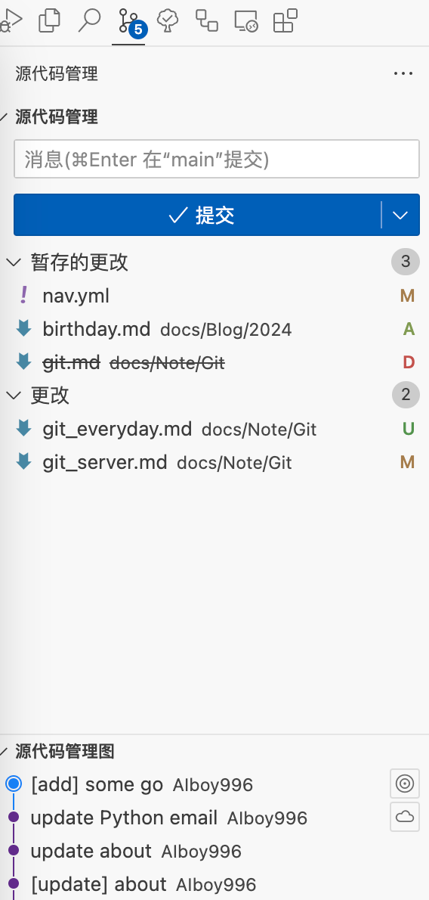

---
tags:
- git
---

# git-everyday

??? question "什么是git"
    Git is a free and open source distributed version control system designed to handle everything from small to very large projects with speed and efficiency.

## 安装git
首先确保你的电脑上安装了[git](https://git-scm.com/)，你可以去官网下载，然后按照指示安装即可。

在命令行查看版本号确保git安装成功了：
<div class="console">

```console
$ git --version
git version 2.39.2 (Apple Git-143)
```

</div>

## git工作流
最简单的git工作流就是下面的几个操作：


安装git的时候也会一并安装git的手册，其中包含了一个`giteveryday`的[文档](https://git-scm.com/docs/giteveryday)：

<div class='console'>

```console
$ man giteveryday

<pre style="color:white;">
NAME
       giteveryday - A useful minimum set 
       of commands for Everyday Git

SYNOPSIS
       Everyday Git With 20 Commands Or So

DESCRIPTION
       Git users can broadly be grouped into four categories 
       for the purposes of describing here a small set of
       useful command for everyday Git.

       •   Individual Developer (Standalone) commands are essential
           for anybody who makes a commit, even for
           somebody who works alone.

       •   If you work with other people, you will need commands 
           listed in the Individual Developer
           (Participant) section as well.

       •   People who play the Integrator role need to learn some
           more commands in addition to the above.

       •   Repository Administration commands are for system 
           administrators who are responsible for the care and
           feeding of Git repositories.
</pre>

```

</div>

这个手册包含了在git日常使用的几个场景下经常用到的命令：

### 个人开发 (独立)

- `git-init` to create a new repository.
- `git-log` to see what happened.
- `git-switch` and `git-branch` to switch branches.
- `git-add` to manage the index file.
- `git-diff` and `git-status` to see what you are in the middle of doing.
- `git-commit` to advance the current branch.
- `git-restore` to undo changes.
- `git-merge` to merge between local branches.
- `git-rebase` to maintain topic branches.
- `git-tag` to mark a known point.

### 个人开发 (协作)

- `git-clone` from the upstream to prime your local repository.
- `git-pull` and `git-fetch` from "origin" to keep up-to-date with the upstream.
- `git-push` to shared repository, if you adopt CVS style shared repository workflow.
- `git-format-patch` to prepare e-mail submission, if you adopt Linux kernel-style public forum workflow.
- `git-send-email` to send your e-mail submission without corruption by your MUA.
- `git-request-pull` to create a summary of changes for your upstream to pull.

### 集成人

- `git-am` to apply patches e-mailed in from your contributors.
- `git-pull` to merge from your trusted lieutenants.
- `git-format-patch` to prepare and send suggested alternative to contributors.
- `git-revert` to undo botched commits.
- `git-push` to publish the bleeding edge.

### 管理员

- `git-daemon` to allow anonymous download from repository.
- `git-shell` can be used as a restricted login shell for shared central repository users.
- `git-http-backend` provides a server side implementation of Git-over-HTTP ("Smart http") allowing both fetch and push services.
- `gitweb` provides a web front-end to Git repositories, which can be set-up using the `git-instaweb` script.

此外还包含了很多的场景实例，你可以去读一读。

## 学习git
[learnGitBranching](https://learngitbranching.js.org/)是一个很好用的在线交互式git学习网站：
<figure markdown>
[](https://github.com/pcottle/learnGitBranching)
</figure>

## git GUI

PyCharm、VSCode等代码编辑器一般都集成了Git的功能，你可以使用他们提供的git GUI来操作：

<figure markdown>
 
{width=300}

</figure>
