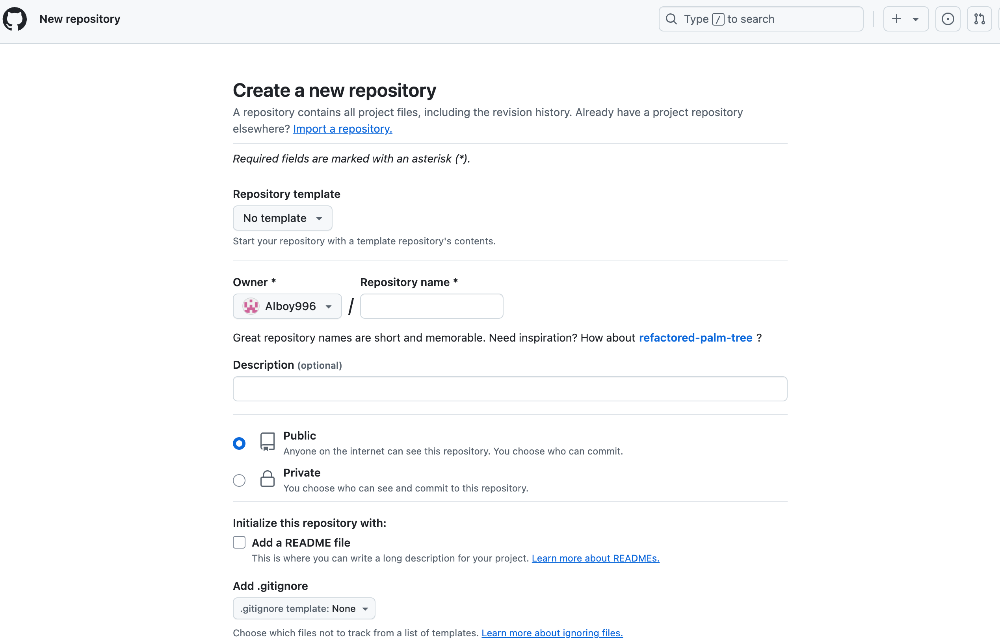
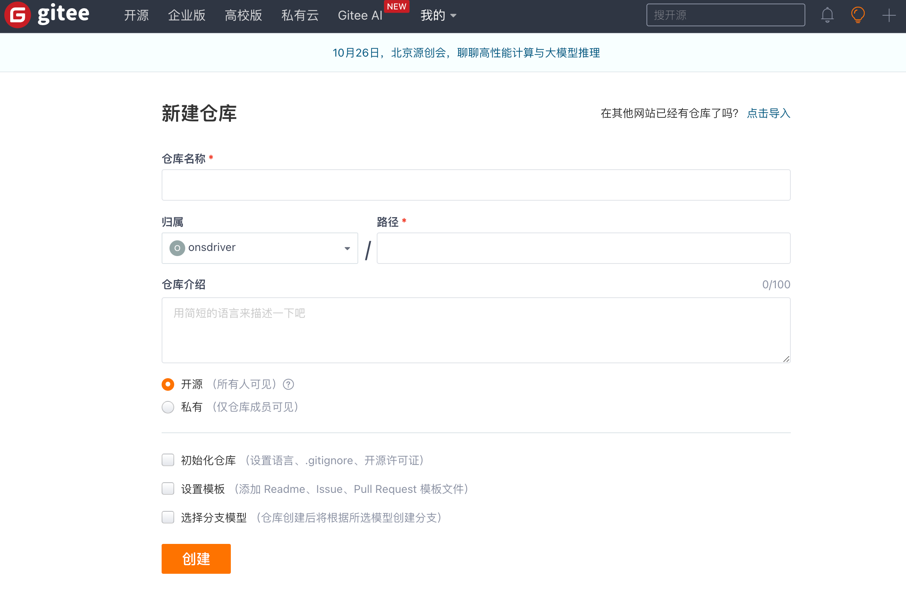

---
tags:
- git
---

# git仓库托管

你可以把你的git仓库托管到云端，以便备份和协作。

## GitHub
最有名的自然就是GitHub咯：

!!! quote
    GitHub是一个在线软件源代码托管服务平台，用于公开程序或软件的代码。使用Git作为版本控制软件，由开发者克里斯·汪斯崔斯、P·J·海特和汤姆·普雷斯顿·沃纳使用Ruby on Rails编写而成。在2018年，GitHub被微软公司收购。

注册了账号之后，你可以很轻松地根据指引托管你的git仓库：

## Gitee
Gitee和GitHub类似，前者是国内的服务商提供的，网络访问更加稳定可靠：

## self-hosted

如果你有自己的服务器，也可以自己搭建git托管平台。

例如开源的gitea：

<figure markdown>

</figure>

gitbucket：

<figure markdown>

</figure>