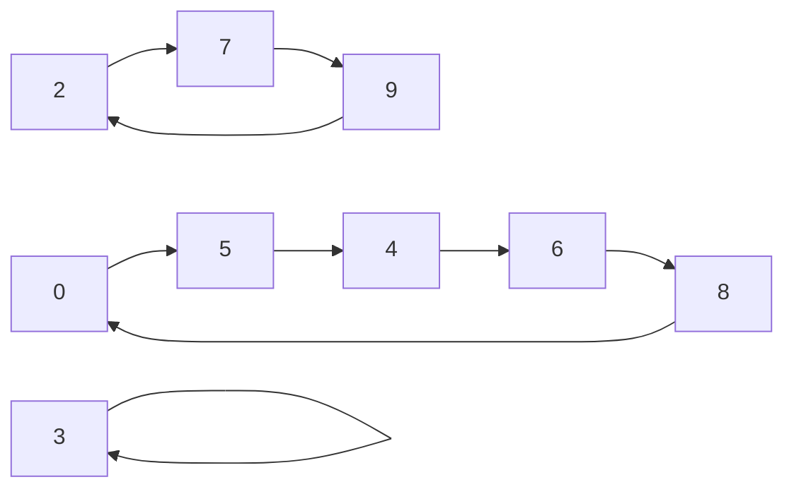

---
tags:
- Leetcode
include:
- math
---

# 排列染色问题

列表`p,q`都是1~n的一个排列。考虑下述染色问题：

每次染色需要选取一个下标`i`，把`p[i]`和`q[i]`同时染色。

要求`p,q`中被染色的数字不能有重复（任何一个数字，只能被染色一次）。

问：最多可以染色多少组？染色哪些下标？（任意输出一个方案即可）

## 暴力求解

我们直接遍历下标的组合即可：

```python
from itertools import combinations


def bf(p, q):
    indices = list(range(len(p)))
    # 从大往小遍历
    for i in range(len(p), 0, -1):
        for subset in combinations(indices, i):
            used = set()
            valid = True
            for j in subset:
                if p[j] in used or q[j] in used or p[j] == q[j]:
                    valid = False
                    break
                used.add(p[j])
                used.add(q[j])
            if valid:
                return subset
```

## 置换群

`p,q`都是n阶置换。他们之间可以通过一个置换作用来映射：

$$
p = \sigma(q)
$$

我们知道，置换群一定可以写成一些循环表示。利用这些循环表示，我们就可以计算出最大的染色数。

例如：

```python
p = [5, 0, 9, 1, 4, 6, 7, 2, 8, 3]
q = [4, 5, 2, 1, 6, 8, 9, 7, 0, 3]
```

实际$p \to q$上可以写成



这两个循环置换。

并且，染色一个下标相当于染色上图中的一条边。

例如：

染色0下标，相当于染色`p[0],q[0]`，相当于染色`5->5`这条边。

那么，很显然。每个循环只需要间隔染色就可以保证不重复了。

也就是说，对于循环$C$，如果它的边数为$|C|$，最多可以染色$\lfloor |C|/2 \rfloor $条边。

于是本题只需要找到所有的循环即可。这是很简单的：

```python
def find_loops(p,q):
    n = len(p)
    loops = []
    done = []
    for i in range(n):
        # 寻找以 p[i] 为开头的循环
        initial_x = p[i]
        if initial_x == q[i]:
            continue
        loop = []
        done.append(initial_x)
        x = initial_x
        while 1:
            x_to = q[p.index(x)]
            loop.append((x, x_to))
            if x_to == initial_x:
                break
            x = x_to
            # 如果这个循环之前看过了，就不再计算
            if x in done:
                loop = []
                break
        loops.append(loop)
    return loops

```

然后只需要对循环长度求和即可得到最大的染色数量：

```python
sum(
    len(loop) // 2 for loop in find_loops(p, q)
)
```

如果要输出染色方案，只需要在每个循环内间隔染色即可：

```python
res = []
for loop in find_loops(p, q):
    if loop:
        m = len(loop)
        for i in range(0, m - 1, 2):
            res.append(p.index(loop[i][0]))

```

## 回溯

我们也可以效仿N皇后的解法，使用回溯来搜索。不过肯定打不过上面基于循环的解法了。
