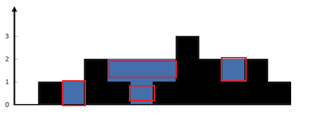

---
tags:
- Leetcode
---

# [接雨水](https://leetcode.cn/problems/trapping-rain-water)

给定 n 个非负整数表示每个宽度为 1 的柱子的高度图，计算按此排列的柱子，下雨之后能接多少雨水。


如上图：`height = [0,1,0,2,1,0,1,3,2,1,2,1]`，可以接6个单位的雨水。

## 题解

接雨水是个经典hard面试题了，本文总结一下它的几种解法。

### 竖看：前缀/后缀最大值

如果我们**竖着看过去**，每一个能接到水的地方都是一个比较低洼的地方，接到的水量取决于左侧最高的柱子和右侧最高的柱子。

于是我们立马可以想到使用额外的数组来计算前缀/后缀最大值，从而得到每个柱子的接水量。

```python
class Solution:
    def trap(self, height: List[int]) -> int:
        premax = []
        postmax = []
        l_max = height[0]
        r_max = height[-1]
        for h in height:
            if h>l_max:
                l_max = h
            premax.append(l_max)
        for h in height[::-1]:
            if h>r_max:
                r_max = h
            postmax.insert(0, r_max)
        res = 0
        for l,r,h in zip(premax, postmax, height):
            res += min(l,r) - h
        return res
```

可以优化一下写法，减少一次循环：

```python
# 代码来自：https://leetcode.doocs.org/lc/42/#_1
class Solution:
    def trap(self, height: List[int]) -> int:
        n = len(height)
        left = [height[0]] * n
        right = [height[-1]] * n
        for i in range(1, n):
            left[i] = max(left[i - 1], height[i])
            right[n - i - 1] = max(right[n - i], height[n - i - 1])
        return sum(min(l, r) - h for l, r, h in zip(left, right, height))
```

我们还可以用`itertools.accumulate`写的简洁花哨一点，效果完全一致：

```python
class Solution:
    def trap(self, height: List[int]) -> int:
        from itertools import accumulate
        premax = accumulate(height, lambda x,y:max(x,y))
        postmax = list(accumulate(height[::-1], lambda x,y:max(x,y)))
        res = 0
        for l,r,h in zip(premax, postmax[::-1], height):
            res += min(l,r) - h
        return res
```

### 横看：单调栈

如果我们**横着看过去**，就会发现接到的水是横着一条条的。



每一条都由一个U形的凹槽构成，而这些凹槽一定是先减后增的数组。有了这个观察我们就可以使用单调栈解决这题：

```python
class Solution:
    def trap(self, height: List[int]) -> int:
        stack = [] # 单调递减栈，出栈入栈都从列表尾部
        res = 0
        for i, h in enumerate(height):
            # 栈非空，并且目前的数字比栈顶大，说明存在U型，能接水
            while stack and h > height[stack[-1]]:
                bottom = stack.pop()
                if not stack:
                    break
                left = stack[-1]
                width = i - left - 1
                height_diff = min(height[left], h) - height[bottom]
                res += width * height_diff
            # 如果栈为空
            # 或者遍历的数组呈现递减，就一直入栈
            stack.append(i)
        return res
```

### 双指针

其实竖着看的思路还可以更进一步优化，只用常数额外空间就可以解决。

我们只需要维护双指针，左侧从0出发，右侧从n-1出发。始终让高度比较小的那一个先走，并且在指针移动的过程中取前缀/后缀最大值，这样就可以简化我们之前的计算公式`min(l,r) - h`了：

```python
class Solution:
    def trap(self, height: List[int]) -> int:
        res = 0
        l = 0
        r = len(height)-1
        l_max = height[l]
        r_max = height[r]
        while l<r:
            # 矮的先走
            while l_max > r_max:
                r -= 1
                res += max(0, r_max-height[r])
                r_max = max(r_max, height[r])
            if l==r:
                break
            l += 1
            res += max(0, l_max-height[l])
            l_max = max(l_max, height[l])
        return res
```

### 优先队列

最后，启发自[Leetcode 407: 接雨水2](https://leetcode.cn/problems/trapping-rain-water-ii)的优先队列解法，我们还可以用优先队列解决这个问题。

核心想法是利用木桶效应、优先收紧比较矮的那个边界，和双指针的效果基本是一致的，都是在动态过程中求前缀/后缀最大值：

```python
class Solution:
    def trap(self, height: List[int]) -> int:
        from heapq import heappop, heappush
        n = len(height)
        pq = []
        heappush(pq, (height[0], 0))
        heappush(pq, (height[n - 1], n - 1))
        not_visited = [1] * n
        not_visited[0] = 0
        not_visited[n - 1] = 0
        res = 0
        while pq:
            h, i = heappop(pq)
            res += max(0, h-height[i])
            if i + 1 < n - 1 and not_visited[i + 1]:
                heappush(pq, (max(h, height[i + 1]), i + 1))
                not_visited[i+1]=0
            if i - 1 >= 0 and not_visited[i - 1]:
                heappush(pq, (max(h, height[i - 1]), i - 1))
                not_visited[i-1]=0
        return res
```

我输出了一下优先队列一步步收紧边界的过程，应该比较直观展示了利用木桶效应的思路：

```text
heappop = 00;  [0]  1   0   2   1   0   1   3   2   1   2  [1] 
heappop = 01;  [0] [1]  0   2   1   0   1   3   2   1   2  [1] 
heappop = 02;  [0] [1] [0]  2   1   0   1   3   2   1   2  [1] 
heappop = 11;  [0] [1] [0] [2]  1   0   1   3   2   1   2  [1] 
heappop = 03;  [0] [1] [0] [2]  1   0   1   3   2   1  [2] [1] 
heappop = 04;  [0] [1] [0] [2] [1]  0   1   3   2   1  [2] [1] 
heappop = 05;  [0] [1] [0] [2] [1] [0]  1   3   2   1  [2] [1] 
heappop = 06;  [0] [1] [0] [2] [1] [0] [1]  3   2   1  [2] [1] 
heappop = 10;  [0] [1] [0] [2] [1] [0] [1] [3]  2   1  [2] [1] 
heappop = 09;  [0] [1] [0] [2] [1] [0] [1] [3]  2  [1] [2] [1] 
heappop = 08;  [0] [1] [0] [2] [1] [0] [1] [3] [2] [1] [2] [1] 
heappop = 07;  [0] [1] [0] [2] [1] [0] [1] [3] [2] [1] [2] [1] 
```