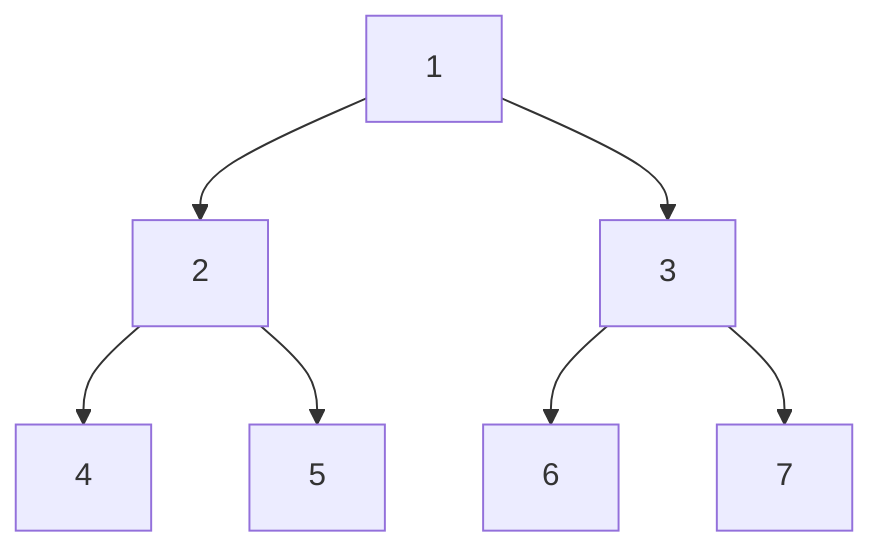
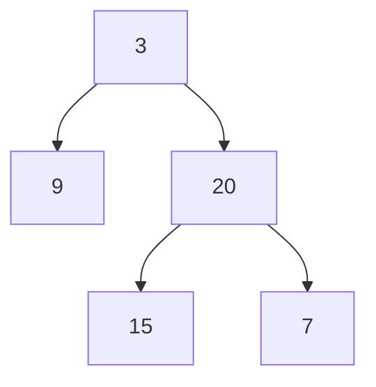
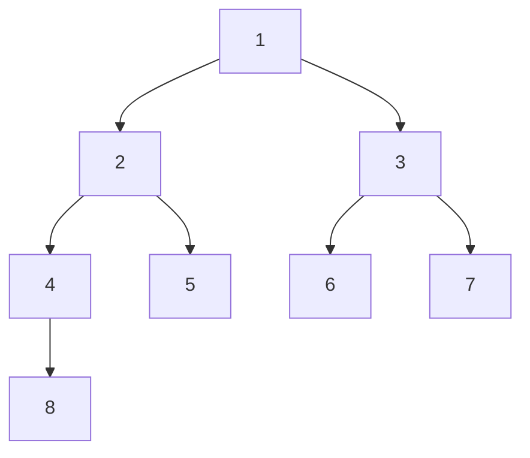

---
tags:
- Leetcode
---

# [从前序与中序遍历构造二叉树](https://leetcode.cn/problems/construct-binary-tree-from-preorder-and-inorder-traversal/description/)

二叉树的遍历问题。

## 二叉树

二叉树是最基本的数据结构之一。

```python
class TreeNode:
    def __init__(self, value, left=None, right=None):
        self.value = value
        self.left = left
        self.right = right
```

每个节点对应一个取值`TreeNode.value`，并且可以有指针指向左子节点和右子节点。

## 二叉树的遍历

### BFS

最简单的方法就是层序遍历，这是一种BFS遍历。



??? info "树的构造"
    ```python
    root = TreeNode(1)
    root.left = TreeNode(2)
    root.right = TreeNode(3)
    root.left.left = TreeNode(4)
    root.left.right = TreeNode(5)
    root.right.left = TreeNode(6)
    root.right.right = TreeNode(7)
    ```

在上面这颗树里就是按照：

- 第一层：1
- 第二层：2 3
- 第三层：4 5 6 7

的顺序来遍历。

```python
def level_order(root: TreeNode) -> list:
    """层序遍历"""
    # 遍历队列
    queue = []
    queue.append(root)
    res = []
    while queue:
        node = queue.pop(0)
        res.append(node.value)
        # 左节先进入队列
        if node.left:
            queue.append(node.left)
        if node.right:
            queue.append(node.right)
    return res
```

### DFS

DFS有三种规则，分别是前序、中序和后序。

DFS就是一条路走到黑，每次都优先访问左侧节点。直到没有左侧节点，就回退到上一层访问右节点。

在这个过程中，我们输出节点value的顺序可以有三种：


hello-algo的[这张图](https://www.hello-algo.com/chapter_tree/binary_tree_traversal/#722)非常形象。

换言之，我们的dfs都是通过递归实现。只不过输出节点value的时机有所不同：

```python
def pre_order(root: TreeNode):
    # 前序遍历
    if root is None:
        return
    yield root.value
    yield from pre_order(root.left)
    yield from pre_order(root.right)
def in_order(root: TreeNode):
    # 中序遍历
    if root is None:
        return
    yield from in_order(root.left)
    yield root.value
    yield from in_order(root.right)
def post_order(root: TreeNode):
    # 后序遍历
    if root is None:
        return
    yield from post_order(root.left)
    yield from post_order(root.right)
    yield root.value
```

??? question "生成器递归"
    正常情况下，我们保存前序遍历的结果可以使用全局变量：

    ```python
    res = []
    def pre_order(root):
        global res
        if root is None:
            return
        res.append(root.value)
        pre_order(root.left)
        pre_order(root.right)
    ```

    当然，也可以使用闭包：

    ```python
    def pre_order(root):
        res = []
        def dfs(node):
            if node is None:
                return
            res.append(node.value)
            dfs(node.left)
            dfs(node.right)
        return res
    ```
    比较fancy的写法就是我们这里的生成器写法：

    ```python
    def pre_order(root):
        if root is None:
            return
        yield root.value
        yield from pre_order(root.left)
        yield from pre_order(root.right)
    ```
    这样就不需要全局变量或者闭包变量来保存遍历的中间输出，而是通过生成器的方式直接保存了结果。

    不过需要注意，递归`yield`的时候，需要使用`yield from`。

    不过如果是go语言就有channel这种好用的东西了。

值得一提的是，前序遍历的结果总是：

```text
[ 根节点, [左子树的前序遍历结果], [右子树的前序遍历结果] ]
```

中序遍历的结果总是：

```text
[ [左子树的中序遍历结果], 根节点, [右子树的中序遍历结果] ]
```

后序遍历的结果总是：

```text
[ [左子树的中序遍历结果], [右子树的中序遍历结果], 根节点 ]
```

这些结果里蕴涵了递归的结构。

> 废话，我们是递归计算的

## 解法

知道了何谓前序和中序遍历，我们就可以来解决这道题目了。

### 递归

题目给出了前序遍历和中序遍历。

例如：



```python
preorder = [3,9,20,15,7]
inorder = [9,3,15,20,7]
```

那么我们知道，根节点是`3`，左子树的中序遍历结果为`9`，右子树的中序遍历结果为`15,20,7`，长度分别为1、3。

所以在前序遍历中，`3`之后的长度为1、的子数组就是`9`、`20,15,7`，分别为左右子树的前序遍历。从而我们可以确定根节点的左子节点为`9`，右子节点为`20`。

以此类推，我们只需要递归**确定子树的根节点**就行了：

```python
def build_tree(preorder, inorder):
    root_value = preorder[0]
    # 每次都只需要找到子树的根节点即可
    root = TreeNode(root_value)
    # 左右子树的分界点
    root_index = inorder.index(root_value)
    # 如果左子树有东西
    if root_index > 0:
        # 递归构建左子树
        root.left = build_tree(
            preorder[1 : 1 + root_index],
            inorder[:root_index],
        )
    # 如果右子树有东西
    if root_index < len(inorder) - 1:
        # 递归构建右子树
        root.right = build_tree(
            preorder[1 + root_index :],
            inorder[root_index + 1 :],
        )
    return root
```

当然这个代码还可以优化一下，我们每次使用`inorder.index(root_value)`都是`O(N)`的查询，可以用哈希表来加速。

### 迭代

```python
def buildTree(preorder, inorder):
    if not preorder:
        return None

    root = TreeNode(preorder[0])
    stack = [root]
    inorderIndex = 0
    for i in range(1, len(preorder)):
        preorderVal = preorder[i]
        node = stack[-1]
        if node.val != inorder[inorderIndex]:
            node.left = TreeNode(preorderVal)
            stack.append(node.left)
        else:
            while stack and stack[-1].val == inorder[inorderIndex]:
                node = stack.pop()
                inorderIndex += 1
            node.right = TreeNode(preorderVal)
            stack.append(node.right)

    return root

```

例如：



```python
preorder = [1, 2, 4, 8, 5, 3, 6, 7]
inorder = [8, 4, 2, 5, 1, 6, 3, 7]
```

我们的迭代解法就是按照前序遍历的顺序，依次往前走。一路上一定都是**左节点**：

> 前序遍历中任意两个连续的u,v。
>
> - 要么v是u的左儿子
> - 要么v是u的右儿子（并且u没有左儿子）
> - 要么v是u某个父节点的右儿子（并且u没子节点）
>
> **我们可以从中序遍历来发现这些右儿子。**

走到5发现栈顶和我们的指针相同。这说明5一定是某个右子节点，下面我们来找它的父节点。

```python
now = 5
stack = [1, 2, 4, 8]
index = 8
```

然后我们的指针按照中序遍历的顺序从8往前走，同时栈进行弹出。直到栈顶和指针不一致。

回退3次，也就是指针到5，栈顶为1，栈上次弹出的是2。

这时候栈顶和指针不同，所以5是2的右子节点。

然后把5压进栈内继续迭代：

```python
now = 3
stack = [1, 5]
index = 5
```

再次发生了栈顶和指针相同的情况。

说明3是右子节点。需要回退2次就发现栈空了，最后弹出的1是它的父节点。

然后把3压入栈内，继续迭代，直到7：

```python
now = 7
stack = [3, 6]
index = 6
```

这时候又再次发现了右节点。回退两次，栈空了，最后弹出的3就是7的父节点。

至此迭代完成，我们的树也构建完成。

```text
[1, 2, 4, 8, 5, 3, 6, 7]

1 是根节点
2 是1的左子节点
4 是2的左子节点
8 是4的左子节点
5 是2的右子节点 # 回退3次找到
3 是1的右子节点 # 回退2次找到
6 是3的左子节点
7 是3的右子节点 # 回退2次找到
```

完整的迭代过程可视化我用python tutor生成了一下：

<iframe width="800" height="500" frameborder="0" src="https://pythontutor.com/iframe-embed.html#code=class%20TreeNode%3A%0A%20%20%20%20def%20__init__%28self,%20value,%20left%3DNone,%20right%3DNone%29%3A%0A%20%20%20%20%20%20%20%20self.value%20%3D%20value%0A%20%20%20%20%20%20%20%20self.left%20%3D%20left%0A%20%20%20%20%20%20%20%20self.right%20%3D%20right%0A%20%20%20%20def%20__repr__%28self%29%3A%0A%20%20%20%20%20%20%20%20return%20f%22TreeNode%28%7Bself.value%7D%29%22%0Adef%20buildTree%28preorder,%20inorder%29%3A%0A%20%20%20%20if%20not%20preorder%3A%0A%20%20%20%20%20%20%20%20return%20None%0A%0A%20%20%20%20root%20%3D%20TreeNode%28preorder%5B0%5D%29%0A%20%20%20%20stack%20%3D%20%5Broot%5D%0A%20%20%20%20inorderIndex%20%3D%200%0A%20%20%20%20for%20i%20in%20range%281,%20len%28preorder%29%29%3A%0A%20%20%20%20%20%20%20%20preorderVal%20%3D%20preorder%5Bi%5D%0A%20%20%20%20%20%20%20%20node%20%3D%20stack%5B-1%5D%0A%20%20%20%20%20%20%20%20if%20node.value%20!%3D%20inorder%5BinorderIndex%5D%3A%0A%20%20%20%20%20%20%20%20%20%20%20%20node.left%20%3D%20TreeNode%28preorderVal%29%0A%20%20%20%20%20%20%20%20%20%20%20%20stack.append%28node.left%29%0A%20%20%20%20%20%20%20%20else%3A%0A%20%20%20%20%20%20%20%20%20%20%20%20while%20stack%20and%20stack%5B-1%5D.value%20%3D%3D%20inorder%5BinorderIndex%5D%3A%0A%20%20%20%20%20%20%20%20%20%20%20%20%20%20%20%20node%20%3D%20stack.pop%28%29%0A%20%20%20%20%20%20%20%20%20%20%20%20%20%20%20%20inorderIndex%20%2B%3D%201%0A%20%20%20%20%20%20%20%20%20%20%20%20node.right%20%3D%20TreeNode%28preorderVal%29%0A%20%20%20%20%20%20%20%20%20%20%20%20stack.append%28node.right%29%0A%0A%20%20%20%20return%20root%0Ares%20%3D%20buildTree%28%5B1,%202,%204,%208,%205,%203,%206,%207%5D,%20%5B8,%204,%202,%205,%201,%206,%203,%207%5D%29&codeDivHeight=400&codeDivWidth=350&cumulative=false&curInstr=0&heapPrimitives=nevernest&origin=opt-frontend.js&py=311&rawInputLstJSON=%5B%5D&textReferences=false"> </iframe>
