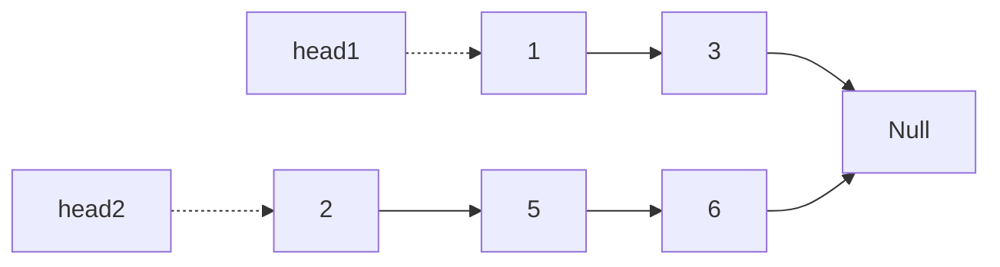
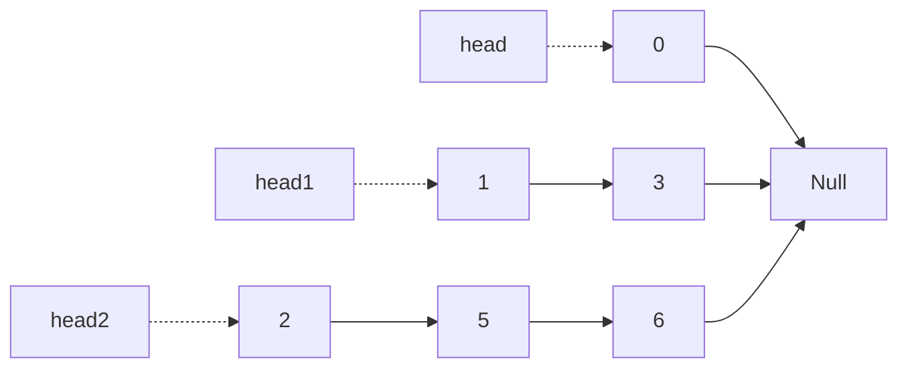
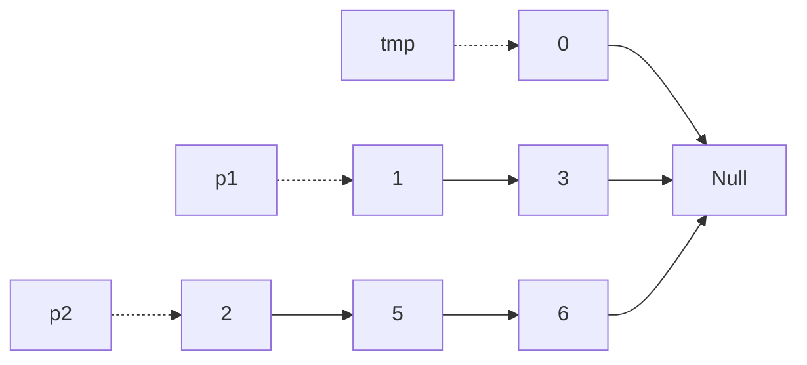
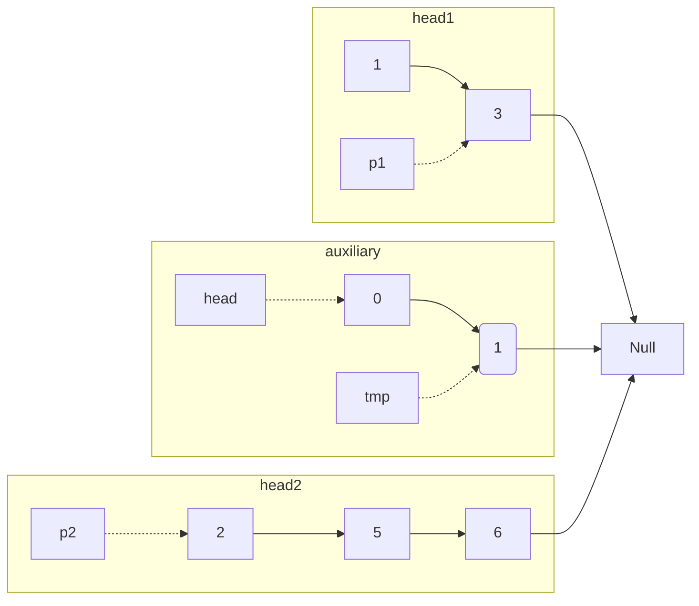
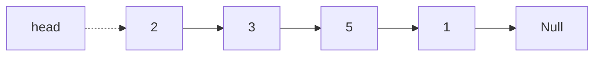
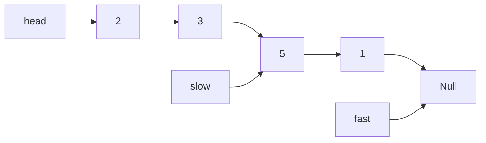

---
tags:
- Leetcode
include:
- math
---

# [排序链表](https://leetcode.cn/problems/sort-list/)

给你链表的头结点 head ，请将其按 升序 排列并返回 排序后的链表 。

## 自顶向下归并排序

> 递归写法的归并排序

### 代码

主要分为两个子函数：

1. 合并有序链表
2. 归并排序

```python
# Definition for singly-linked list.
# class ListNode:
#     def __init__(self, val=0, next=None):
#         self.val = val
#         self.next = next
class Solution:
    def sortList(self, head: Optional[ListNode]) -> Optional[ListNode]:
        def merge(head1, head2):
            tmp_head = ListNode()
            tmp, p1, p2 = tmp_head, head1, head2
            while p1 and p2:
                if p1.val <= p2.val:
                    tmp.next = p1
                    p1 = p1.next
                else:
                    tmp.next = p2
                    p2 = p2.next
                tmp = tmp.next
            # 链表长度不一致
            if p1:
                tmp.next = p1
            elif p2:
                tmp.next = p2
            return tmp_head.next
        def sort_ln(head, tail):
            # 递归出口
            ## 空链表，直接返回
            if not head:
                return head
            ## 单元素链表，首尾相同
            if head.next == tail:
                head.next = None
                return head
            # 寻找中点
            slow, fast = head, head
            while fast != tail:
                slow = slow.next
                fast = fast.next
                # 快指针一次走两步
                if fast != tail:
                    fast = fast.next
            mid = slow
            return merge(sort_ln(head, mid), sort_ln(mid, tail))
        return sort_ln(head, None)
```

时间复杂度：$\mathcal{O}(n\log n)$，其中 n 是链表的长度。

空间复杂度：$\mathcal{O}(\log n)$，其中 n 是链表的长度。空间复杂度主要取决于递归调用的栈空间。

### 合并有序链表 图解

合并有序链表的方法很简单：



我们创建一个辅助链表：



然后挨个同时遍历head1和head2即可：



每次把比较小的那一个接到tmp后面，然后把tmp往前移一位：



以此类推，直到某一个链表到了尽头。

这时候如果两个链表长度不一致，需要把长的那一个剩下的元素接上去。

### 归并排序 图解

归并排序是一种分治算法，用递归写起来很快。

例如：



我们先要用快慢指针寻找中点：

```python
slow, fast = head, head
while fast != tail:
    # 慢指针一次走一步
    slow = slow.next
    # 快指针一次走两步
    fast = fast.next
    if fast != tail:
        fast = fast.next
```

这样快指针走到末尾的时候，慢指针所在的位置就是中点：



然后直接递归求解即可：`return merge(sort_ln(head, mid), sort_ln(mid, tail))`

## 自底向上归并排序

为了降低空间复杂度，可以自底向上实现归并排序。

去掉了递归调用，空间复杂度降低为：$\mathcal{O}(1)$

### 代码

为了方便演示，给ListNode加了两个方法：

```python
# Definition for singly-linked list.
class ListNode:
    def __init__(self, val=0, next=None):
        self.val = val
        self.next = next

    def __repr__(self):
        s = [str(self.val)]
        cur = self
        while cur.next:
            s.append(str(cur.next.val))
            cur = cur.next
        return "-->".join(s)

    @staticmethod
    def new(list):
        head = ListNode(list[0])
        cur = head
        for i in range(1, len(list)):
            cur.next = ListNode(list[i])
            cur = cur.next
        return head
```

算法如下：

```python

class Solution:
    def sortList(self, head):
        def merge(head1, head2):
            """合并有序链表"""
            tmp_head = ListNode()
            tmp, p1, p2 = tmp_head, head1, head2
            while p1 and p2:
                if p1.val <= p2.val:
                    tmp.next = p1
                    p1 = p1.next
                else:
                    tmp.next = p2
                    p2 = p2.next
                tmp = tmp.next
            # 链表长度不一致
            if p1:
                tmp.next = p1
            elif p2:
                tmp.next = p2
            return tmp_head.next

        if not head:
            return head
        # 计算链表长度
        length = 0
        now = head
        while now:
            length += 1
            now = now.next
        # 添加一个辅助节点
        aux_head = ListNode(0, head)
        sub_length = 1
        # 从1开始，每次倍增sub_length，直到超过整个链表的长度
        while sub_length < length:
            prev, curr = aux_head, aux_head.next
            while curr:
                # head1和head2，都是长度为sub_length的子链表
                head1 = curr
                for i in range(1, sub_length):
                    if curr.next:
                        curr = curr.next
                    else:
                        break
                head2 = curr.next
                curr.next = None
                curr = head2
                for i in range(1, sub_length):
                    if curr and curr.next:
                        curr = curr.next
                    else:
                        break
                # 除了head1和head2，剩下的节点都放到succ上
                succ = None
                if curr:
                    succ = curr.next
                    curr.next = None
                # 合并head1和head2
                merged = merge(head1, head2)
                # 合并之后，拼接到辅助节点后
                prev.next = merged
                # 然后把prev指针移到最后一个节点，等待下一个子序列拼接上来
                while prev.next:
                    prev = prev.next
                # 移动到下一段
                curr = succ
            sub_length *= 2
            print(f"When {sub_length=}:\t", aux_head)
        return aux_head.next

```

随便写了一个例子：

```python
s = Solution()
ln = ListNode.new([9, 2, 1, 4, 6, 5, 4, 3, -1])
print("Raw ListNode:\t\t", ln)
res = s.sortList(ln)
print("Sorted ListNode:\t", res)
```

可以清晰地看到排序的过程：

```text
Raw ListNode:       9-->2-->1-->4-->6-->5-->4-->3-->-1
When sub_length=1:  2-->9-->1-->4-->5-->6-->3-->4-->-1
When sub_length=2:  1-->2-->4-->9-->3-->4-->5-->6-->-1
When sub_length=4:  1-->2-->3-->4-->4-->5-->6-->9-->-1
When sub_length=8:  -1-->1-->2-->3-->4-->4-->5-->6-->9
Sorted ListNode:    -1-->1-->2-->3-->4-->4-->5-->6-->9
```

### 图解

初始链表：

```text
9-->2-->1-->4-->6-->5-->4-->3-->-1
```

经过第一次排序，这时候，呈现分段（每段的长度为2）有序：

```text
2-->9  1-->4   5-->6   3-->4   -1
```

经过第二次排序，段的长度变为4:

```text
1-->2-->4-->9   3-->4-->5-->6   -1
```

经过第三次排序，段段长度变为8:

```text
1-->2-->3-->4-->4-->5-->6-->9   -1
```

最终得到全局有序的链表：

```text
-1-->1-->2-->3-->4-->4-->5-->6-->9
```
