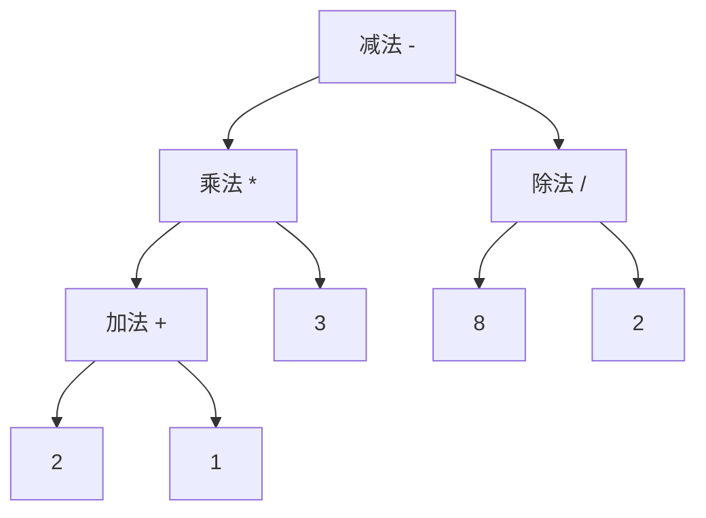

---
tags:
- Leetcode
- 数据结构
---

# 表达式求值

刷题的时候遇到了[逆波兰表达式的求值](https://leetcode.cn/problems/evaluate-reverse-polish-notation/)，如果掌握了栈的用法的话这题本身其实并不难。

然而**表达式求值**本身却是一个更加通用、比更加困难并且更加有趣的算法。它也让我充分认识到树这个结构的精妙，原来前序后序中序遍历不是瞎搞的，确实有用！

因此特此写下此文。

## 计算树

> 更一般的也可以叫做：抽象语法树（AST）

一个典型四则运算的数学表达式形如：`(2 + 1) * 3 - 8 / 2`

> 这里我们暂时先不考虑单目运算符，例如取负`-2`、取反`~2`等等

我们把算符放在父节点、把数字放在子节点，它就可以表示为一个计算树：



实际上，正常的表达式就是这棵树的[中序遍历](./105.md#dfs)。

而它的后序遍历就是所谓的**逆波兰表达式**：`2 1 + 3 * 8 2 / -`

前序遍历自然就是**波兰表达式**：`- * + 2 1 3 / 8 2`

我们来验证一下：

```python hl_lines="7-17"
class Node:
    def __init__(self, val, left=None, right=None):
        self.val = val
        self.left = left
        self.right = right

    def dfs(self, order="in"):#(1)!
        if order == "pre":
            yield self.val
        if self.left:
            yield from self.left.dfs(order)
        if order == "in":
            yield self.val
        if self.right:
            yield from self.right.dfs(order)
        if order == "post":
            yield self.val


t = Node("-")
t.left = Node(
    "*",
    Node("+", Node("2"), Node("1")),
    Node("3"),
)
t.right = Node("/", Node("8"), Node("2"))
print(*t.dfs("pre"))
print(*t.dfs("in"))
print(*t.dfs("post"))
```

1. 这是经典的dfs三种顺序写法，利用了递归生成器比较简洁

我快速写了一个demo，它的输出就是：

```text
- * + 2 1 3 / 8 2
2 + 1 * 3 - 8 / 2
2 1 + 3 * 8 2 / -
```

不难发现，中序遍历必须**依赖括号**来表达运算的优先级。也就是`(2+1)*3-8/2`其中的括号不可以忽略。然而后面我们会看到，波兰表达式和逆波兰表达式都不依赖括号来表达运算优先级。这是他们在计算机中广泛使用的重要原因。

### 逆波兰表达式求值

如果表达式已经被写成了逆波兰表达式，那么求值是一件比较简单的事情。这其实是逆波兰表达式为什么如此另外一个重要的原因。

但是如何得到逆波兰表达式并不那么容易，这一点我们下一节再说。先来看看逆波兰表达式如何求值：

#### 代码

只需要用到一个栈即可。我们遍历表达式的每个元素，如果是数字就压栈，如果遇到运算符就从栈顶拿出两个数字进行运算。运算结果继续压栈。

重复上述过程就可以在`O(N)`时间内解决表达式求值的问题：

```python
from math import trunc

class Solution:
    def evalRPN(self, tokens: List[str]) -> int:
        num = []
        op = "+-*/"
        while tokens:
            token = tokens.pop(0)
            if token not in op:
                # 压栈
                num.append(int(token))
            else:
                # 出栈，注意先出栈的是b
                b = num.pop()
                a = num.pop()
                match token:
                    case "+":
                        res = a+b
                    case '-':
                        res = a-b
                    case '*':
                        res = a*b
                    case '/':
                        res = trunc(a/b)
                num.append(res)
        return num[0]
```

### 中序表达式转后序表达式

> 也就是普通表达式转换为逆波兰表达式

这是一个经典的算法：[调度场算法](https://zh.wikipedia.org/wiki/%E8%B0%83%E5%BA%A6%E5%9C%BA%E7%AE%97%E6%B3%95)。并且他的发明人也是大名鼎鼎：Dijkstra。

下面这张图基本完全解释了这个算法的精髓（以及它为什么叫调度场）：


#### 代码

??? note "调度场算法"
    ```python
    def to_rpn(expression: str) -> list[str]:
        """使用调度场算法将中序表达式转换为逆波兰表达式。"""
        operators = []
        output = []
        # 需要预先定义运算优先级
        # 我们这里只处理双目运算符
        priority = {"+": 1, "-": 1, "*": 2, "/": 2}
        i = 0

        # 从前到后扫描整个表达式
        while i < len(expression):
            char = expression[i]
            if char.isspace():
                i += 1
                continue
            
            # 遇到数字直接进入输出队列
            if char.isdigit():
                j = i
                while j < len(expression) and expression[j].isdigit():
                    j += 1
                output.append(expression[i:j])
                i = j
                continue
            
            # 遇到左括号需要压栈
            if char == "(":
                operators.append(char)
            # 遇到右括号开始出栈
            elif char == ")":
                while operators and operators[-1] != "(":
                    output.append(operators.pop())
                if not operators:
                    raise ValueError("括号不匹配")
                operators.pop() # 应该还剩一个左括号，丢掉
            # 遇到运算符，需要进行判断
            elif char in priority:
                # 如果当前运算优先级不高，就把栈内的运算都弹出来
                while (
                    operators
                    and operators[-1] != "("
                    and priority[operators[-1]] >= priority[char]
                ):
                    output.append(operators.pop())
                # 如果当前运算优先级高，就压栈
                operators.append(char)
            else:
                raise ValueError(f"无法识别的字符: {char}")
            i += 1

        # 扫描完成后剩下的所有运算符都进入输出队列
        while operators:
            # 如果还有左括号，就是表达式错了
            if operators[-1] == "(":
                raise ValueError("括号不匹配")
            output.append(operators.pop())
        return output


    print(to_rpn("(2 + 1) * 3 - 8 / 2"))
    # ['2', '1', '+', '3', '*', '8', '2', '/', '-']
    ```

下面是代码的可视化运行，可以清晰地看到我们压栈、出栈的过程：

<iframe width="800" height="500" frameborder="0" src="https://pythontutor.com/iframe-embed.html#code=def%20to_rpn%28expression%3A%20str%29%20-%3E%20list%5Bstr%5D%3A%0A%20%20%20%20%22%22%22%E4%BD%BF%E7%94%A8%E8%B0%83%E5%BA%A6%E5%9C%BA%E7%AE%97%E6%B3%95%E5%B0%86%E4%B8%AD%E5%BA%8F%E8%A1%A8%E8%BE%BE%E5%BC%8F%E8%BD%AC%E6%8D%A2%E4%B8%BA%E9%80%86%E6%B3%A2%E5%85%B0%E8%A1%A8%E8%BE%BE%E5%BC%8F%E3%80%82%22%22%22%0A%20%20%20%20operators%20%3D%20%5B%5D%0A%20%20%20%20output%20%3D%20%5B%5D%0A%20%20%20%20priority%20%3D%20%7B%22%2B%22%3A%201,%20%22-%22%3A%201,%20%22*%22%3A%202,%20%22/%22%3A%202%7D%0A%20%20%20%20i%20%3D%200%0A%0A%20%20%20%20while%20i%20%3C%20len%28expression%29%3A%0A%20%20%20%20%20%20%20%20char%20%3D%20expression%5Bi%5D%0A%20%20%20%20%20%20%20%20if%20char.isspace%28%29%3A%0A%20%20%20%20%20%20%20%20%20%20%20%20i%20%2B%3D%201%0A%20%20%20%20%20%20%20%20%20%20%20%20continue%0A%0A%20%20%20%20%20%20%20%20if%20char.isdigit%28%29%3A%0A%20%20%20%20%20%20%20%20%20%20%20%20j%20%3D%20i%0A%20%20%20%20%20%20%20%20%20%20%20%20while%20j%20%3C%20len%28expression%29%20and%20expression%5Bj%5D.isdigit%28%29%3A%0A%20%20%20%20%20%20%20%20%20%20%20%20%20%20%20%20j%20%2B%3D%201%0A%20%20%20%20%20%20%20%20%20%20%20%20output.append%28expression%5Bi%3Aj%5D%29%0A%20%20%20%20%20%20%20%20%20%20%20%20i%20%3D%20j%0A%20%20%20%20%20%20%20%20%20%20%20%20continue%0A%0A%20%20%20%20%20%20%20%20if%20char%20%3D%3D%20%22%28%22%3A%0A%20%20%20%20%20%20%20%20%20%20%20%20operators.append%28char%29%0A%20%20%20%20%20%20%20%20elif%20char%20%3D%3D%20%22%29%22%3A%0A%20%20%20%20%20%20%20%20%20%20%20%20while%20operators%20and%20operators%5B-1%5D%20!%3D%20%22%28%22%3A%0A%20%20%20%20%20%20%20%20%20%20%20%20%20%20%20%20output.append%28operators.pop%28%29%29%0A%20%20%20%20%20%20%20%20%20%20%20%20if%20not%20operators%3A%0A%20%20%20%20%20%20%20%20%20%20%20%20%20%20%20%20raise%20ValueError%28%22%E6%8B%AC%E5%8F%B7%E4%B8%8D%E5%8C%B9%E9%85%8D%22%29%0A%20%20%20%20%20%20%20%20%20%20%20%20operators.pop%28%29%0A%20%20%20%20%20%20%20%20elif%20char%20in%20priority%3A%0A%20%20%20%20%20%20%20%20%20%20%20%20while%20%28%0A%20%20%20%20%20%20%20%20%20%20%20%20%20%20%20%20operators%0A%20%20%20%20%20%20%20%20%20%20%20%20%20%20%20%20and%20operators%5B-1%5D%20!%3D%20%22%28%22%0A%20%20%20%20%20%20%20%20%20%20%20%20%20%20%20%20and%20priority%5Boperators%5B-1%5D%5D%20%3E%3D%20priority%5Bchar%5D%0A%20%20%20%20%20%20%20%20%20%20%20%20%29%3A%0A%20%20%20%20%20%20%20%20%20%20%20%20%20%20%20%20output.append%28operators.pop%28%29%29%0A%20%20%20%20%20%20%20%20%20%20%20%20operators.append%28char%29%0A%20%20%20%20%20%20%20%20else%3A%0A%20%20%20%20%20%20%20%20%20%20%20%20raise%20ValueError%28f%22%E6%97%A0%E6%B3%95%E8%AF%86%E5%88%AB%E7%9A%84%E5%AD%97%E7%AC%A6%3A%20%7Bchar%7D%22%29%0A%20%20%20%20%20%20%20%20i%20%2B%3D%201%0A%0A%20%20%20%20while%20operators%3A%0A%20%20%20%20%20%20%20%20if%20operators%5B-1%5D%20%3D%3D%20%22%28%22%3A%0A%20%20%20%20%20%20%20%20%20%20%20%20raise%20ValueError%28%22%E6%8B%AC%E5%8F%B7%E4%B8%8D%E5%8C%B9%E9%85%8D%22%29%0A%20%20%20%20%20%20%20%20output.append%28operators.pop%28%29%29%0A%20%20%20%20return%20output%0A%0A%0Aprint%28to_rpn%28%22%282%20%2B%201%29%20*%203%20-%208%20/%202%22%29%29&codeDivHeight=400&codeDivWidth=350&curInstr=0&origin=opt-frontend.js&py=311"> </iframe>

### 计算树的构造：双栈

最开始我们说过，表达式可以转化成一个二叉树。这一节我们就来亲手构造出这个树。

构造的过程需要使用双栈：

!!! info "这是可视化输出树的一个好写法"

```python title="树的定义" hl_lines="7-12"
class Node:
    """计算树节点。"""
    def __init__(self, val, left=None, right=None):
        self.val = val
        self.left = left
        self.right = right
    def __repr__(self):
        """输出中序遍历表达式"""
        if self.left is None and self.right is None:
            return str(self.val)
        return f"({self.left} {self.val} {self.right})"
        # 这里看起来非常简洁，实际上隐含调用了self.left.__repr__()
    def RPN(self):
        """输出后缀表达式"""
        if self.left is None and self.right is None:
            return str(self.val)
        return f"{self.left.RPN()} {self.right.RPN()} {self.val}"
    def PN(self):
        """输出前缀表达式"""
        if self.left is None and self.right is None:
            return str(self.val)
        return f"{self.val} {self.left.PN()} {self.right.PN()}"
```

```python title="AST的构造算法：双栈"
def build_ast(expression: str) -> Node:
    """使用双栈将中序表达式构造为抽象语法树。"""
    operators = []
    operands = []
    priority = {"+": 1, "-": 1, "*": 2, "/": 2}

    def reduce_once():
        if not operators or operators[-1] == "(":
            raise ValueError("缺少运算符")
        operator = operators.pop()
        if len(operands) < 2:
            raise ValueError("缺少操作数")
        right = operands.pop()
        left = operands.pop()
        operands.append(Node(operator, left, right))

    i = 0
    while i < len(expression):
        char = expression[i]
        if char.isspace():
            i += 1
            continue
        if char.isdigit():
            j = i
            while j < len(expression) and expression[j].isdigit():
                j += 1
            operands.append(Node(expression[i:j]))
            i = j
            continue
        if char == "(":
            operators.append(char)
        elif char == ")":
            while operators and operators[-1] != "(":
                reduce_once()
            if not operators:
                raise ValueError("括号不匹配")
            operators.pop()
        elif char in priority:
            while (
                operators
                and operators[-1] != "("
                and priority[operators[-1]] >= priority[char]
            ):
                reduce_once()
            operators.append(char)
        else:
            raise ValueError(f"无法识别的字符: {char}")
        i += 1

    while operators:
        if operators[-1] == "(":
            raise ValueError("括号不匹配")
        reduce_once()

    if len(operands) != 1:
        raise ValueError("表达式不合法")
    return operands[0]


tree = build_ast("(2 + 1) * 3 - 8 / 2")
print(tree)
print(tree.RPN())
print(tree.PN())
```

### 计算树的构造：三栈

AI写的代码太规范了，而且不是最好理解的。我自己也写了一个三栈的版本：

```python title="AST构造算法：三栈"
def three_stack_build_ast(expression):
    op = []
    num = []
    stack = []
    priority = {"+": 1, "-": 1, "*": 2, "/": 2}

    # 定义一个函数来处理运算符栈和操作数栈的归约操作
    def reduce_ops():
        while op:
            operator = op.pop()
            right = num.pop()
            left = num.pop()
            num.append(Node(operator, left, right))

    i = 0
    while i < len(expression):
        char = expression[i]
        if char.isspace():
            i += 1
        elif char.isdigit():
            j = i
            while j < len(expression) and expression[j].isdigit():
                j += 1
            num.append(Node(expression[i:j]))
            i = j
        elif char == "(":
            # 保存当前层的运算符和操作数，括号内使用新的队列。
            stack.append((op, num))
            op = []
            num = []
            i += 1
        elif char == ")":
            # 计算括号内的表达式，并将结果压入上层的操作数栈
            reduce_ops()
            prev_op, prev_num = stack.pop()
            prev_num.append(num[0])
            op = prev_op
            num = prev_num
            i += 1
        elif char in priority:
            while op and priority[op[-1]] >= priority[char]:
                reduce_ops()
            op.append(char)
            i += 1
    reduce_ops()
    return num[0]

tree = three_stack_build_ast("(2 + 1) * 3 - 8 / 2")
print(tree)
print(tree.RPN())
print(tree.PN())
```

### 变种Leetcode题

- <https://leetcode.cn/problems/basic-calculator-ii/>
    - 这是简化版本，不涉及括号
- <https://leetcode.cn/problems/basic-calculator/>
    - 只涉及加减法运算，但是涉及到取负这个单目运算
- <https://leetcode.cn/problems/basic-calculator-iv/>
    - 花里胡哨版本，还带变量替换
- <https://leetcode.cn/problems/parse-lisp-expression/>
    - Lips语法解析，正经AST！！
- <https://leetcode.cn/problems/number-of-atoms/>
    - 化学式的解析也可以用AST的算法

再往下刷还有更难的😭

我就不刷了，各位大手子刷吧！
