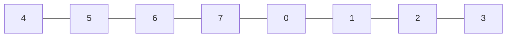
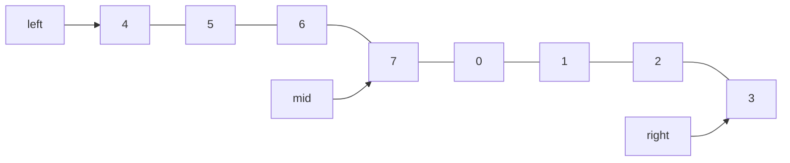
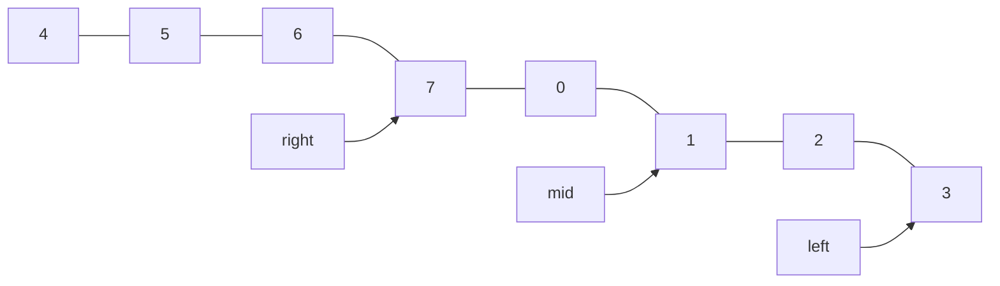
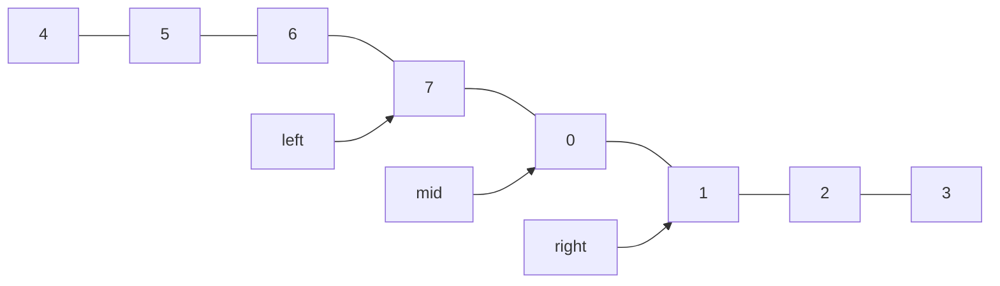
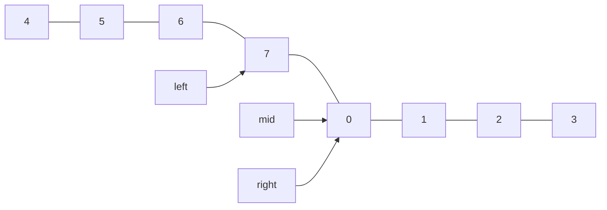

---
tags:
- Leetcode
---

# [寻找旋转排序数组中的最小值](https://leetcode.cn/problems/find-minimum-in-rotated-sorted-array/description/)

已知一个长度为 n 的数组，预先按照升序排列，经由 1 到 n 次 旋转 后，得到输入数组。例如，原数组 `nums = [0,1,2,4,5,6,7]` 在变化后可能得到：

- 若旋转 4 次，则可以得到 `[4,5,6,7,0,1,2]`
- 若旋转 7 次，则可以得到 `[0,1,2,4,5,6,7]`

注意，数组 `[a[0], a[1], a[2], ..., a[n-1]]` 旋转一次 的结果为数组 `[a[n-1], a[0], a[1], a[2], ..., a[n-2]]` 。

给你一个元素值 互不相同 的数组 nums ，它原来是一个升序排列的数组，并按上述情形进行了多次旋转。请你找出并返回数组中的 最小元素 。

你必须设计一个时间复杂度为 O(log n) 的算法解决此问题。

## 题解

### 分析

这其实就是一个找最小值的问题。

由于数组带有一定的性质：

- 要么是升序的
- 要么是两个升序数组拼起来

最小值只可能在两个地方取：

1. 要么是第一个元素
2. 要么是第一个出现降序（`a[i] > a[i+1]`）的`a[i+1]`

### 代码

第一种情况很简单，只需要判断首末两个位置的数字谁比较大。因为旋转之后的数组一定是首位数字比末尾大。

```python
class Solution:
    def findMin(self, nums: List[int]) -> int:
        if nums[0] <= nums[-1]:
            return nums[0]
        else:
            ...
```

如果不是第一种情况可以考虑**二分查找**。

```python
class Solution:
    def findMin(self, nums: List[int]) -> int:
        if nums[0] <= nums[-1]:
            return nums[0]
        else:
            left = 0
            right = len(nums)-1
            while 1:
                mid = (left + right) // 2
                if mid==left:
                    return nums[left+1]
                if nums[left] > nums[mid]:
                    left, right = left, mid
                else:
                    left, right = mid, right
```

### 图解

对于需要二分查找的情况（也就是原来的升序数组被打乱了）。

例如：



我们初始化指针：



然后比较left和mid即可。

- 如果left比较大，说明最小值在左侧：`left, right = left, mid`
- 如果left比较小，说明最小值在右侧：`left, right = mid, right`

如此不断进行迭代。直到`mid == left`，继续迭代是死循环。这时候已经找到了最小值：`nums[left+1]`。

第一次迭代：



第二次迭代：



第三次迭代：



继续迭代是死循环，其实这时候已经找到了最小值。
