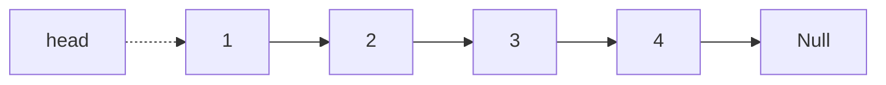
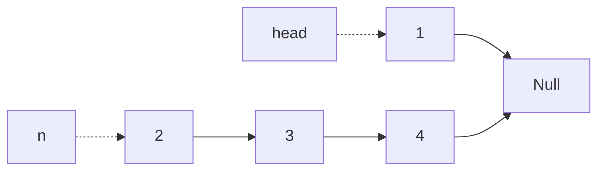
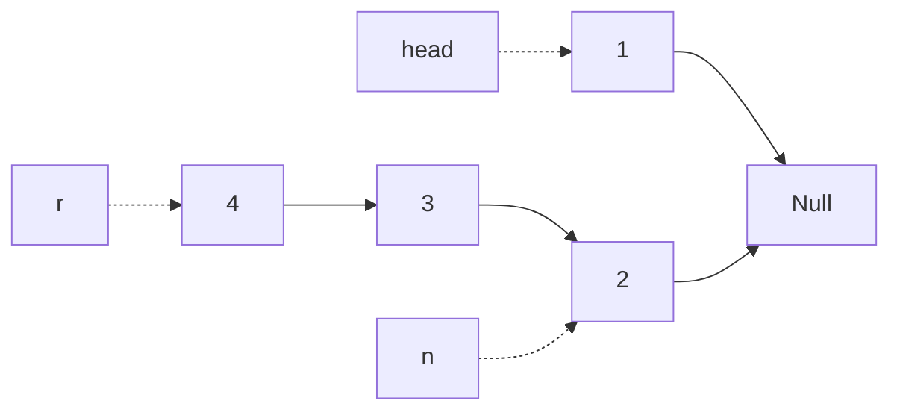
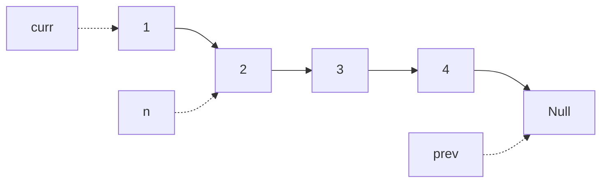
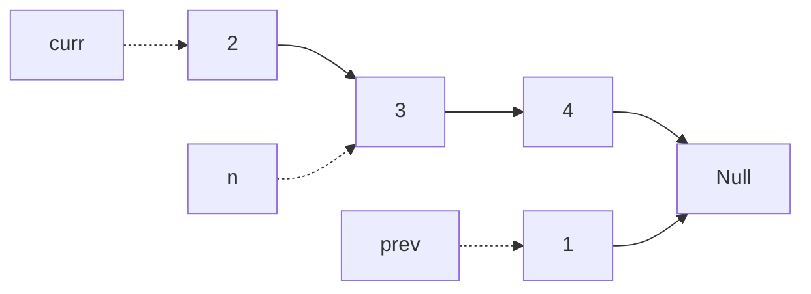
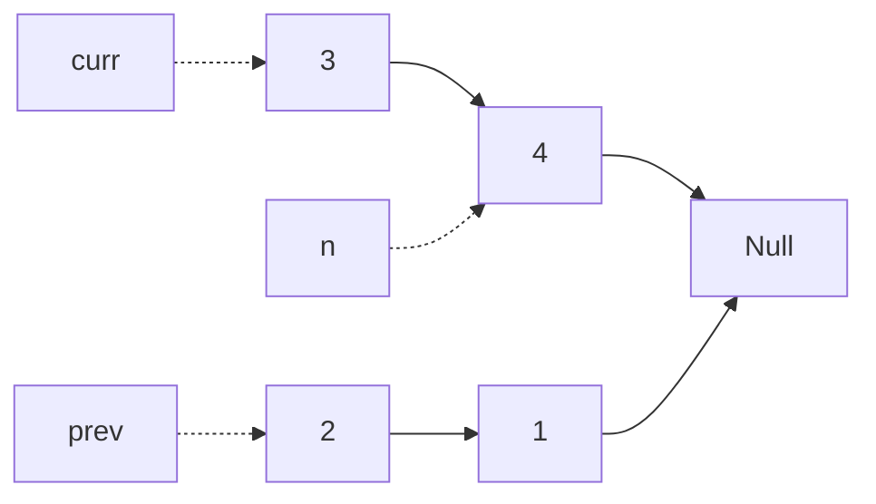
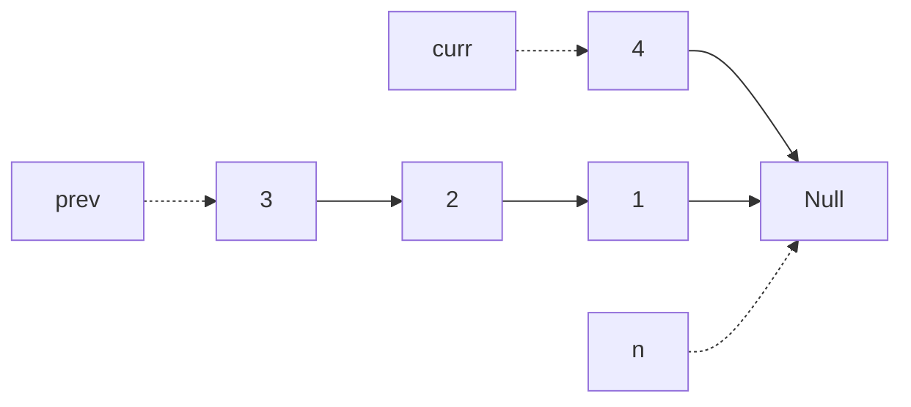
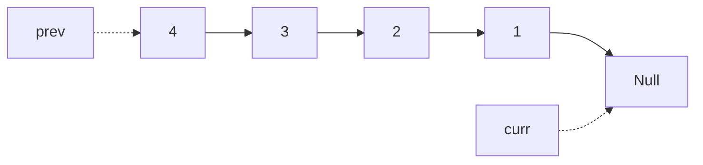

---
tags:
- Leetcode
include:
- math
---

# [反转链表](https://leetcode.cn/problems/reverse-linked-list/)

> 经典数据结构题，考研复试面试题～

给你单链表的头节点 head ，请你反转链表，并返回反转后的链表。

## 递归

### 代码

最简单的写法就是递归实现：

```python
# Definition for singly-linked list.
# class ListNode:
#     def __init__(self, val=0, next=None):
#         self.val = val
#         self.next = next
class Solution:
    def reverseList(self, head: Optional[ListNode]) -> Optional[ListNode]:
        if (head is None) or (head.next is None):
            return head
        else:
            n = head.next
            head.next = None
            r = self.reverseList(n)
            n.next = head
            return r

```

先处理边界情况：如果链表长度为0或者1，直接返回即可。

然后进行递归拆分。

### 图解

例如：



首先把1和1的子节点单独拿出来分别记录为`head`和`n`，把1的子节点设置为空：



然后反转字链表n得到r，这时候n指针依然不动：



最后做一个拼接就完成了：

```python
n.next = head
```

时间复杂度：$\mathcal{O}(N)$，需要对链表的每个节点进行反转操作。

空间复杂度：$\mathcal{O}(N)$，空间复杂度主要取决于递归调用的栈空间，最多为 n 层。

## 双指针迭代

### 代码

用双指针即可直接进行迭代：

```python
# Definition for singly-linked list.
# class ListNode:
#     def __init__(self, val=0, next=None):
#         self.val = val
#         self.next = next
class Solution:
    def reverseList(self, head: Optional[ListNode]) -> Optional[ListNode]:
        prev = None
        curr = head
        while curr is not None:
            n = curr.next
            curr.next = prev
            prev = curr
            curr = n
        return prev
```

### 图解

例如：


先定义双指针：



如果curr不是空，就向前移动一个位置：



以此类推即可：



下一步：



下一步：



此时迭代结束，返回`prev`即可。

时间复杂度：$\mathcal{O}(N)$，需要遍历一次链表。

空间复杂度：$\mathcal{O}(1)$，只定义了一些指针变量，没有使用额外空间。
