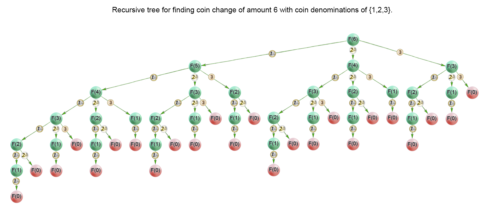

---
tags:
- Leetcode
---

# [零钱兑换](https://leetcode.cn/problems/coin-change/)

给你一个整数数组 coins ，表示不同面额的硬币；以及一个整数 amount ，表示总金额。

计算并返回可以凑成总金额所需的 最少的硬币个数 。如果没有任何一种硬币组合能组成总金额，返回 -1 。

你可以认为每种硬币的数量是无限的。

## 动态规划

> 这个题只能说做过一次就会了。

### 代码

可以用动态规划来解决：

设`dp[i]`表示组成i金额最少需要的硬币数量。

那么有递归公式：

```python
dp[i] = min(
    dp[i-c] + 1 if i-c>=0 else inf for c in coins
)
```

也就是说，要组成金额i，我们考虑使用所有可行的硬币（也就是那些`i-c>=0`的硬币），在这些可行的方案中选择最好的那一个。

然后我们规定`dp[0]=0`为**边界条件**，`dp[i] = inf`为**初始值**（因为我们要找最小值，所以初始化为无穷大）。跑一次循环就结束了。

```python
def coinChange(self, coins: List[int], amount: int) -> int:
    inf = float('inf')
    dp = [inf for _ in range(amount+1)]
    dp[0] = 0
    for i in range(1, amount+1):
        dp[i] = min(dp[i-c] + 1 if i-c>=0 else inf for c in coins)
    return dp[-1] if dp[-1] != inf else -1
```

### 求解过程

例如求解：`coins = [1,2,5]`, `amount=11`的情况

首先，我们的dp数组长度为12，初始化为：

```python
dp = [0] + [inf] * 11
```

然后从前往后依次更新：

第一次更新，发现组成金额1最少需要1枚硬币，因为1是可以使用的硬币：

```python
dp = [0, 1] + [inf] * 10
```

第二次更新和第一次更新逻辑相同：

```python
dp = [0, 1, 1] + [inf] * 9
```

第三次更新，需要求`dp[3]`，需要求最值：

```python
min(
    dp[3-1],
    dp[3-2],
    inf
) = 1
```

所以这时候更新为：

```python
dp = [0, 1, 1, 2] + [inf] * 8
```

依次类推，最后我们可以输出一下更新的轨迹：

```python
[0, 1, inf, inf, inf, inf, inf, inf, inf, inf, inf, inf]
[0, 1, 1, inf, inf, inf, inf, inf, inf, inf, inf, inf]
[0, 1, 1, 2, inf, inf, inf, inf, inf, inf, inf, inf]
[0, 1, 1, 2, 2, inf, inf, inf, inf, inf, inf, inf]
[0, 1, 1, 2, 2, 1, inf, inf, inf, inf, inf, inf]
[0, 1, 1, 2, 2, 1, 2, inf, inf, inf, inf, inf]
[0, 1, 1, 2, 2, 1, 2, 2, inf, inf, inf, inf]
[0, 1, 1, 2, 2, 1, 2, 2, 3, inf, inf, inf]
[0, 1, 1, 2, 2, 1, 2, 2, 3, 3, inf, inf]
[0, 1, 1, 2, 2, 1, 2, 2, 3, 3, 2, inf]
[0, 1, 1, 2, 2, 1, 2, 2, 3, 3, 2, 3]
```

## 递归

当然，我们也可以使用递归（深度优先搜索）来做：

### 代码

每次我们考虑`len(coins)`个递归分支，取这些分支的最优解即可：

```python
def coinChange(self, coins: List[int], amount: int) -> int:
    def dfs(amt):
        if amt == 0:
            return 0 # 代表可行，刚好余额减少为0
        elif amt<0:
            return float("inf") # 代表可行
        else:
            return min(dfs(amt-c)+1 for c in coins)
    res = dfs(amount)
    return res if res != float('inf') else -1
```

当然，我们可以加上记忆优化来减少重复计算：

```python
def coinChange(self, coins: List[int], amount: int) -> int:
    mem = {}
    def dfs(amt):
        if amt in mem:
            return mem[amt]
        if amt == 0:
            return 0
        elif amt<0:
            return float("inf")
        else:
            res = min(dfs(amt-c)+1 for c in coins)
            mem[amt] = res # 返回之前记忆此次结果
            return res
    res = dfs(amount)
    return res if res != float('inf') else -1
```

### 可视化


