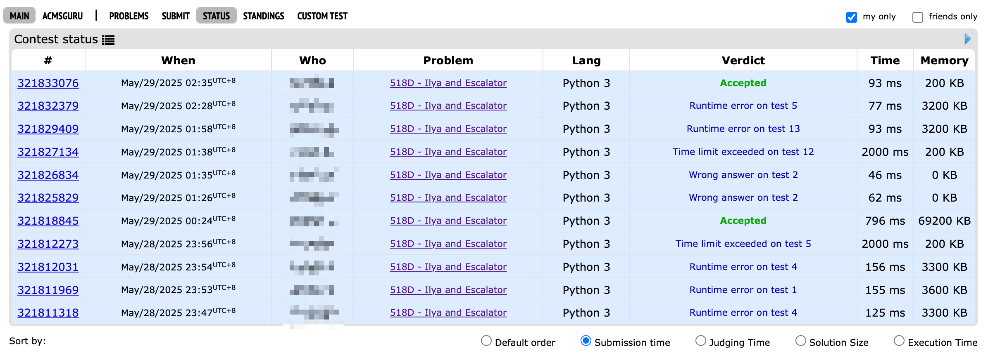

---
tags:
- Leetcode
include:
- math
---

# [排队上电梯](https://codeforces.com/problemset/problem/518/D/)

$n$个人排队上电梯，每一秒钟都有一个人站在电梯前，以$p$的概率上电梯，$1-p$的概率停滞不前。

求$t$秒钟之后，上电梯人数的期望值。

## 条件概率递推

显然，如果$t\le n$，一共只有$t$秒钟不够$n$个人都走完，那么每一秒都有人在电梯前等待。那么上电梯的人数就是一个二项分布$B(t, p)$，这时候上电梯的人数期望为：$pt$。

下面我们只考虑$t\gt n$的情况，这时候就不一定每一秒钟都有人在电梯前等待了。我们设随机变量$X_t$表示$t$秒钟上电梯的人数。

那么对于$1\le k \le n-1$显然有条件概率公式：
$$
\begin{aligned}
&P(X_t = k) \\\\
= &P(X_t = k \mid X_{t-1}=k)P(X_{t-1}=k) \\\\
 &+ P(X_t = k \mid X_{t-1}=k-1)P(X_{t-1}=k-1)\\\\
= &(1-p)P(X_{t-1}=k) + pP(X_{t-1}=k-1)
\end{aligned}
$$

> 注意上述公式对$k=0,n$的情况不成立

$k=0$的情况比较简单：
$$
P(X_t = 0) = (1-p)^t
$$
$k=n$的情况较为特殊，因为后继无人，所以不需要$1-p$这个因子了：
$$
P(X_t = n) = P(X_{t-1}=n) + pP(X_{t-1}=n-1)
$$

### 代码

上面的条件概率公式用dp数组写出来就是：

```python
n, p, t = input().split()
n = int(n)
p = float(p)
t = int(t)
if t <= n:
    print(t * p)
else:
    dp = [[0] * (n + 1) for _ in range(t + 1)]
    dp[0][0] = 1.0
    for i in range(1, t + 1):
        dp[i][0] = dp[i - 1][0] * (1 - p)
        for j in range(1, n):
            dp[i][j] = dp[i - 1][j - 1] * p + dp[i - 1][j] * (1 - p)
        dp[i][n] = dp[i - 1][n - 1] * p + dp[i - 1][n]
    # 求期望
    print(sum(k * dp[t][k] for k in range(n + 1)))
```

其中`dp[i][j]`代表$j$秒钟有$i$个人上电梯的概率。

## 直接求期望

利用前面的概率递推式我们可以求一求期望：

$$
\begin{aligned}
&E(X_t)\\\\
= & \sum_{k=0}^n kP(X_t=k)\\\\
= & \sum_{k=1}^n kP(X_t=k)\\\\
= & \sum_{k=1}^n k\left[(1-p)P(X_{t-1}=k)+pP(X_{t-1}=k-1)\right] + npP(X_{t-1}=n)\\\\
= & {\color{red}(1-p)\sum_{k=1}^n kP(X_{t-1}=k)} + p\sum_{k=1}^n kP(X_{t-1}=k-1) + npP(X_{t-1}=n)\\\\
= & {\color{red}(1-p)E(X_{t-1})} + p\sum_{k=1}^n (k-1)P(X_{t-1}=k-1)+ npP(X_{t-1}=n)\\\\
&+ p\sum_{k=1}^n P(X_{t-1}=k-1)\\\\
= &(1-p)E(X_{t-1})+p\sum_{k=1}^{n+1} (k-1)P(X_{t-1}=k-1) + p\sum_{k=1}^n P(X_{t-1}=k-1)\\\\
= & (1-p)E(X_{t-1}) + pE(X_{t-1}) + p (1-P(X_{t-1}= n))\\\\
= & E(X_{t-1}) + p(1-P(X_{t-1}= n))
\end{aligned}
$$

实际上，这个公式不必如此麻烦也可以得到。

不难发现：
$$
X_t = X_{t-1} + \mathcal{1}(X_{t-1}\ne n) \mathcal{1}(Y=1)
$$
其中$Y$是参数为$p$的0-1随机变量，代表$t-1$时候之后的那一秒是否有人进入电梯, $\mathcal{1}(\cdot)$是示性函数。

两侧求期望即可得到：
$$
E(X_t) = E(X_{t-1}) + E(\mathcal{1}(X_{t-1}\ne n) \mathcal{1}(Y=1))
$$

其中
$$
\begin{aligned}
&E(\mathcal{1}(X_{t-1}\ne n) \mathcal{1}(Y=1)) \\\\
= &P(Y=1, X_{t-1}\ne n)\\\\
= &P(Y=1 \mid X_{t-1}\ne n)P(X_{t-1}\ne n)\\\\
= &p (1-P(X_{t-1}= n))
\end{aligned}
$$

所以想要求$E(X_t)$只需要求$P(X_{t-1}= n)$即可：

$$
E(X_t) = E(X_{t-1}) +p (1-P(X_{t-1}= n))
$$

不断递推得到：
$$
E(X_t) = p (1-P(X_{t-1}= n)) + p(1-P(X_{t-2}=n)) + \cdots + p (1-P(X_{1}= n)) + p (1-P(X_{0}= n)) + E(X_0)
$$

所以：
$$
E(X_t) = pt - p\sum_{i=0}^{t-1} P(X_{i}=n)
$$

显然
$$
P(X_i=n) = 0 \quad \forall i\lt n
$$
所以：
$$
E(X_t) = pt - p\sum_{i=n}^{t-1} P(X_{i}=n)
$$

这里面：
$$
P(X_i = n) = P(X_{i-1}=n) + pP(X_{i-1}=n-1) \quad i\ge n
$$

涉及到了$P(X_{i-1}=n-1)$，比较难处理。如果递归求解那么计算量和第一种方法差不多。

所以我们考虑直接求解$P(X_i = n)$，也就是$i$秒钟$n$个人全部走掉的概率。

只需要条件于最后一个走掉的人的时间即可：

$$
P(X_i = n) = \sum_{s=0}^{i-n} C_{i-s-1}^{n-1} p^{n}(1-p)^{i-s-n}
$$

> 前$i-s-1$秒走掉了$n-1$个人，第$i-s$秒走掉了最后一个人，后面的$s$秒无事发生。

### 双重求和代码

同样的，我们写出代码：

```python
from math import comb
n, p, t = input().split()
n = int(n)
p = float(p)
t = int(t)
if t <= n:
    print(t * p)
else:
    print(
        t * p
        - p
        * sum(
            sum(
                comb(i - s - 1, n - 1) * p**n * (1 - p) ** (i - s - n)
                for s in range(i - n + 1)
            )
            for i in range(n, t)
        )
    )

```

不过这个代码慢得很。

### 单重求和

没关系，我们可以用一点点数学等价变形把双重求和变成单层：
$$
E(X_t) = pt - p\sum_{k=0}^{d-1} (d-k)C_{n+k-1}^{n-1} p^{n}(1-p)^{k}
$$
其中$d=t-n$

??? question "咋变的？"
    我们的期望是

    $$
    E(X_t) = pt - p\sum_{i=n}^{t-1} \sum_{s=0}^{i-n} C_{i-s-1}^{n-1} p^{n}(1-p)^{i-s-n}
    $$

    这里面有一个双重求和：
    $$
    S = \sum_{i=n}^{t-1} \sum_{s=0}^{i-n} C_{i-s-1}^{n-1} p^{n}(1-p)^{i-s-n}
    $$

    **注意到后面的求和只和$i-s$相关。**为了简化记号，我们做一些换元。

    首先我们做变量代换：$d = t-n$，那么：
    $$
    S = \sum_{i=n}^{n+d-1} \sum_{s=0}^{i-n} C_{i-s-1}^{n-1} p^{n}(1-p)^{i-s-n}
    $$

    再令$j = i-n$得到：
    $$
    S = \sum_{j=0}^{d-1} \sum_{s=0}^{j} C_{j+n-s-1}^{n-1} p^{n}(1-p)^{j-s}
    $$
    观察到后面的求和实际上只和$j-s$有关系，所以我们可以把双重求和变为关于$k = j-s$的单重求和。

    $k$的取值为$0,1,\cdots, d-1$，**重数**分别为$d, d-1, \cdots, 1$。

    > 重数的计算很简单，观察一下：
    >
    > |j|0|1|2|...|d-1|
    > |--|--|--|--|--|--|
    > |s|0|0,1|0,1,2|...|0,1,...,d-1|
    > |j-s|0|1,0|2,1,0|...|d-1,d-2,...,0|
    >
    > 就知道，$j-s=k$出现的次数是$d-k$

    所以：

    $$
    S = \sum_{k=0}^{d-1} (d-k)C_{n+k-1}^{n-1} p^{n}(1-p)^{k}
    $$

    这就把双重求和变成了单重。

```python
from math import comb
n, p, t = input().split()
n = int(n)
p = float(p)
t = int(t)
if t <= n:
    print(t * p)
else:
    d = t - n
    print(
        t * p
        - p
        * sum(
            (d - k) * comb(n + k - 1, n-1) * p**n * (1 - p) ** k
            for k in range(d)
        )
    )
```

这下代码很快了，但是数字很大的时候会有`OverflowError`，一个超大的整数乘以浮点数是会有问题的，恼。

### 数值安全

但是没有关系，我们再加入一点点数值计算的小技巧，先取对数再做指数。这样就不会overflow了：

```python
from math import comb, log, exp
n, p, t = input().split()
n = int(n)
p = float(p)
t = int(t)
if t <= n:
    print(t * p)
else:
    d = t - n
    # 要取对数了，所以特殊情况排除一下
    if p == 1:
        print(n)
    elif p == 0:
        print(0)
    else:
        print(
            t * p
            - p
            * sum(
                exp(
                    log(d - k)
                    + log(comb(n + k - 1, n - 1))
                    + n * log(p)
                    + k * log(1 - p)
                )
                for k in range(d)
            )
        )
```

### AC

终于，dp算法和直接用组合数的解法都AC了😭

前者是常规算法，时间复杂度和空间复杂度还可以。后者没有空间复杂度，时间复杂度也很低✌️



该睡觉了😴
