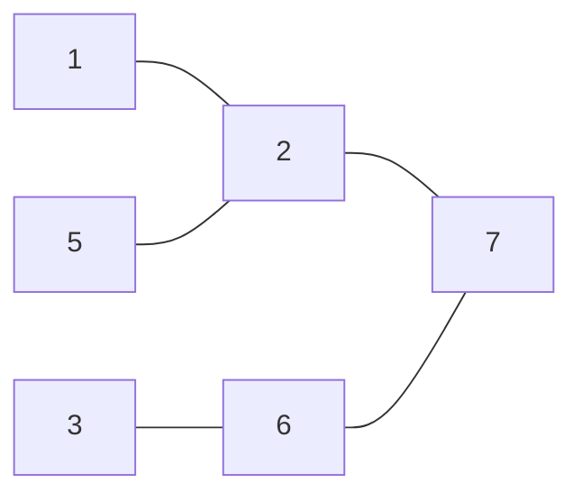
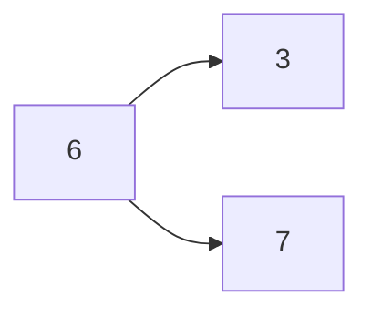
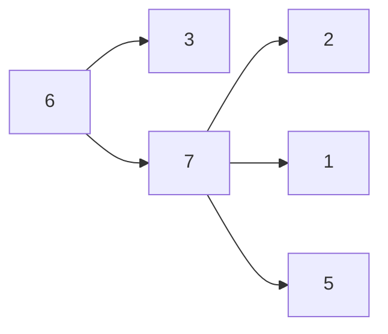
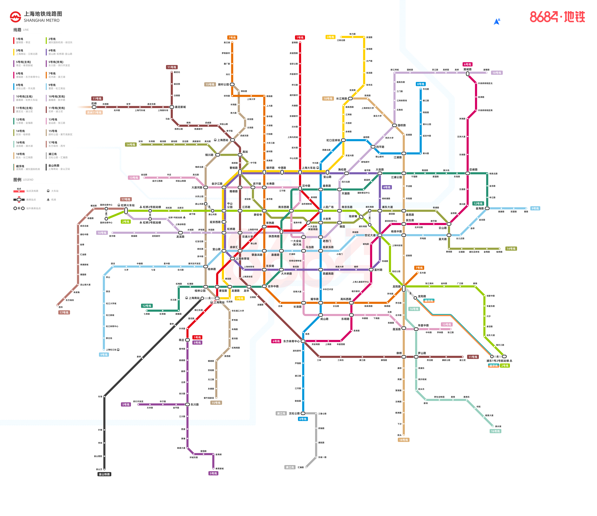

---
tags:
- Leetcode
- 生活
---

# [公交线路](https://leetcode.cn/problems/bus-routes/)

给你一个数组 routes ，表示一系列公交线路，其中每个 routes[i] 表示一条公交线路，第 i 辆公交车将会在上面循环行驶。

例如，路线 routes[0] = [1, 5, 7] 表示第 0 辆公交车会一直按序列 `1 -> 5 -> 7 -> 1 -> 5 -> 7 -> 1 -> ...` 这样的车站路线行驶。
现在从 source 车站出发（初始时不在公交车上），要前往 target 车站。 期间仅可乘坐公交车。

求出 最少乘坐的公交车数量 。如果不可能到达终点车站，返回 -1 。

## BFS

首先，题目给出的原始数据需要进行一下预处理。

我们可以先找出每个车站有哪些线路：

```python
d = {}
for i, r in enumerate(routes):
    for station in r:
        if station not in d:
            d[station] = set()
        d[station].add(i)
```

然后进行广度优先搜索：

```python
def travel(source, target):
    distance = {source: 0}  # 这个字典表示从souce到每个key的距离
    q = [source]  # 维护一个队列，表示坐公交车的堆栈
    visted = []  # 记录已经访问过的线路，避免重复访问
    while q:
        current = q.pop(0)  # 从current开始坐车
        dist = distance[current]  # 已经换乘了dist次
        for route in d[current]:  # 对于每一个可以换成的线路
            if route not in visted:  # 如果还没访问过
                for station in routes[route]:
                    # 对于每一个可以去的车站并且没去过的车站
                    if station not in distance:
                        distance[station] = dist + 1
                        q.append(station)
                visted.append(route)  # 标记为已经访问过，避免重复访问
    return distance.get(target, -1)
```

当然，我们还可以在搜索的过程中记录换乘的车站：

```python
def travel_with_path(source, target):
    distance = {source: (0, [])}  # 这个字典表示从souce到每个key的距离和路径
    q = [source]  # 维护一个队列，表示坐公交车的堆栈
    visted = []  # 记录已经访问过的线路，避免重复访问
    while q:
        current = q.pop(0)  # 从current开始坐车
        dist, path = distance[current]  # 已经换乘了dist次
        for route in d[current]:  # 对于每一个可以换成的线路
            if route not in visted:  # 如果还没访问过
                for station in routes[route]:
                    # 对于每一个可以去的车站并且没去过的车站
                    if station not in distance:
                        # 更新距离和路径
                        distance[station] = dist + 1, path + [station]
                        q.append(station)
                visted.append(route)  # 标记为已经访问过，避免重复访问
    dist, path = distance.get(target, -1)
    return dist, [source] + path
```

## 可视化

假设我们的公交线路图是这样的：



现在我们要从6站台坐车到1站台。

也就是：

```python
routes = [
    [1,2,7],
    [5,2,7],
    [3,6,7]
]
source = 6
target = 1
```

我们从6开始进行广度优先搜索：

深度为1：



深度为2:



这时候已经搜索到了目标车站，即可结束搜索。

## 上海地铁换乘



根据上面的代码，我们可以做一个简易版的上海地铁换乘。

上海有21条线路：

> 数据来自[高德api](https://map.amap.com/service/subway?_1707368894338&srhdata=3100_drw_shanghai.json)

```python
lines = {
    "1号线": [ "莘庄","外环路","莲花路","锦江乐园","上海南站","漕宝路","上海体育馆","徐家汇","衡山路","常熟路","陕西南路","一大会址·黄陂南路","人民广场","新闸路","汉中路","上海火车站","中山北路","延长路","上海马戏城","汶水路","彭浦新村","共康路","通河新村","呼兰路","共富新村","宝安公路","友谊西路","富锦路", ],
    "2号线": [ "浦东1号2号航站楼", "海天三路", "远东大道", "凌空路", "川沙", "华夏东路", "创新中路", "唐镇", "广兰路", "金科路", "张江高科", "龙阳路", "世纪公园", "上海科技馆", "世纪大道", "浦东南路(原东昌路)", "陆家嘴", "南京东路", "人民广场", "南京西路", "静安寺", "江苏路", "中山公园", "娄山关路", "威宁路", "北新泾", "淞虹路", "虹桥2号航站楼", "虹桥火车站", "国家会展中心(2号线)", ],
    "3号线": [ "江杨北路", "铁力路", "友谊路", "宝杨路", "水产路", "淞滨路", "张华浜", "淞发路", "长江南路", "殷高西路", "江湾镇", "大柏树", "赤峰路", "虹口足球场", "东宝兴路", "宝山路", "上海火车站", "中潭路", "镇坪路", "曹杨路", "金沙江路", "中山公园", "延安西路", "虹桥路", "宜山路", "漕溪路", "龙漕路", "石龙路", "上海南站", ],
    "4号线": [ "宜山路", "虹桥路", "延安西路", "中山公园", "金沙江路", "曹杨路", "镇坪路", "中潭路", "上海火车站", "宝山路", "海伦路", "临平路", "大连路", "杨树浦路", "浦东大道", "世纪大道", "向城路", "蓝村路", "塘桥", "南浦大桥", "西藏南路", "鲁班路", "大木桥路", "东安路", "上海体育场", "上海体育馆", ],
    "5号线": [ "莘庄", "春申路", "银都路", "颛桥", "北桥", "剑川路", "东川路", "江川路", "西渡", "萧塘", "奉浦大道", "环城东路", "望园路", "金海湖", "奉贤新城", ],
    "6号线": [ "东方体育中心", "灵岩南路", "上南路", "华夏西路", "高青路", "东明路", "高科西路", "临沂新村", "上海儿童医学中心", "蓝村路", "浦电路", "世纪大道", "源深体育中心", "民生路", "北洋泾路", "德平路", "云山路", "金桥路", "博兴路", "五莲路", "巨峰路", "东靖路", "五洲大道", "洲海路", "外高桥保税区南", "航津路", "外高桥保税区北", "港城路", ],
    "7号线": [ "花木路", "龙阳路", "芳华路", "锦绣路", "杨高南路", "高科西路", "云台路", "耀华路", "长清路", "后滩", "龙华中路", "东安路", "肇嘉浜路", "常熟路", "静安寺", "昌平路", "长寿路", "镇坪路", "岚皋路", "新村路", "大华三路", "行知路", "大场镇", "场中路", "上大路", "南陈路", "上海大学", "祁华路", "顾村公园", "刘行", "潘广路", "罗南新村", "美兰湖", ],
    "8号线": [ "沈杜公路", "联航路", "江月路", "浦江镇", "芦恒路", "凌兆新村", "东方体育中心", "杨思", "成山路", "耀华路", "中华艺术宫", "西藏南路", "陆家浜路", "老西门", "大世界", "人民广场", "曲阜路", "中兴路", "西藏北路", "虹口足球场", "曲阳路", "四平路", "鞍山新村", "江浦路", "黄兴路", "延吉中路", "黄兴公园", "翔殷路", "嫩江路", "市光路", ],
    "9号线": [ "曹路", "民雷路", "顾唐路", "金海路", "金吉路", "金桥", "台儿庄路", "蓝天路", "芳甸路", "杨高中路", "世纪大道", "商城路", "小南门", "陆家浜路", "马当路", "打浦桥", "嘉善路", "肇嘉浜路", "徐家汇", "宜山路", "桂林路", "漕河泾开发区", "合川路", "星中路", "七宝", "中春路", "九亭", "泗泾", "佘山", "洞泾", "松江大学城", "松江新城", "松江体育中心", "醉白池", "上海松江站", ],
    "10号线": [ "基隆路", "港城路", "高桥", "高桥西", "双江路", "国帆路", "新江湾城", "殷高东路", "三门路", "江湾体育场", "五角场", "国权路", "同济大学", "四平路", "邮电新村", "海伦路", "四川北路", "天潼路", "南京东路", "豫园", "老西门", "一大会址·新天地", "陕西南路", "上海图书馆", "交通大学", "虹桥路", "宋园路", "伊犁路", "水城路", "龙溪路", "上海动物园", "虹桥1号航站楼", "虹桥2号航站楼", "虹桥火车站", ],
    "11号线": [ "迪士尼", "康新公路", "秀沿路", "罗山路", "御桥", "康恒路", "浦三路", "三林东", "三林", "东方体育中心", "龙耀路", "云锦路", "龙华", "上海游泳馆", "徐家汇", "交通大学", "江苏路", "隆德路", "曹杨路", "枫桥路", "真如", "上海西站", "李子园", "祁连山路", "武威路", "桃浦新村", "南翔", "陈翔公路", "马陆", "嘉定新城", "上海赛车场", "昌吉东路", "上海汽车城", "安亭", "兆丰路", "光明路", "花桥", ],
    "12号线": [ "七莘路", "虹莘路", "顾戴路", "东兰路", "虹梅路", "虹漕路", "桂林公园", "漕宝路", "龙漕路", "龙华", "龙华中路", "大木桥路", "嘉善路", "陕西南路", "南京西路", "汉中路", "曲阜路", "天潼路", "国际客运中心", "提篮桥", "大连路", "江浦公园", "宁国路", "隆昌路", "爱国路", "复兴岛", "东陆路", "巨峰路", "杨高北路", "金京路", "申江路", "金海路", ],
    "13号线": [ "金运路", "金沙江西路", "丰庄", "祁连山南路", "真北路", "大渡河路", "金沙江路", "隆德路", "武宁路", "长寿路", "江宁路", "汉中路", "自然博物馆", "南京西路", "淮海中路", "一大会址·新天地", "马当路", "世博会博物馆", "世博大道", "长清路", "成山路", "东明路", "华鹏路", "下南路", "北蔡", "陈春路", "莲溪路", "华夏中路", "中科路", "学林路", "张江路", ],
    "14号线": [ "封浜", "乐秀路", "临洮路", "嘉怡路", "定边路", "真新新村", "真光路", "铜川路", "真如", "中宁路", "曹杨路", "武宁路", "武定路", "静安寺", "一大会址·黄陂南路", "大世界", "豫园", "陆家嘴", "浦东南路", "浦东大道", "源深路", "昌邑路", "歇浦路", "云山路", "蓝天路", "黄杨路", "云顺路", "浦东足球场", "金粤路", "桂桥路", ],
    "15号线": [ "顾村公园", "锦秋路", "丰翔路", "南大路", "祁安路", "古浪路", "武威东路", "上海西站", "铜川路", "梅岭北路", "大渡河路", "长风公园", "娄山关路", "红宝石路", "姚虹路", "吴中路", "桂林路", "桂林公园", "上海南站", "华东理工大学", "罗秀路", "朱梅路", "景洪路(15号线)", "景洪路(15号线)", "虹梅南路", "景西路", "曙建路", "双柏路", "元江路", "永德路", "紫竹高新区", ],
    "16号线": [ "龙阳路", "华夏中路", "罗山路", "周浦东", "鹤沙航城", "航头东", "新场", "野生动物园", "惠南", "惠南东", "书院", "临港大道", "滴水湖", ],
    "17号线": [ "虹桥火车站", "国家会展中心(17号线)", "蟠龙路", "徐盈路", "徐泾北城", "嘉松中路", "赵巷", "汇金路", "青浦新城", "漕盈路", "淀山湖大道", "朱家角", "东方绿舟", "西岑", ],
    "18号线": [ "长江南路", "殷高路", "上海财经大学", "复旦大学", "国权路", "抚顺路", "江浦路", "江浦公园", "平凉路", "丹阳路", "昌邑路", "民生路", "杨高中路", "迎春路", "龙阳路", "芳芯路", "北中路", "莲溪路", "御桥", "康桥", "周浦", "繁荣路", "沈梅路", "鹤涛路", "下沙", "航头", ],
    "磁悬浮": [ "浦东1号2号航站楼", "龙阳路"],
    "浦江线": [ "沈杜公路", "三鲁公路", "闵瑞路", "浦航路", "东城一路", "汇臻路"],
    "市域机场线": [ "虹桥2号航站楼", "中春路", "景洪路(市域机场线)", "三林南", "康桥东", "上海国际旅游度假区", "浦东1号2号航站楼", ],
}
```

我们可以计算任意两站的换乘：

```python
routes = list(lines.values())
source = "交通大学"
target = "复旦大学"
travel_with_path(source, target)
# (2, ['交通大学', '国权路', '复旦大学'])
```

上海地铁的换乘站太多了，基本任意两点都只需要换乘一次。任意两点之间最多需要换乘3次。

例如从复旦大学到北桥就需要换乘三次：

```python
source = "复旦大学"
target = "北桥"
travel_with_path(source, target)
# (4, ['复旦大学', '长江南路', '上海火车站', '莘庄', '北桥'])
```

当然，这个路线肯定不是最快的。现实世界的导航比这个复杂多了。
