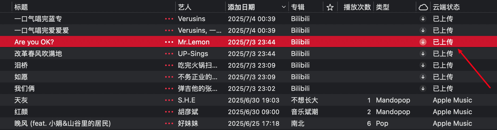
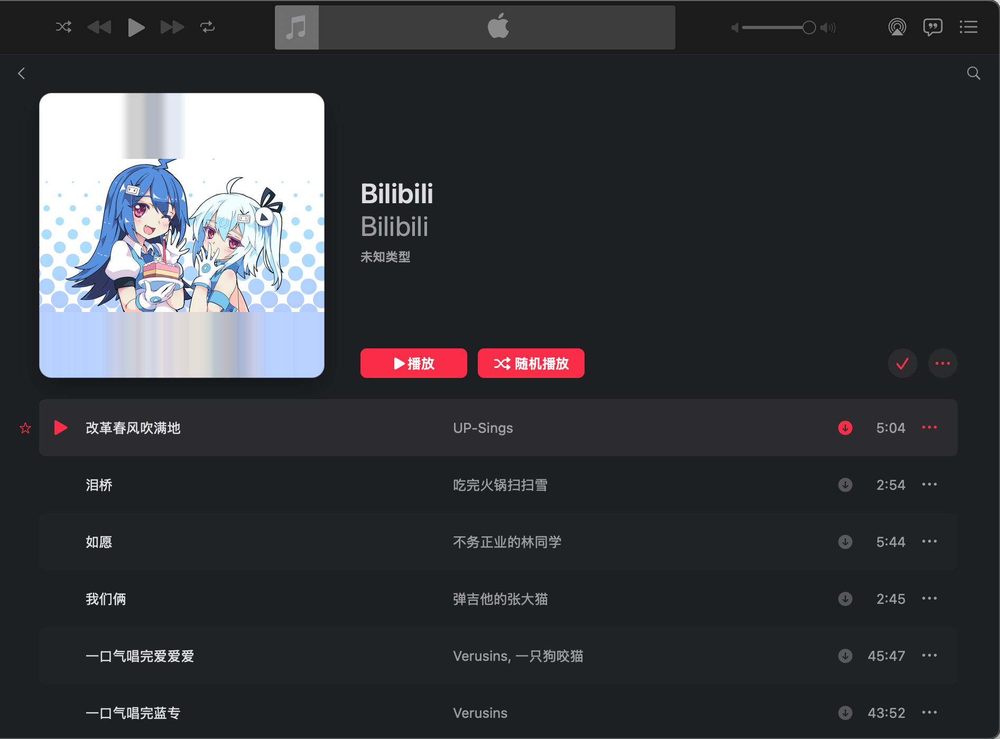
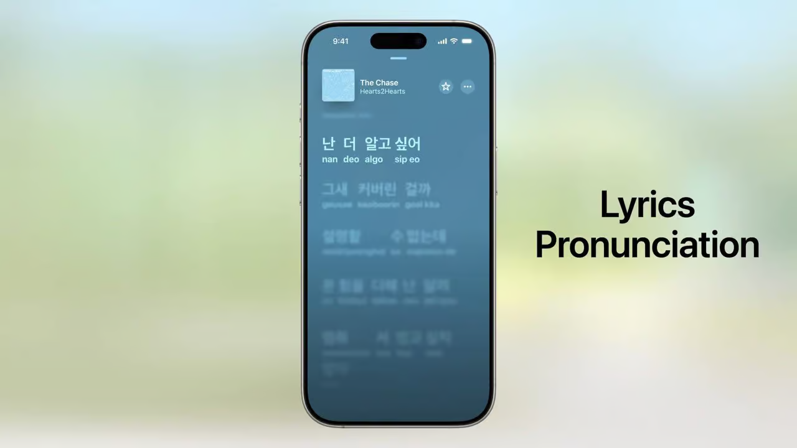

---
include:
- ai-summary
tags:
- Mac
- 音乐
title: "Apple Music"
---

# Apple Music: 真正的云音乐

Apple Music绝对是我用过的最好的音乐软件，没有之一。

它是我在全平台（iPhone、iPad、Macbook、Apple Watch、Windows、Android）的唯一指定听歌软件。

> 除非要和对象一起听歌，Apple的同播共享我还是不太喜欢

它实在是太好用了，订阅费也便宜的不像话😭

这才一个听歌软件该有的样子：

<figure markdown>

{width=250}

</figure>

一秒打开，没有弹窗、没有广告、没有视频流、<s>没有金融借贷功能</s>，只有丝滑的动画和高码率的无损歌曲。

## 致命缺点

### 曲库不全

但它有一个致命的缺点：**曲库不全**。比如你去搜《我们俩》，根本搜不到：

> 但是它好像又知道这首歌是郭顶的，很多歌都会出现类似的情况

然而你在其他平台很容易就能搜到：

职业歌手的专辑歌曲尚且如此，就更别谈各种翻唱歌手、小众歌手。

而且就算Apple Music收录了，中国大陆也不一定可以听到，很多动漫日文歌在国区都是没有的。

最后，就算你现在能听，未来也未必能听。和网易云一样，Apple Music也会经常出现被下架的**灰歌**。

### 歌词翻译

另外一个长久以来的痛点就是Apple Music里的外文歌词没有本地化翻译（更没有歌词发音这种人性化的功能）。

英文歌还好，日文歌、泰文歌、韩文歌就直接两眼一瞎了。

## 解决方案

### 云音乐

好在，和网易云类似，Apple Music可以自己上传音乐（不支持FLAC格式，最好是ALAC格式；文件大小上限未知，至少50MB完全没问题）。

不过这个功能似乎**只能在Macbook上操作**，手机上无法进行。

上传的方法也很简单，直接把音乐文件拖拽到歌曲列表就行了。上传完之后，可以手动编辑各种元信息（封面、歌词、歌手、专辑、分类等等）：

> 我就把雷总这一首经典的are you ok上传了，随时随地听一听😂

<figure markdown>

{width=300}

</figure>

然后稍等片刻就可以在其他设备上通过云端访问了：

效果还是不错的：

<figure markdown>

{width=250}

<figurecaption>Hello? Thank you!</figurecaption>
</figure>

我就上传了一堆从哔哩哔哩下载的歌，专门整理了一个专辑：

??? question "如何从哔哩哔哩下歌？"

    推荐使用：

    <figure markdown>
    
    
    
    </figure>

### 歌词的权宜之计

目前，在iPhone上有Musixmatch这个软件，用起来还可以：

Macbook上推荐使用：

<figure markdown>

</figure>

效果很不错：

### 未来更新

不过据说iOS 26上Apple Music会迎来更新，添加原生的歌词翻译和歌词发音：

Apple亲自下场，值得期待。
