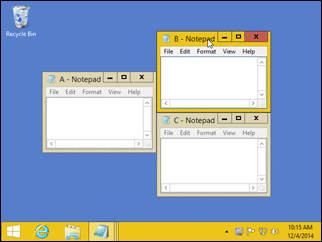
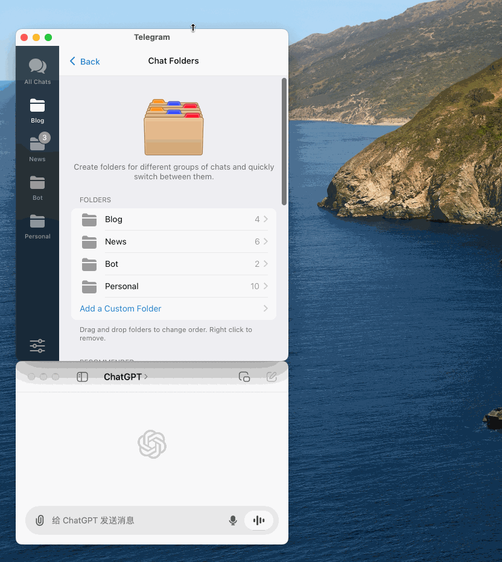
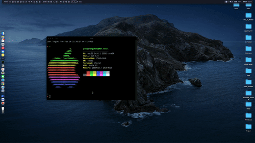

---
tags:
- Mac
- 折腾
---

# Hammerspoon

> 相关的配置文件保存在我的[dotfiles仓库](https://github.com/AIboy996/dotfiles)。

## 突发奇想

前几天突发奇想，想知道[有没有什么软件可以把两个窗口粘起来](https://www.v2ex.com/t/1069573)。

理想中大概就是实现这么一个效果：



上面这个图里的是V友说的AquaSnap，可惜只支持Windows系统。不过V友还说，如果只是特定的软件粘起来，可以试试Hammerspoon。

我琢磨了一下，实现了这样的效果：



感觉也不错！顺带还解决了快捷键分屏的一个痛点。且听我道来～

## Hammerspoon的安装

非常简单，只需要：

```bash
brew install hammerspoon --cask
```

然后打开相应的权限即可。

## 窗口同步移动

要想实现窗口的同步移动，只需要在配置文件`init.lua`中加入：

```lua title="窗口同步移动" hl_lines="10"
local function moveChatGPT()
    local targetFrame = hs.application.applicationsForBundleID(
        "ru.keepcoder.Telegram"
    )[1]:focusedWindow():frame()
    local gpt = hs.application.applicationsForBundleID(
        "com.openai.chat"
    )[1]:allWindows()[1]
    targetFrame.y = targetFrame.y + targetFrame.h
    targetFrame.h = targetFrame.h / 2
    gpt:setFrame(targetFrame)
end

local telegramWindowFilter = hs.window.filter.new(
    false
):setAppFilter('Telegram')
telegramWindowFilter:subscribe(
    hs.window.filter.windowMoved, 
    moveChatGPT
)
```

这几行代码的功能还是比较简单易懂的

- 创建`telegramWindowFilter`来确定触发的窗口
- 利用`hs.window.subscribe()`方法来订阅窗口移动的事件
- 每当窗口移动，就调用回调函数`moveChatGPT`实现窗口的同步移动
- 回调函数中先分别找到需要同步移动的窗口，然后稍作计算，最后使用`hs.window:setFrame()`接口设置窗口的位置即可

## 快捷键分屏

在Mac上的分屏我一直用的是[rectangle](https://rectangleapp.com/)。它非常好，快捷键、窗口吸附都做的很好，可以得到和Windows差不多的体验。

但是它有一个问题，在我使用[sketchybar](https://github.com/FelixKratz/SketchyBar)的时候，我会隐藏系统的任务栏。这样一来窗口管理器就会**认为屏幕是完全可用的**。
> 如果是Mac原生的、带刘海儿的显示器，还会有一个刘海的高度不可用；否则就是认为整个显示器高度都是可用的

这个时候如果把软件全屏就会把sketchybar给遮住，很烦！

而rectangle并不能调整全屏的上下边距。就算能调整也很难**对每个显示器单独设置**。

Hammerspoon完全可以做到这一点，只需要在`init.lua`里加上一个快捷键绑定即可：

```lua hl_lines="6" title="全屏快捷键"
hs.hotkey.bind({ "cmd", "shift" }, "Up", function()
    local win = hs.window.focusedWindow()
    local f = win:frame()
    local screen = win:screen()
    local max = screen:frame()
    if (hs.screen.mainScreen() == hs.screen("Redmi")) then
        notch = 35
    else
        notch = 0
    end
    f.x = max.x
    f.y = max.y + notch
    f.w = max.w
    f.h = max.h - notch
    win:setFrame(f)
end)
```

上面就进行了一个简单的判断，当前的主显示器是不是Redmi，如果是的话为全屏留下一定的宽度：



优雅！

## Airpods音量调节

我就纳了闷了，这个bug多久了，Apple就是不管。

Airpods断开重连无法记录上次调节的音量，而且默认的音量巨大无比，每次都要被炸一下。写了个自动调节：

```lua
-- 切换到AirPods Pro的时候自动调整音量
-- 不然真的要聋了
hs.audiodevice.watcher.setCallback(function()
    local now_device = hs.audiodevice.defaultEffectDevice()
    if now_device:name() == "yang的AirPods Pro" then
        hs.audiodevice.defaultOutputDevice():setVolume(25)
        hs.alert.show("已切换到yang的AirPods Pro")
    end
end)
hs.audiodevice.watcher.start()
```

TBC:Hammerspoon的更多功能有待开发。
