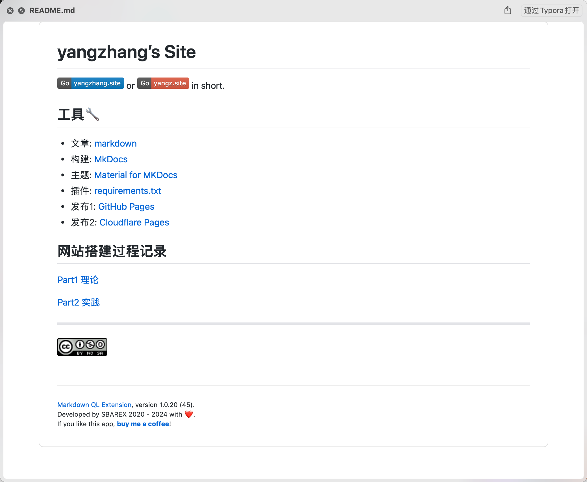
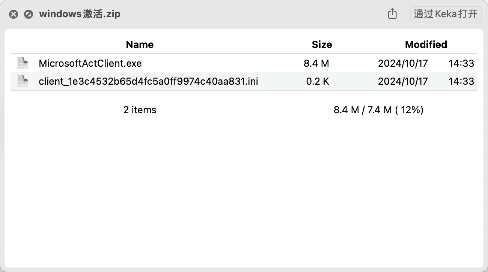
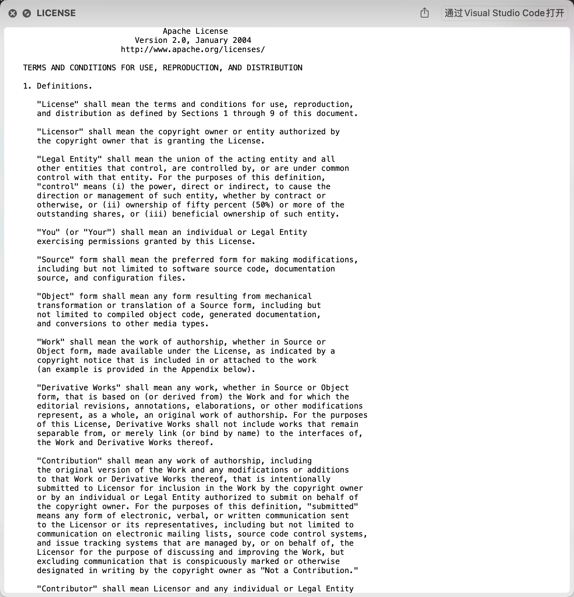

---
tags:
- Mac
---

# QuickLook

QuickLook（快速预览）是Mac上最好用的功能之一。

比如说你可以快速查看、编辑图片：

<figure markdown>

{width=400}

</figure>


然而它还不够好用，很多文件格式都不支持QuickLook。这时我们可以通过扩展插件来支持特定的文件格式。

## Markdown文件

我最常用的文档格式之一，使用qlmarkdown插件即可预览：

<figure markdown>

[](https://github.com/toland/qlmarkdown)

</figure>

安装方法：
```bash
brew install --cask qlmarkdown
```

效果：


> 主题可以自选，我这里选择了GitHub的主题

## 压缩文件
Mac上我使用的是[Keka](https://www.keka.io/en/)来压缩、解压缩文件。很好用，但是它不提供对压缩包的预览。qlZipInfo可以解决这个问题：

<figure markdown>

[](https://github.com/srirangav/qlZipInfo)

</figure>

安装方法：

    1. Create the directory ~/Library/QuickLook if it doesn't
       exist

    2. Copy qlZipInfo.qlgenerator to ~/Library/QuickLook

    3. Restart QuickLook:

       /usr/bin/qlmanage -r
       /usr/bin/qlmanage -r cache

    4. Wait a minute or two for QuickLook to properly load
       or reload qlZipInfo.qlgenerator

效果：


## 无后缀纯文本文件

例如LISCENSE、INSTALL、MAKEFILE等无后缀纯文本文件，可以使用qlstephen来预览：

<figure markdown>

[](https://github.com/whomwah/qlstephen)

</figure>

安装方法：
```bash
brew install --cask qlstephen
```

效果：


## 其他

暂时我就安装了这三个插件。

更多插件可以参考：

<figure markdown>

[](https://github.com/haokaiyang/Mac-QuickLook)

</figure>

这个仓库列举了很多QuickLook plugins

以及：

[加强你的「一指禅」：Mac QuickLook「快速预览」兼容性扩展教程](https://sspai.com/post/31927)

这篇文章也介绍了好几个插件。

你甚至可以自己写一个简单的插件，我猜想并不复杂。

例如支持zip文件预览的小插件：

<figure markdown>

[](https://github.com/richie5um/QLZip)

</figure>

代码量很小。