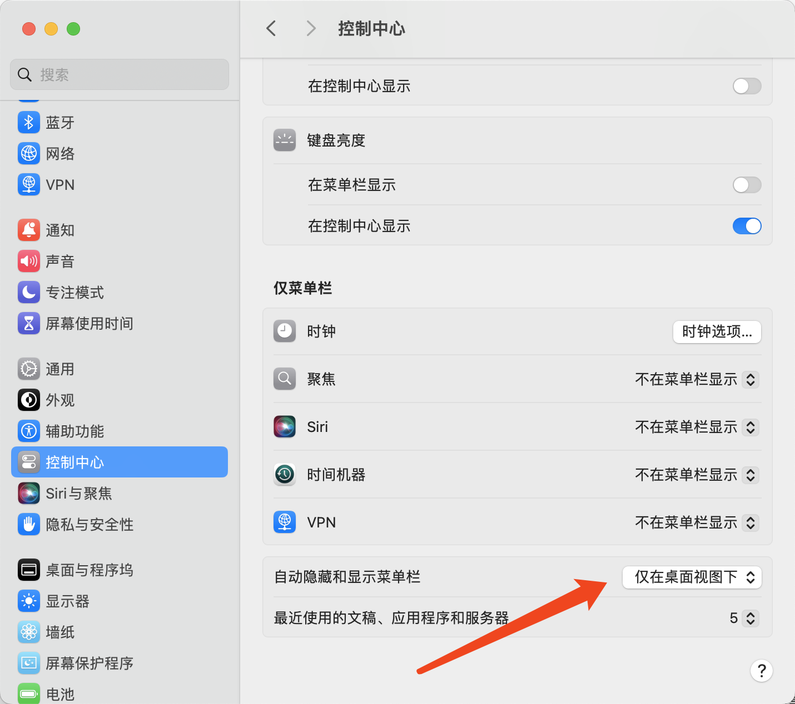
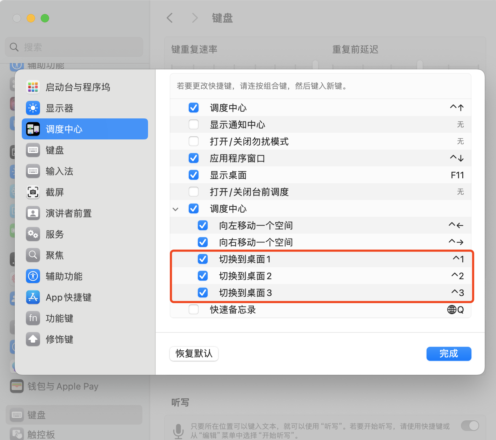
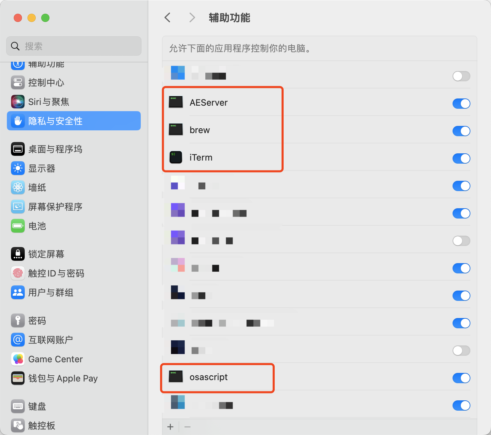
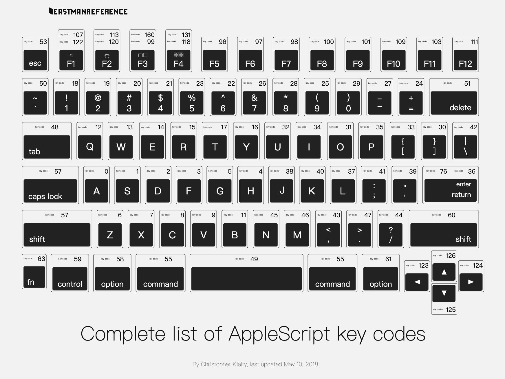
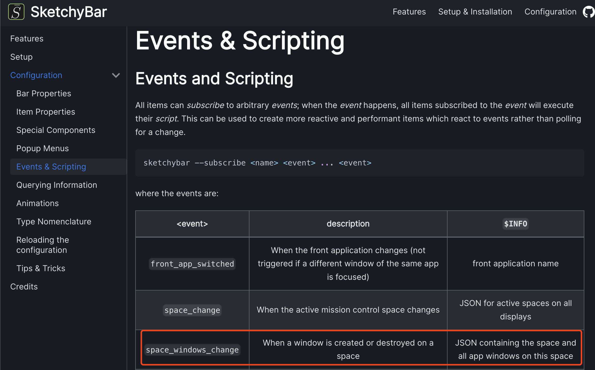

---
tags:
- Mac
- 折腾
---

# sketchybar+yabai
> 相关的配置文件保存在我的[dotfiles仓库](https://github.com/AIboy996/dotfiles)。主要参照FelixKratz的[dotfiles](https://github.com/FelixKratz/dotfiles)。

使用sketchybar+yabai来替代mac原生的菜单栏：


主要功能：

- Apple Logo（可以弹出几个菜单）
- 显示各个Desktop Spaces在运行的窗口（使用yabai实现）
- 显示当前激活的窗口标题
- 显示其他自定义内容
    - 微信、QQ通知
    - 电池
    - 日期

我自己修改的功能：

- [桌面切换](#_1)：点击的时候切换到对应的Space（使用osacript实现）
    - FelixKratz是使用yabai实现Space切换。
- [实时监听窗口变化](#_5)：有窗口变动时自动更新Desktop Spaces的内容（使用sketchybar自带的事件`space_windows_change`实现）
    - FelixKratz的模版无此功能，只有切换Space的时候才会更新。

软件的安装、启动没啥好说的。跟着官方的教程走就行了。

安装完之后可以设置Mac内置的菜单栏在桌面视图自动隐藏：


## 桌面切换

### yabai
值得一提的是，yabai虽然功能很强大，但是想要实现**切换Desktop Space**的功能需要配置Scripts Addition。

而想要开启这个SA功能个首先需要关闭MacOS的System Integrity Protection，然后才可以：
> yabai uses the macOS Mach APIs to **inject code** into Dock.app; this requires elevated (root) privileges. You can configure your user to execute yabai --load-sa as the root user without having to enter a password. To do this, we add a new configuration entry that is loaded by /etc/sudoers.

看起来就是一个非常危险的操作，我不太愿意这么干。所以我寻找了一个替代方案：osascript，这是Mac自带的脚本工具。

> osascript – execute OSA scripts (AppleScript, JavaScript, etc.)

### 开启快捷键
首先，需要开启桌面切换的快捷键：



### 给予权限

其次需要在辅助功能里打开权限（否则osascript无法模拟键盘快捷键）：



- AEServer：AppEvent Server
- brew：我的sketchybar是使用`brew services start sketchybar`启动的。
- iTerm2：我用的终端
- osascript：脚本运行软件

### 添加脚本

最后我们可以在sketchybar的配置文件里添加鼠标点击事件的回调函数：

> 这个功能原来是用yabai实现的。

```sh hl_lines="9" title="sketchybar/plugins/space.sh"
mouse_clicked() {
  if [ "$BUTTON" = "right" ]; then
    # yabai -m space --destroy $SID
    sketchybar --trigger windows_on_spaces --trigger space_change
  else
    # yabai -m space --focus $SID 2>/dev/null
    # https://eastmanreference.com/complete-list-of-applescript-key-codes
    # simulate control+18, 19, 20
    osascript -e "tell application \"System Events\" to key code $((SID+17)) using control down"
  fi
}
```

最重要的一行就是一句AppleScript，用来模拟键盘按下特定的快捷键（例如++ctrl+1++）：
```sh
osascript -e "tell application \"System Events\" to key code $((SID+17)) using control down"
```

> `key code 18`对应数字键1，更多对应关系如下：



## 实时监听窗口变化

### 效果

### 实现方法
根据官方文档sketchybar会时刻检查窗口的情况，如果有新增或者减少都会触发`space_windows_change`事件。所以我们只需要订阅这个事件即可：




主要修改的代码如下：
```bash hl_lines="9" title="items/spaces.sh"
spaces=()
for i in "${!SPACE_ICONS[@]}"; do
	sid=$(($i + 1))
	space=(
    ...
	)
	sketchybar --add space space.$sid left \
		--set space.$sid "${space[@]}" \
		--subscribe space.$sid mouse.clicked space_windows_change
done
```

```bash hl_lines="4-6" title="plugins/space.sh"
case "$SENDER" in
  "mouse.clicked") mouse_clicked
  ;;
  "space_windows_change")
  # 手动触发windows_on_spaces事件，即可实现图标的更新
  sketchybar --trigger windows_on_spaces 
  ;;
  *) update
  ;;
esac
```