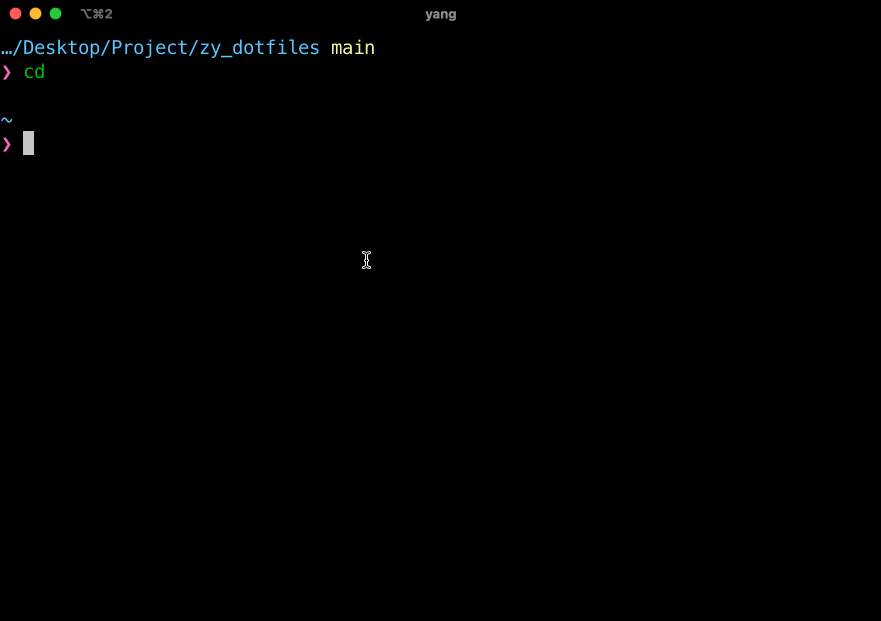

---
tags:
- Mac
- 折腾
- Shell
---

# iTerm2+zsh
> 相关的配置文件保存在我的[dotfiles仓库](https://github.com/AIboy996/dotfiles)。

zsh是Mac默认的Shell，对我已经足够好用。iTerm2则比Mac自带的Terminal要好用的多。我使用的zsh主题是[powerlevel10k](https://github.com/romkatv/powerlevel10k)，主打一个简洁：

{.nonzoom}

我还安装了很多终端工具，包括但不限于：

- [homebrew](https://brew.sh/)（Mac包管理器）
- [zoxide](https://github.com/ajeetdsouza/zoxide)（cd的上位替代）
- [neofetch](https://github.com/dylanaraps/neofetch)（显示系统信息）
- [trans-shell](https://github.com/Freed-Wu/translate-shell)（命令行翻译工具）
- ...
