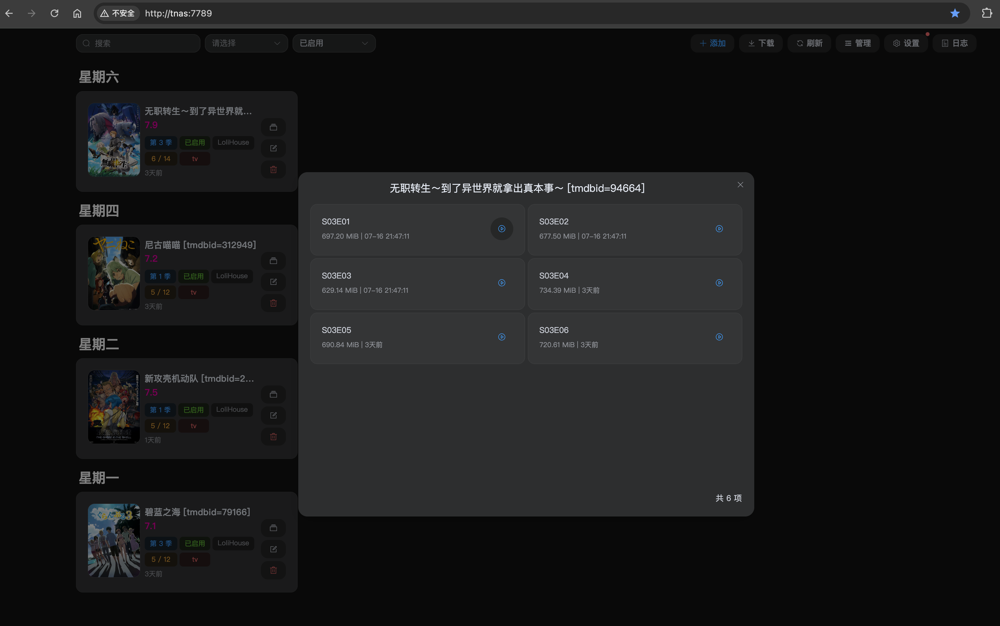
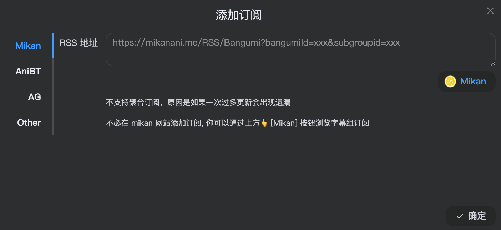
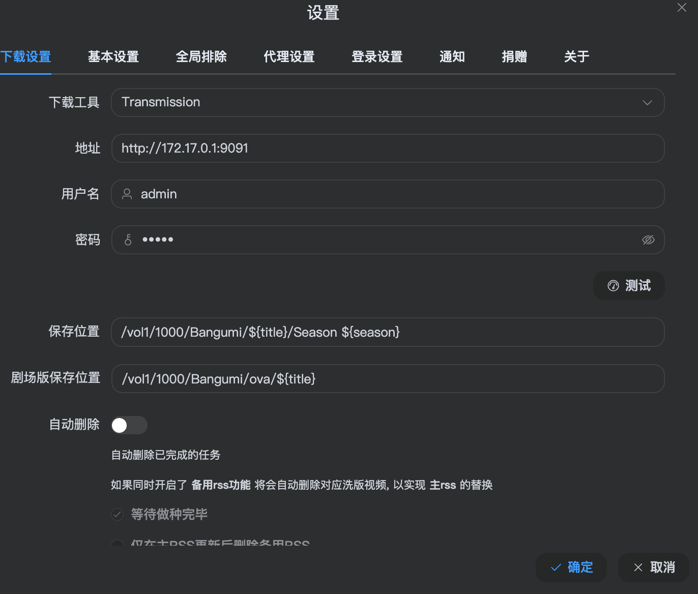
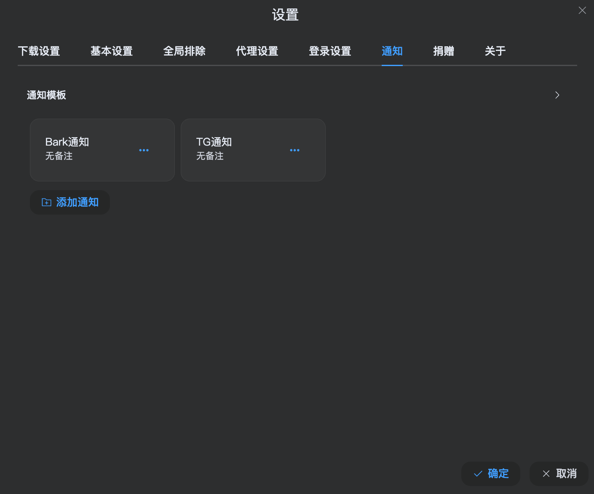

---
tags:
- NAS
- 折腾
- Docker
---

# 全自动追番

B站追番已经成为历史，现在基本只能靠社区里热心二次元不稳定地上传，追番体验非常糟糕。

既然有NAS，何不部署一套全自动追番流程呢？

## 选型

随便在网上搜了一下，大概有两个项目比较热门：

<figure markdown>

</figure>

和

<figure markdown>

</figure>

听说第二个比较轻量化，我就选了ani-rss。

## 部署

部署起来非常简单，使用Docker基本上就可以一键部署。记得要小心处理存放动漫的路径映射。因为ani-rss本身不带下载器，需要使用容器外部的下载器，所以需要格外注意路径的统一。

## 配置

容器启动之后，进入web服务就可以开始追番了。

最终效果：

> 每周字幕组发布新剧集之后就会自动下载～

### 添加订阅

如果网络环境没问题，也是一键就可以添加订阅：

如果网络有问题就需要配置代理服务器了。

### 下载服务器

别忘了添加一个种子下载服务器，ani-rss是基于rss种子订阅实现自动追番、下载的。

### 自动通知

还可以添加一个Bark通知，这样番剧更新了手机可以收到即时通知～

当然如果你喜欢telegram或者邮件通知等任何其他方式都是可以的。

完结撒花～
