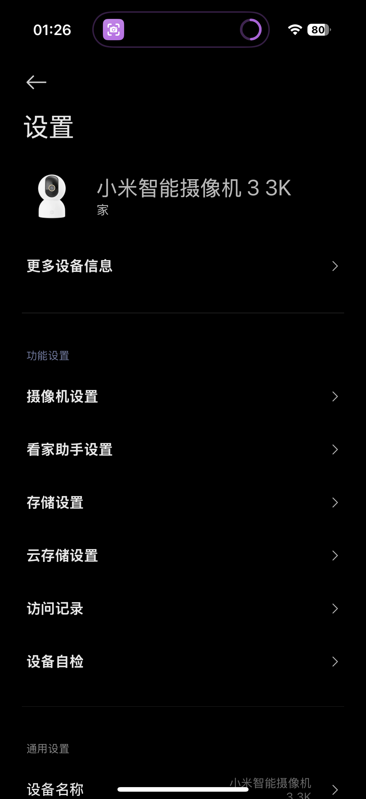
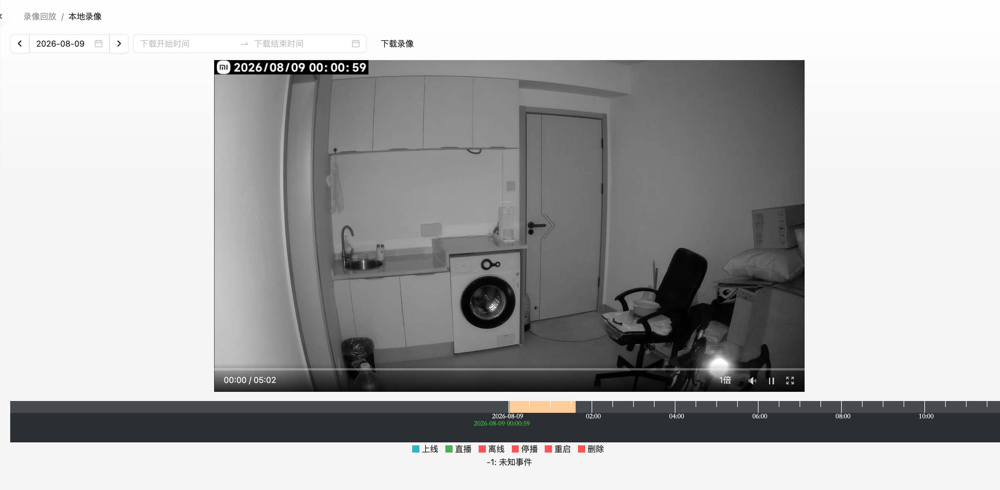

---
tags:
- NAS
- 折腾
- Docker
- 米家
---

# 米家监控录像

是的，我买了台 *小米智能摄像机 3 3K*，放在出租屋里正对着我那不堪一击的入户门。一个人住总感觉这样才能安心点。

<figure markdown>

{width=200}

</figure>

这款米家摄像头优点是颜值高、有云台、可以无缝接入米家APP、可以在**公网随时查看家里的情况**。

缺点就是使用**封闭协议**，无法轻易使用NAS进行视频录制。

## 鸡肋的本机录制

我买的这款摄像头（或者说大部分米家摄像头）都有三种录像方式：

1. 米家云存储，需要付费使用
2. 本地microSD卡录制，大概16GB可以录制一整天的视频
3. NAS网络存储，听起来非常牛，实际上鸡肋的一B
    - 必须要插入SD卡才能用这个功能
    - 本质上是定期把SD卡里的内容通过SMB协议传输到NAS服务器
    - 存储过去视频比较杂乱，不好回看

综上，我只能自己想办法录像了。

## 录像机软件选型

市面上有非常多摄像机录像软件，我选的是功能比较简单的EasyNVR：

<figure markdown>

</figure>

我还听说过一个更全面，带各种AI功能的Frigate：

<figure markdown>

</figure>

## 米家摄像头视频流捕获

米家摄像头的视频流使用自家的封闭协议进行传输，不开放给用户进行捕获。不像TPlink、海康威视等其他牌子的摄像头，直接一个ip就可以拿到视频流了。不过方法总比困难多，前辈们早就搞定了这个问题：

<figure markdown>

</figure>

这个项目可以通过**米家APP的接口**（我也是猜测，因为它需要在go2rtc的配置文件中填入米家账号的cookie），来捕获视频流，并且转换成NVR录像软件可以识别的RTSP、RTMP等通用视频流协议。

## 完全体

通过上述两个软件的配合终于可以实现录像自由了：

虽然我也不知道这有什么用，或许等我养了小猫就可以拍到许多有趣的画面了。
