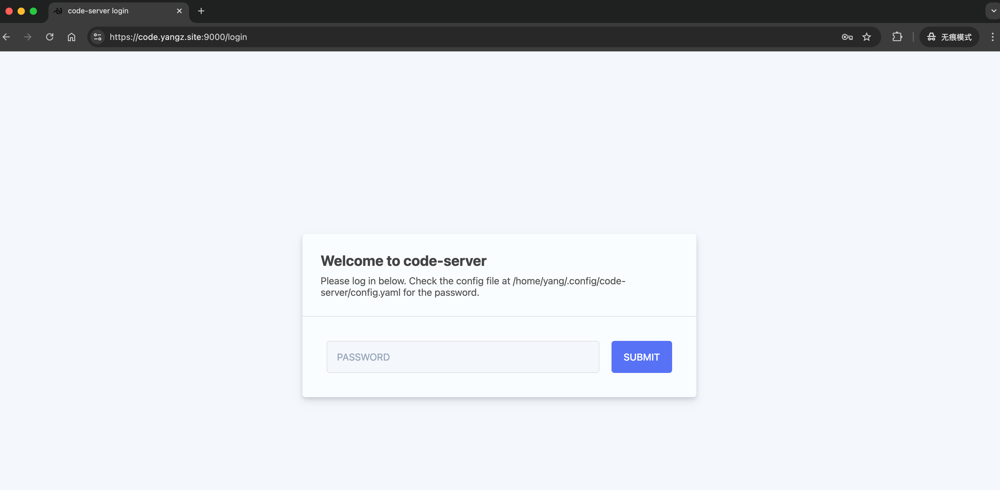

---
tags:
- NAS
- 折腾
---

# 在线VSCode

vscode是最受欢迎的代码编辑器之一，也是我用的最多的编辑器。

它之所以这么流行，一方面是因为比较轻量化（相比JetBrains系列），另一方面是因为它全平台兼容（基于electron，使用node.js），甚至可以在浏览器里运行。

你可以直接去<https://vscode.dev>体验在线vscode。

## code-server

既然可以在浏览器访问，那我就不得不在自己的NAS上部署一下了。

项目是开源的：

<figure markdown>

[](https://github.com/coder/code-server)

</figure>

最开始我尝试在我的Windows 10上直接部署code-server。由于官方不提供Windows的发行版，只能通过npm安装、本地编译。我弄来弄去都无法解决npm的兼容性问题。

> npm绝对是最毒瘤的包管理器，node.js的社区绝对是最鱼龙混杂的开源社区

无奈，只能转移到wsl里面。下载官方发行的deb包，一键安装，一键启动。

```bash
# 下载
wget https://github.com/coder/code-server/releases/download/v4.99.3/code-server_4.99.3_amd64.deb
# 安装
dpkg -i "./code-server_4.99.3_amd64.deb"
# 启动
code-server --port 8888
```

启动之后命令行会提示配置文件的位置，里面写了初始密码。

然后就可以去对应的网址访问啦：



体验和<https://vscode.dev>别无二致。

## 踩坑

有几个小坑。

### nginx配置

如果你用nginx把code-server转发到公网，可能会遇到[这个问题](https://github.com/coder/code-server/issues/6038)：


> This workbench failed to connect to the server.

后台报错是一堆js找不到：
```text
File not found: /usr/lib/code-server/lib/vscode/extensions/emmet/dist/browser/emmetBrowserMain.js
File not found: /usr/lib/code-server/lib/vscode/extensions/git-base/dist/browser/extension.js
File not found: /usr/lib/code-server/lib/vscode/extensions/merge-conflict/dist/browser/mergeConflictMain.js
```

解决方案是在配置文件中加上：

```text
proxy_set_header X-Forwarded-Host $host:$server_port;
```

也就是说完整的配置文件可能是：

```text hl_lines="12"
server {
    # code server
    listen PORT ssl;
    server_name HOST_NAME;
    ssl_certificate CER_PATH;
    ssl_certificate_key KEY_PATH;
    location / {
        proxy_pass http://127.0.0.1:8888;
        proxy_set_header X-Real-IP $remote_addr;
        proxy_set_header X-Forwarded-For $proxy_add_x_forwarded_for;
        proxy_set_header X-Forwarded-Proto $scheme;
        proxy_set_header X-Forwarded-Host $host:$server_port; 
        proxy_connect_timeout 300;
        proxy_http_version 1.1;
        proxy_set_header Host $host;
        proxy_set_header Upgrade $http_upgrade;
        proxy_set_header Connection upgrade;
        proxy_set_header Accept-Encoding gzip;
    }
}
```

### 远程复制图片

如果要在code-server中使用[Paste Image](https://marketplace.visualstudio.com/items?itemName=mushan.vscode-paste-image)这种插件，需要额外安装`xclip`：

```bash
sudo apt install xclip
```

这样就可以把图片远程复制过去啦。


## 小结

部署一个code-server可以随时随地写代码还是很爽的，iPad+妙控键盘说不定真能是生产力了。

并且我发现，如果你在code-server上运行一个服务，然后把网页关掉。服务还是会一直在，例如你可以跑一个`mkdocs serve`。

所以现在我的网站会开放一个**预览版本**：[dev.yangz.site](https://dev.yangz.site:9000)，会实时更新未提交的草稿内容。
