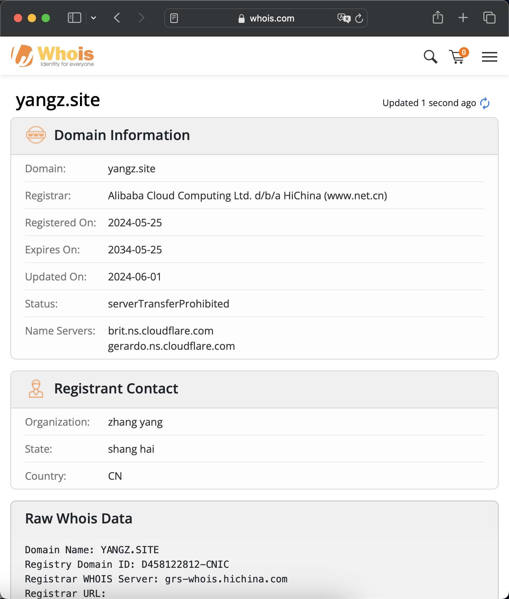

---
tags:
- NAS
- 折腾
- 计算机网络
---

# 域名两三事

## 什么是域名

### URL
既然你能看到这个页面，那么你肯定知道什么是网址（URL），通常来说：

```
URL = 协议+子域名+二级域名+顶级域+路径
```

例如下面的网址：
```
https://bilibili.yangz.site/legacy.html
```
就有

- 协议（protocol）：`https`
- 子域名（subdomain）：`bilibili`
- 二级域名（domain）：`yangz`
- 顶级域名（TLD，top level domain）：`site`
- 路径（path）：`/legacy.html`

通常我们所说的域名就是二级域名+TLD的组合，例如`yangzhang.site`。

### TLD

#### TLD的作用

TLD 在 DNS 查找过程中发挥着重要作用。对于所有未缓存的请求，例如当用户在浏览器窗口中输入`google.com`之类的域名时，**DNS 解析器**会通过与 **TLD 服务器**通信来开始搜索。在这种情况下，TLD 是`.com`，因此解析器将联系 TLD DNS 服务器，然后向解析器提供 Google 源服务器的 IP 地址。

TLD 的另一个目的是帮助分类和传达域名的目的。每个 TLD 都会透露出一些关于它前面的域的信息；例如：

- `.com`用于商业企业。
- `.gov`用于美国政府实体。
- `.uk`用于来自英国的域。

#### TLD的分类

- APRA：Address and Routing Parameter Area（`.apra`）
- gTLD：Generic top-level domains（`.com`）
- sTLD：Sponsored top-level domains（`.aero`）
- ccTLD：country-code top-level domains（`.cn`）
    - IDN ccTLD：Internationalized country code top-level domains（`.ไทย	`）
- tTLD：Test top-level domains（`.test`）

!!! info "ccTLD"
    所有两个字母的TLD都是ccTLD，常见的如：

    - `.cn`：中国
    - `.uk`：英国
    - `.jp`：日本
    - `.hk`：中国香港
    - `.us`：英国
    - `.ai`：Anguilla（英国海外领土）
    - `.io`：British Indian Ocean Territory（英属印度洋领地）
    - `.is`：冰岛
    - `.it`：意大利

#### 谁拥有TLD

互联网名称与数字地址分配机构 (**ICANN**) 对互联网上使用的所有 TLD 拥有权力，并将这些 TLD 的责任委托给各个组织。例如，一家名为 VeriSign 的美国公司运营着所有的`.com`和`.net`TLD。

## 域名能干什么

### 好记
其实没域名也能行，网络世界只需要ip就够了。域名更多是为了便于人类记忆。例如：<https://time.is>这个网站，就可以查看世界时钟。巧妙的域名组合能极大提高网站的知名度。

不仅仅是`http`服务器，`ftp`、`smtp`等其他服务器也可以使用域名。例如你可以通过<mailto:mail@yangzhang.site>给我发邮件。

### 官方认证
很多时候域名是一个公司最基本的资产。例如`qq.com`、`baidu.com`，大家看到这些域名就知道是哪个公司的网址。

再比如`gov.cn`、`fudan.edu.cn`，这样的官方域名就是权威的代表。

可以说域名就是**互联网世界的官方认证**。

### 负载均衡
域名-IP之间可以实现一对多，例如`github.com`一个域名会对应多台服务器的IP，这样可以把访问均匀分配到各个服务器，提高负载量。

### 理财
是的，如果你注册到了很靓仔的域名，说不定会有人高价买入。或者你恰好注册到了某家公司的域名，他们为了品牌保护说不定也会买走。

忘记在哪看到了，有一个人注册了`a.coffee`这个二级域名，所有者发了一个帖子说，他在出售：`buy.somebody.a.coffee`这些子域名。

### 我的域名
我持有`yangz.site`和`yangzhang.site`两个域名。有如下的DNS记录：

- 本站的主网址是：<https://yangzhang.site>，短网址是：<https://yangz.site>（会被302到主网址）。
- 我写的哔哩哔哩开屏插画Gallery：<https://bilibili.yangz.site>
- 我写的PyScript小demo：<https://plt.yangz.site>
- 给我发邮件：<mailto:mail@yangzhang.site>

你可以去<https://whois.com>查询域名的注册信息：


## 如何管理域名

### 注册

选好自己想要的域名，然后交钱就行了。国内的阿里云、腾讯云都有域名售卖域名的服务。国外的Cloudflare等也有售卖。

### DNS解析

通常，售卖域名的平台都会提供免费的DNS解析服务。只需要按照他们的提示操作即可。举例来说，Cloudflare的DNS服务可以添加以下几类DNS记录：

- A 记录 - 保存域的 IP 地址的记录。
- AAAA 记录 - 包含域的 IPv6 地址的记录（与 A 记录相反，A 记录列出的是 IPv4 地址）。
- CNAME 记录 - 将一个域或子域转发到另一个域，不提供 IP 地址。
- MX 记录 - 将邮件定向到电子邮件服务器。
- TXT 记录 - 可让管理员在记录中存储文本注释。这些记录通常用于电子邮件安全。
- NS 记录 - 存储 DNS 条目的名称服务器。
- SOA 记录 - 存储域的管理信息。
- SRV 记录 - 指定用于特定服务的端口。
- PTR 记录 - 在反向查询中提供域名。