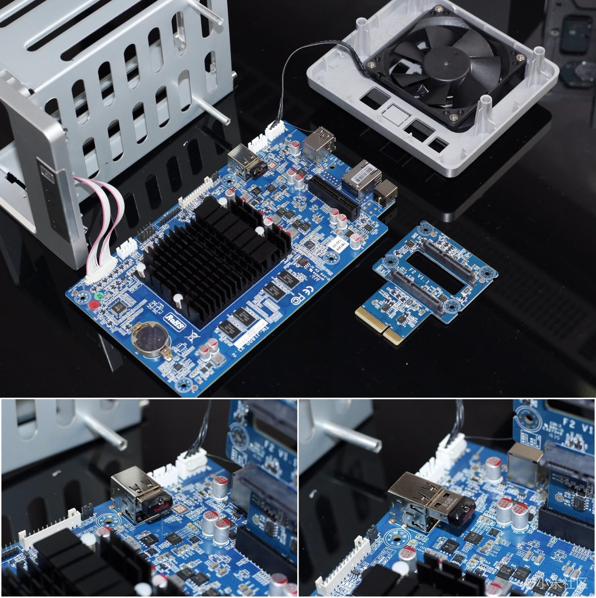

---
tags:
- NAS
- 折腾
- Docker
include:
- ai-summary
---

# 飞牛OS

> 飞牛fnOS是由骨灰级玩家团队倾心打造的NAS系统，融合AI本地端模型，致力于为家庭和企业提供高效、安全的存储解决方案.

实际上飞牛就是一个基于Debian发行版二次开发的Linux系统。我把它安装在了我的铁威马F2-220上，体验很不错！

## 观前提示

!!! warning
    注意，飞牛目前是**闭源免费**的，目前最新的**公测版本号**为`0.9.35`。

    也就是说，在可以预期的未来它会结束公测，进入1.0版本之后很有可能成为一个付费系统。

然而即使飞牛闭源，还有随时有可能跑路、收费。

但它实在是太好用了，在低配机器上的丝滑体验，外加开箱即用的**下载**、**备份**、**网盘挂载**、**影视**、**相册**、**Docker**等等功能。甚至还有专门的多平台移动端APP。

实在是太香了，值得我铤而走险一把。

## 安装

由于飞牛就是一个Linux发行版，所以安装起来非常简单，大多数硬件都可以直接驱动。

社区里也有人专门开发驱动，例如我见过一个哥们给绿联NAS的前面板LED灯开发了一个驱动：

<figure markdown>

</figure>

太有活了：

可惜F2-220实在是太小众了，大概是等不到驱动了。

### 傻瓜安装

飞牛官方写了一个安装指导：[如何安装和初始化飞牛 fnOS？](https://help.fnnas.com/articles/fnosV1/start/install-os.md)

简单来说就是三步走：

- 下载系统镜像（==需要一台电脑==）
- 制作引导U盘（==需要一块U盘==）
- 从引导U盘启动，刷入系统（==需要显示器和键鼠==）

安装完之后系统就会进入下面的状态：

可以进入Web端进行可视化配置。

### F2-220无显示器安装

上述安装过程其实比较基础，有折腾经验的小伙伴很快就可以搞定。

不过我的铁威马F2-220**无法连接显示器**，因此只能另寻出路。

??? question "真没法连显示器吗？"
    实际上F2-220的主板上是有视频信号接口的，处理器Intel® Celeron® J1800也有核显，不过主板上的针脚空在那里，没有给连接线：

    <figure markdown>
    
    
    
    <figurecaption>主板上的VGA_H接口，图源[网络](https://post.smzdm.com/p/583388/)</figurecaption>
    </figure>

    如果你有对应的连接线可以试一试。

我猜想，既然飞牛OS就是一个定制化的Linux系统，那它应该包含了常见的驱动，可以**刷在移动硬盘上**变成一个即插即用的系统。

于是，我把F2-220上自带的引导U盘拔掉：

<figure markdown>

{width=400}

<figurecaption>F2-220拆机，图源[网络](https://www.sohu.com/a/118594824_216580) 图中的小U盘就是TOS的引导盘</figurecaption>
</figure>

然后找了一台笔记本，把飞牛OS刷到一个移动硬盘里；最后把刷好系统的硬盘连到F2-220上，开机，等待片刻果然成功进系统了。

!!! info "记得提前配置好网络！"
    由于我们没有显示器，没法在进入飞牛OS之后配置网络。因此需要提前把网络配置好。

    所幸，**网络基本是和网卡绑定的**。我们只需要把网卡连接到路由器，然后找到对应的MAC地址，提前给它分配一个静态IP就可以了。这样飞牛OS启动之后就可以直接通过网卡上网了。

## 配置

### 存储

请看：

- [如何创建存储空间](https://help.fnnas.com/articles/fnosV1/volume/create.md)
    - fnOS 共支持 Btrfs、ZFS 和 ext4 这 3 种 NAS 上主流的文件系统
    - 对ZFS的支持是`0.9.32`版本才加入的，要用的朋友记得升级系统～
- [如何使用SSD缓存加速](https://help.fnnas.com/articles/fnosV1/volume/ssd_cache.md)
    - 当然，F2-220作为低配NAS没有SSD盘位

### 预装应用

飞牛预装了一些基础的应用，都挺实用：

- 备份
    - 可以实现飞牛（本地或者另外一台飞牛NAS）、网盘（百度云、阿里云）、文件服务器（SMB、FTP、web dav）等多个文件空间之间的**加密同步备份**
- 下载
    - 封装了aria2和qbitorrent两个下载器，**直链和种子**下载都支持
- Docker
    - 支持容器、镜像、网络等资源的可视化管理
    - 支持Docker Compose
    - 也支持在命令行直接操作docker（需要sudo
- 日志
- 文件管理
    - 支持应用级别的权限管理
    - 支持**远程文件夹挂载**，包括各种协议的文件服务器（SMB、WebDAV、FTP、NFS）以及各家网盘（百度、阿里、115、夸克、123、OneDrive）
    - 支持文件直链分享（如果你有DDNS的话

### 应用商店

除了上述预装软件，飞牛还有一个应用商店。`0.9.29`版本，飞牛官方出品的应用如下：

目前还是比较简陋的，和群晖这样成熟的系统比不了，但对我来说也够用！

- 其中**飞牛影视**和**飞牛相册**都做的非常好，完全达到了可用的程度。
    - 飞牛影视不仅可以读取本地磁盘上的影视文件，还可以直接读取挂载在本地的网盘文件，然后**从网盘直链播放**，非常强大！刮削的效果也不错，准确度非常高。并且在多平台都有客户端可以用，很丝滑～
    - 飞牛相册做的也不错，可以直接读取RAW图片，用起来很丝滑，在飞牛APP里可以直接打开～

我已经用他们替代了Jellyfin和Photoprism。

??? question "这能替代吗？"
    其实我也不想替代，主要是在飞牛应用商店里直接安装的版本基本不可用（来自[矿神SPK](https://spk7.imnks.com/)等第三方）。

    Docker容器的版本性能又不太行，尤其是Photoprism，很卡。相比之下，飞牛自己做的倒是丝滑很多。我一次性导入了两千多张RAW图片，也没卡死。

- 飞牛同步我没怎么用，没有这方面的需求。
- 文本编辑器和Office预览都是飞牛文件管理器的插件，安装之后可以在文件管理器里可视化地编辑对应的文件。
- 文件快照、虚拟机、百度网盘这三个我没用过。
    - F2-220的配置比较垃圾，我加了一块2GB的低压DDR3内存才能不爆；J1800这CPU性能实在是太累弱了，虚拟机估计是开不动的

!!! info
    最近飞牛更新了iSCSI功能，请看[iSCSI 基础功能介绍](https://help.fnnas.com/articles/fnosV1/iscsi/iscsi-create.md)。

## 多端应用

飞牛还有一大特色就是它针对多平台开发的客户端矩阵。包括

- 飞牛Web
- 飞牛APP
- 飞牛播放器APP
- 飞牛TV
- 飞牛同步

### Web

web端是飞牛最基本的入口，只要你有浏览器就可以访问，你可以在这里完成所有的配置。

### 移动端

飞牛APP支持iOS和Android，和Web端功能基本一致。iOS客户端做的非常丝滑，相册、影视、Docker等子页面都很好使。配置了DDNS之后可以随时随地打开，很方便～

    
    
    
    

### 其他

- 飞牛播放器APP
    - 飞牛播放器就是给飞牛影视专门做的独立客户端，其实和飞牛APP里的影视子页面差不多，用起来还不错。
- 飞牛TV
    - 没用过
    - 
- 飞牛同步
    - 没用过
    - 
