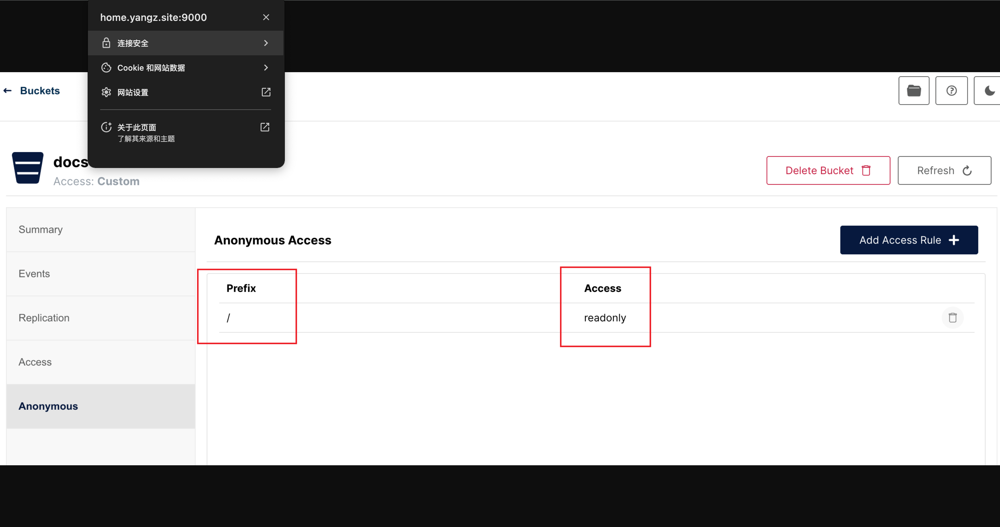

---
tags:
- NAS
- 折腾
- 计算机网络
---

# SSL/TLS证书

为了确保自建图床在https网页上能正常工作，自建图床本身也需要支持SSL/TLS加密。

## 踩坑

本来以为很简单，但是折腾了好久才搞定。

最开始我直接从CloudFlare上生成了一对，虽然也能成功开启SSL加密，但是这个证书在Chrome上不被信任。图床也就无法正常加载了。


## acme.sh

折腾了好久，还是没搞定。最终我还是放弃CloudFlare的证书了。

听说[acme.sh](https://github.com/acmesh-official/acme.sh)很好用，我试了试，果然是神！！

### acme的安装

在Mac上比较简单；在Windows上需要提前用Cygwin安装好`curl, openssl, crontab`。

然后用脚本安装：

```bash
curl https://get.acme.sh | sh -s email=my@example.com
```

### 配置

我的域名是放在CloudFlare上解析的，所以需要配置一下Token方便acme在获取证书的过程中能够写入DNS记录。

在CloudFlare上创建一个可以编辑DNS记录的 API Token ，然后将 API Token 写入 `~/.acme.sh/account.conf` 文件中：

```text
CF_Token="your_cloudflare_api_token"
CF_Account_ID="your_cloudflare_account_id" # 可选
```

### 签发证书

```bash title="修改默认ca为letsencrypt"
acme.sh --set-default-ca --server letsencrypt
```

```bash title="生成证书"
acme.sh --issue --dns dns_cf -d home.yangz.site --ecc
```

!!! info "多域名"
    如果是多个域名可以分别申请（多个证书文件）：
    ```bash
    acme.sh --issue --standalone -d a.example.com -d b.example.com -d c.example.com
    ```
    也可以一起申请（一个证书文件）：
    ```bash
    acme.sh --issue -d a.example.com -d b.example.com -d c.example.com
    ```

生成证书的过程比较漫长，大概分为下面几个步骤：

1. 使用邮箱（或许是）注册一个ID
2. 使用DNS的api token来验证域名的所有权
    - 先添加一个Text DNS记录
    - 然后再删掉
3. 生成证书

### 安装证书

```bash
acme.sh --install-cert -d home.yangz.site \
--key-file       ~/Desktop/key.pem  \
--cert-file      ~/Desktop/cert.pem \
--reloadcmd     'cmd /c "C:/Users/yangz/Downloads/nginx-1.26.3/restart.bat"'
```

在Windows平台上，重启nginx服务比较麻烦，我从网上找了个脚本：

```bat title="重启nginx"
@ECHO OFF
cd "C:/Users/yangz/Downloads/nginx-1.26.3/"
taskkill /f /IM nginx.exe
start nginx
EXIT
```

安装证书完成之后，acme会用crontab注册一个自动化任务，每当证书过期就会自动续签。

### 证书续签

当然也可以手动续签：

```bash
acme.sh --renew -d home.yangz.site --force --ecc
```

### 效果展示

小锁🔒终于是加上了：



<figure markdown>

{width=400}

</figure>
