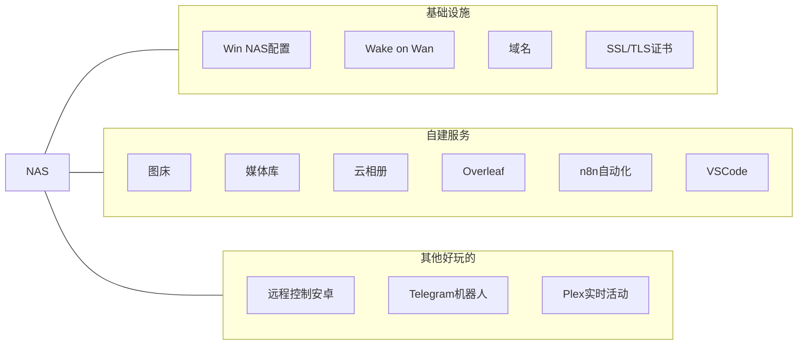
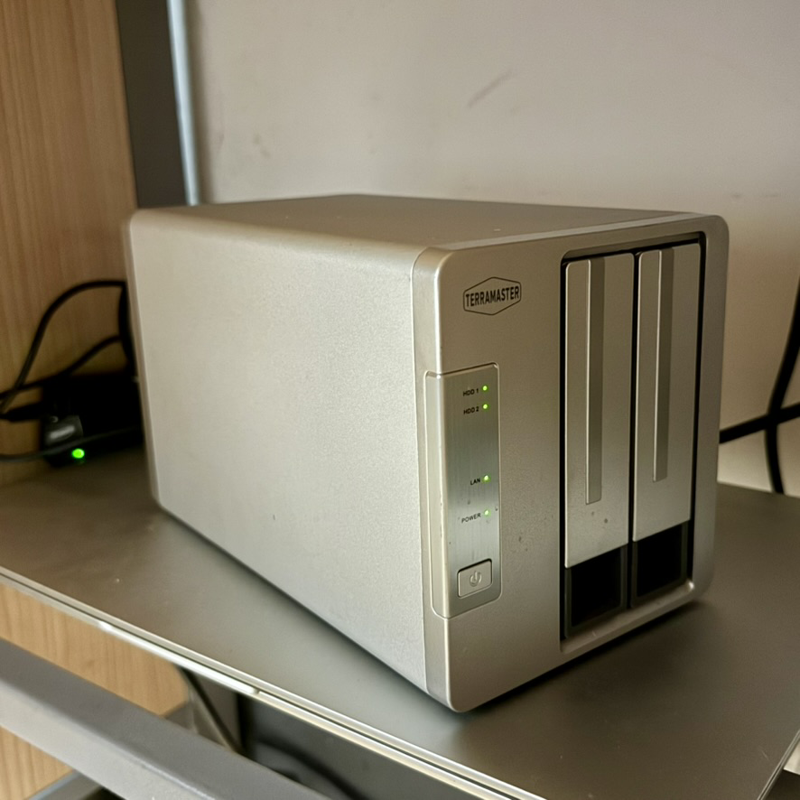

---
tags:
- NAS
- 折腾
---

# NAS编年史

> 倒叙，NAS i.e. Network Attached Storage

已折腾：

## 4.0时代

手痒了，又买了一台品牌NAS，这次充分吸取了群晖220j的教训，买的是x86架构、2GB内存的**铁威马F2-220**（不是221哦）：

<figure markdown>

{width=500}

<figurecaption>男生自用88新</figurecaption>
</figure>

这下终于可以摆脱“尿袋式”硬盘盒了，双盘位刚好放两张4TB的机械盘，短期应该是够用了。铁威马不如群晖，也不如Windows和Linux，但也够用了。有一些基础的套件，还可以跑Docker～

### 4.2

用上了新潮的飞牛OS，铁威马F2-220原装没有系统盘、只有一个引导U盘。而飞牛是基于Linux的，必须把系统装在硬盘上。于是我只能有外挂了一个硬盘盒专门放飞牛系统。安装完之后体验了几周，系统丝滑得很，比铁威马那个TNAS系统好用多了。甚至还有多平台的手机APP。爽！

### 4.1

用了一段时间铁威马自带的系统，能用但是忒卡了。还是最终放弃了，转向飞牛OS。

## 3.0时代

这个时代的NAS就是我换下来的荣耀Windows笔记本，续航血崩但是性能还行（i5-8265U + NV GeForce MX250）。外接<s>俩</s>机械硬盘，当个NAS绰绰有余！

<figure markdown>

{width=500}

<figurecaption>灰是真的大</figurecaption>
</figure>

### 3.3

彻彻底底地remake，[换回了原生的Windows系统](./windows.md)（为此，我把之前在ext4磁盘上所有的数据都抹掉了😭😭），希望NTFS稳定一些。

### 3.2

这次终于实践了我很久以前就想做的事情：刷一个PVE，玩一玩All in One

然而事实证明，`all in one = all in boom`，很快PVE直接挂掉了，我的所有虚拟机毁于一旦，g

### 3.1

这个时期用的系统是Ubuntu，主面板是[CasaOS](https://casaos.io/)

用了一年多两年不到，Docker出了一些问题，磁盘也有些小毛病。于是下定决心remake了

## 2.0时代

后来一段时间我的NAS就是一台Surface go，用一个USB hub吊着几个硬盘，用起来非常蛋疼。

由于它的磁吸充电口坏掉了，所以机身上仅存的一个USB C接口承担了巨多功能。尤其是装系统的时候，需要电源+键盘+鼠标。用我手边的扩展坞接上这些设备需要连成长龙：

<figure markdown>

{width=500}

<figurecaption>大概就是这么个造型</figurecaption>

</figure>

一开始我给它装上了Ubuntu系统，后来为了充分利用触摸屏又换成了Fedora系统（真的很好用！）。

不过由于io接口太过缺少，这个时代的NAS也没有坚持太久，一年差不多我就受不了了。

## 1.0时代

之前玩过群晖的220j，那个ARM芯片真的性能捉急-_-

稍微有一个大动作（比如下载了一个剧集，Plex扫描一下）就会卡死。于是咸鱼来的很快就咸鱼走掉了。

<figure markdown>

{width=300}

<figurecaption>塑料感拉满了</figurecaption>
</figure>

但是不得不说，群晖毕竟是专业的，用起来很省心~

## 0.0时代

这个时期我就在自己的主力机上下载资源，架设Media Server，需要用的时候就打开。

长此以往太过麻烦，无法全天候在线否则资源消耗太严重，遂开始筹备单独的NAS设备。
