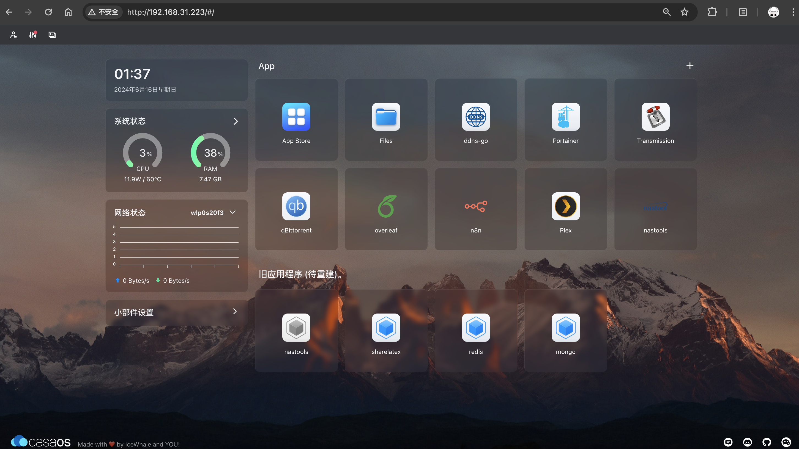
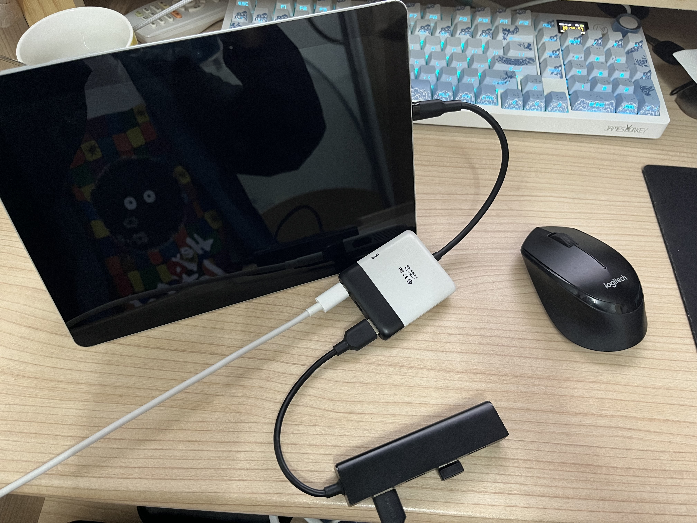
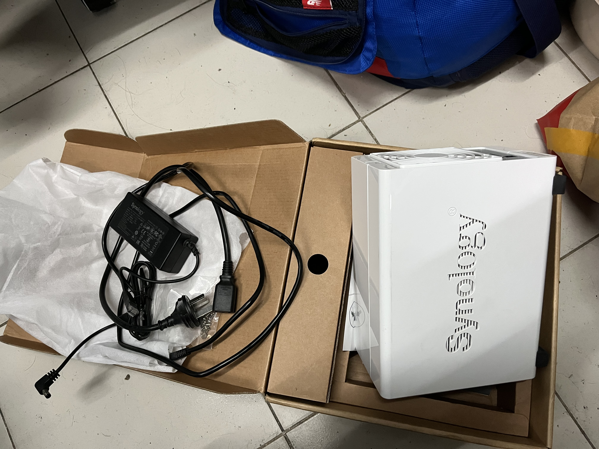

---
tags:
- NAS
- 折腾
---

# NAS编年史
> 倒叙，NAS i.e. Network Attached Storage

## 3.0时代
我现在的NAS就是我淘汰下来的Windows笔记本，续航血崩但是性能还行（i5-8265U + NV GeForce MX250）。外接俩机械硬盘，当个NAS绰绰有余！

### 3.0.3

彻彻底底地remake，[换回了原生的Windows系统](./windows)（为此，我把之前在ext4磁盘上所有的数据都抹掉了😭😭），希望NTFS稳定一些。

### 3.0.2
这次终于实践了我很久以前就想做的事情：刷一个PVE，玩一玩All in One

然而事实证明，`all in one = all in boom`，很快PVE直接挂掉了，我的所有虚拟机毁于一旦，g

### 3.0.1
这个时期用的系统是Ubuntu，主面板是[CasaOS](https://casaos.io/)

用了一年多两年不到，Docker出了一些问题，磁盘也有些小毛病。于是下定决心remake了

## 2.0时代
后来一段时间我的NAS就是一台Surface go，用一个USB hub吊着几个硬盘，用起来非常蛋疼。

由于它的磁吸充电口坏掉了，所以机身上仅存的一个USB C接口承担了巨多功能。尤其是装系统的时候，需要电源+键盘+鼠标。用我手边的扩展坞接上这些设备需要连成长龙：

<figure markdown>

{width=500}

<figurecaption>大概就是这么个造型</figurecaption>

</figure>

一开始我给它装上了Ubuntu系统，后来为了充分利用触摸屏又换成了Fedora系统（真的很好用！）。

不过由于io接口太过缺少，这个时代的NAS也没有坚持太久，一年差不多我就受不了了。

## 1.0时代
之前玩过群晖的220j，那个ARM芯片真的性能捉急-_-

稍微有一个大动作（比如下载了一个剧集，Plex扫描一下）就会卡死。于是咸鱼来的很快就咸鱼走掉了。

<figure markdown>

{width=400}

</figure>

但是不得不说，群晖毕竟是专业的，用起来很省心~

## 0.0时代
这个时期我就在自己的主力机上下载资源，架设Media Server，需要用的时候就打开。

长此以往太过麻烦，无法全天候在线否则资源消耗太严重，遂开始筹备单独的NAS设备。