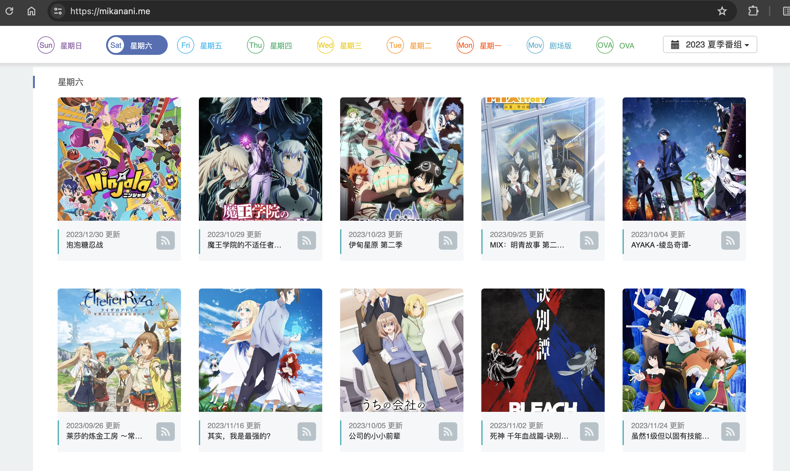
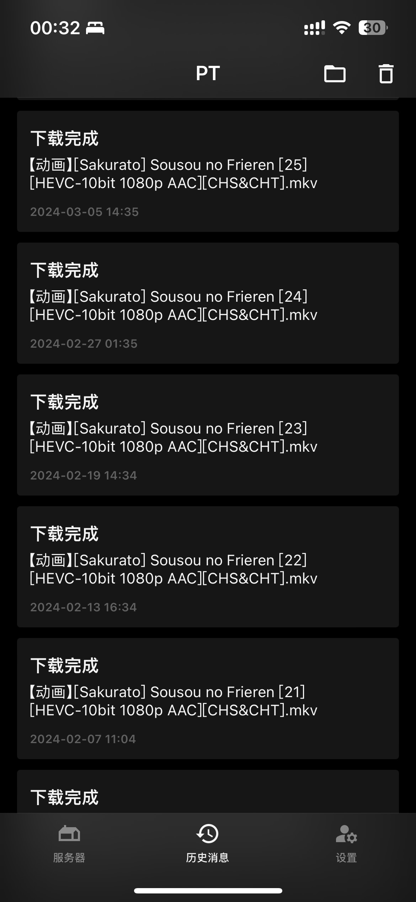
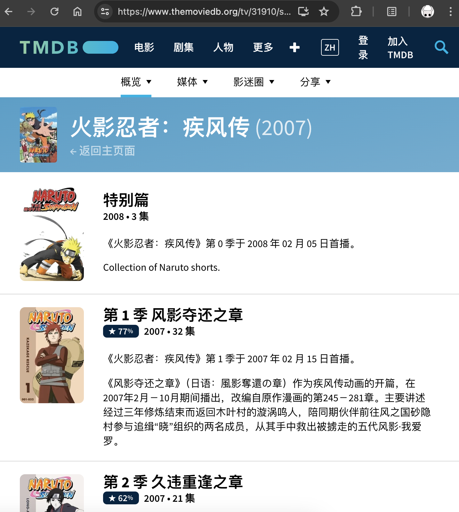
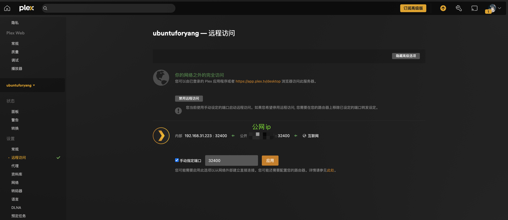

---
tags:
- NAS
- 折腾
- Docker
---

# 个人媒体库
国产剧集能看的不多，国外的剧集正版引进也是寥寥无几。B站更是完全看不了番剧。大家看剧、看番、看电影都是讲究一个各显神通。我则比较喜欢下载到NAS来看。

效果：


## 资源站
这个大家只能各显神通了。BT、PT、网盘、论坛……

略举一例：

## 下载器

### BT/PT
推荐使用[qBittorrent](https://www.qbittorrent.org/)，功能齐全，可以同时管理巨量下载任务。

### 网盘
使用Syncthing等同步软件下载到本地。或者使用Webdav挂载到本地。我不怎么用。

### RSS订阅
一切皆可自动化，每周更新的剧集、番剧自然也可以通过RSS订阅自动下载。qBittorrent支持此功能。

### Webhook
下载器可以搭配webhook来实现下载完成的提醒。我在用[Bark](https://bark.day.app/#/)：一款注重隐私、安全可控的自定义通知推送工具。这样，RSS订阅每次更新，自动下载完成之后就会给我发一个消息（iOS消息弹窗的形式）：

| {width=300} | {width=300}

### 资源整理
下载完了之后，需要按照特定的格式整理一下，方便后续的媒体服务器识别、刮削。

我的习惯是：
```
SeriesName
    S00
    S01
        S01E01
        S01E02
        ...
    S02
```

不论动漫还是电视剧都按照这个结构来命名。

如果不知道如何划分Season，可以参考[TMDB](https://www.themoviedb.org/tv/31910/seasons)：

<figure markdown>

{width=400}

</figure>

## 媒体服务器
我比较喜欢[Plex](https://www.plex.tv/)，UI清爽好看，功能齐全，全平台都有官方APP。唯一美中不足的是，离线缓存到设备是一个付费功能。

此外还有：

- [Jellyfin](https://jellyfin.org/)：The Free Software Media System
- [Emby](https://emby.media/)：The open media solution
- [vidhub](https://apps.apple.com/us/app/vidhub-video-library-player/id1659622164)：Video Library & Player

等软件。

## 公网访问

Plex自带此功能，只要把NAS的端口开放即可。

<figure markdown>

 {width=600}

</figure>

这样就可以随时随地看下载好的媒体啦。只不过很考验你的宽带上传！