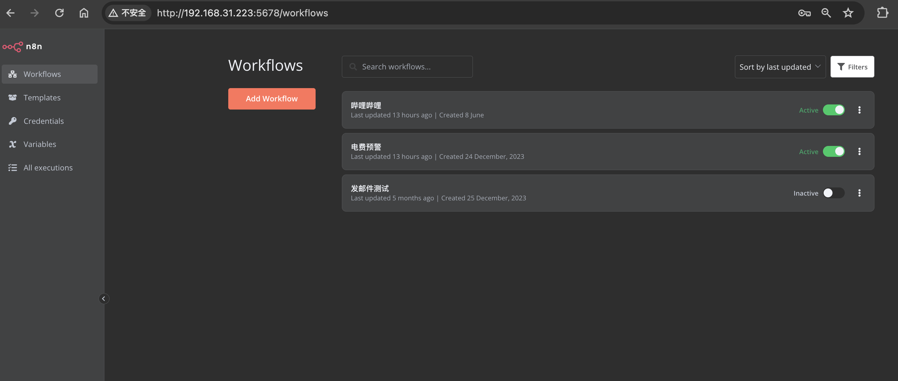

---
tags:
- NAS
- 折腾
- Docker
---

# 自动化Workflow

使用[n8n](https://n8n.io/)：a powerful workflow automation tool。

目前只是定时执行写好的脚本，更多的功能还在探索中。

每天定时：

- 查宿舍的电费（FDU为什么不能自己给我预警一下！！！！真的很烦宿舍突然停电啊！）
- 爬取哔哩哔哩的开屏封面

TBC:n8n