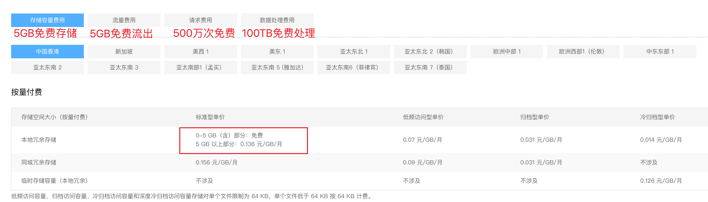
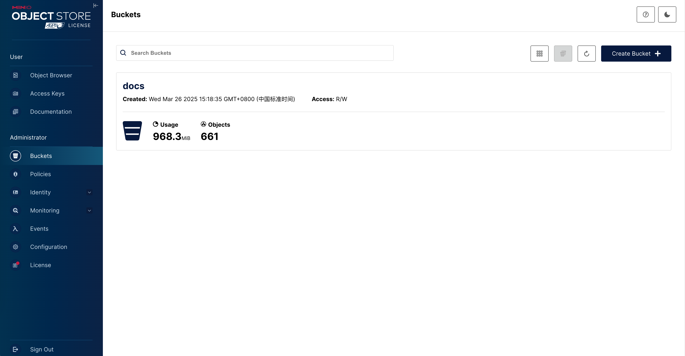

---
tags:
- NAS
- 折腾
---

# 自建图床

图床我是用过一些的：

- [路过图床](https://imgse.com/)
- [imgur](https://imgur.com/)
- [GitHub](https://github.com/)
- [CloudFlare](https://pages.cloudflare.com/)

也听说过一些：

- 微博图床
- Gitee图床
- Telegram图床

但免费的往往是最贵的，稳定、便宜、高速是个不可能三角。

现在我手里有台可以公网访问的NAS，所以干脆自己搞个图床玩玩。

## OSS

!!! chatgpt-summary "AskGPT: 什么是OSS？"
    OSS（Object Storage Service）是一种云端对象存储服务，用于存储和管理海量数据，如图片、视频、备份等。常见的 OSS 服务包括：

    - 阿里云 OSS
    - AWS S3
    - 腾讯云 COS
    - Google Cloud Storage

    它们支持高可用性、自动扩展、API 访问，并常用于网站托管、数据备份和大数据分析。

其实阿里云的[公共云OSS](https://www.aliyun.com/price/product?spm=a2c4g.11186623.0.0.68e7603834RyfS#/oss/detail/ossbag)看起来也不错：

> 【公共云】中国香港&海外地区--价格详情
>
> 中国香港&海外地区包括：中国香港、新加坡、亚太东北 1（东京）、美西 1（硅谷）、美东 1（弗吉尼亚）等地域。各地域的资源单价有所不同。



但总归有[被攻击](https://www.bilibili.com/video/BV1Tb411Q7V4)的风险，我可不想一觉睡醒就拿到天价账单。

所以我选择自己架设OSS服务，在[awsome-selfhosted](https://github.com/awesome-selfhosted/awesome-selfhosted)里看了一圈，最终选择的是MinIO：

<figure markdown>

[](https://github.com/minio/minio)

</figure>

起服务很简单，在Windows上只需要下载它的二进制文件

> <https://dl.min.io/server/minio/release/windows-amd64/minio.exe>

然后就可以一键启动了：

```cmd
minio.exe server D:\
```

如果需要**开机自启动**可以搭配之前推荐过的[nssm](https://nssm.cc/download)来注册服务。

## MinIO

### 启动服务

我们可以写一个`.bat`脚本来启动minio服务，`MINIO_ROOT_USER`和`MINIO_ROOT_PASSWORD`是管理员账户密码，建议修改一下不要使用默认的。

```cmd
@echo off
set MINIO_ROOT_USER=
set MINIO_ROOT_PASSWORD=
minio.exe server ./data --address "0.0.0.0:9000" --console-address ":9001"
```

服务启动了之后，我们就可以在`localhost:9001`管理minio服务啦。和其他OSS服务一样，我们可以创建一个bucket：



创建完了之后，可以设置一下匿名访问：


这样就可以在没有身份认证的情况下，从`localhost:9000/<bucket-name>/<file-path>`访问到OSS中存储的文件啦。

### mc-client

建议使用`mc-client`作为客户端来连接minio服务器。

Mac上可以直接用homebrew安装：

```bash
brew install minio-mc
```

安装完了之后需要添加MinIO OSS的配置文件：

```bash
mc config host add minio http://<host-cname>:<port> MINIO_ROOT_USER MINIO_ROOT_PASSWORD
# 当然也可以直接修改配置文件：`~/.mc/config.json`
```

添加了配置之后，就可以无密码访问云端oss啦：

<div class='console'>

```console
$ mc ls lap/docs
[2025-03-26 15:28:12 CST]    14B STANDARD CNAME
[2025-03-26 15:29:24 CST]    58B STANDARD ads.txt
[2025-03-26 15:29:24 CST]   502B STANDARD index.en.md
[2025-03-26 15:29:24 CST]   522B STANDARD index.md
[2025-03-26 15:45:59 CST]     0B About/
[2025-03-26 15:45:59 CST]     0B Blog/
[2025-03-26 15:45:59 CST]     0B Go/
[2025-03-26 15:45:59 CST]     0B Note/
[2025-03-26 15:45:59 CST]     0B Playground/
[2025-03-26 15:45:59 CST]     0B Project/
[2025-03-26 15:45:59 CST]     0B Python/
[2025-03-26 15:45:59 CST]     0B SomeMath/
[2025-03-26 15:45:59 CST]     0B Statistics/
[2025-03-26 15:45:59 CST]     0B Tags/
[2025-03-26 15:45:59 CST]     0B assets/

```

</div>

mc提供了很多类unix的命令，例如查看文件夹大小：

<div class='console'>

```console
$ mc du lap/docs/Blog
1.5GiB 781 objects docs/Blog

```

</div>

### 常用的文件操作

我的目标是把本站的所有源文件都同步到minio，下面是我常用的命令：

```bash title="递归复制文件"
# 初始化，把所有的文件都复制到云端
mc cp <source> <cloud> --recursive
```

```bash title="同步文件夹的修改到云端"
# 使用mirror，覆盖模式增量修改
mc mirror <source> <cloud> --overwrite
```

```bash title="其他api"
# 查看本地和云端不一致的文件
mc diff <source> <cloud>
# 查看空间占用
mc du <cloud>
# 删除文件
mc rm <cloud>
```

### 效果展示

我把<a href="/Blog/2025/travel_to_japan2" target="_blank">再游日本</a>中的所有图片url都替换为了本文搭建的图床。

作为对比<a href="/Blog/2023/travel_to_japan" target="_blank">毕业.旅行.日本</a>中也有大量图片，依然托管在CloudFlare Pages上。

你可以感受一下它们的速度差异。
