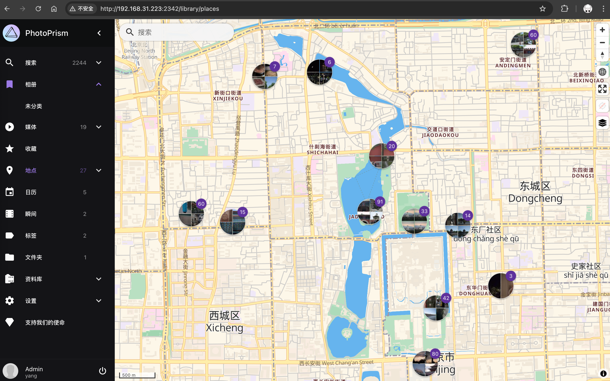
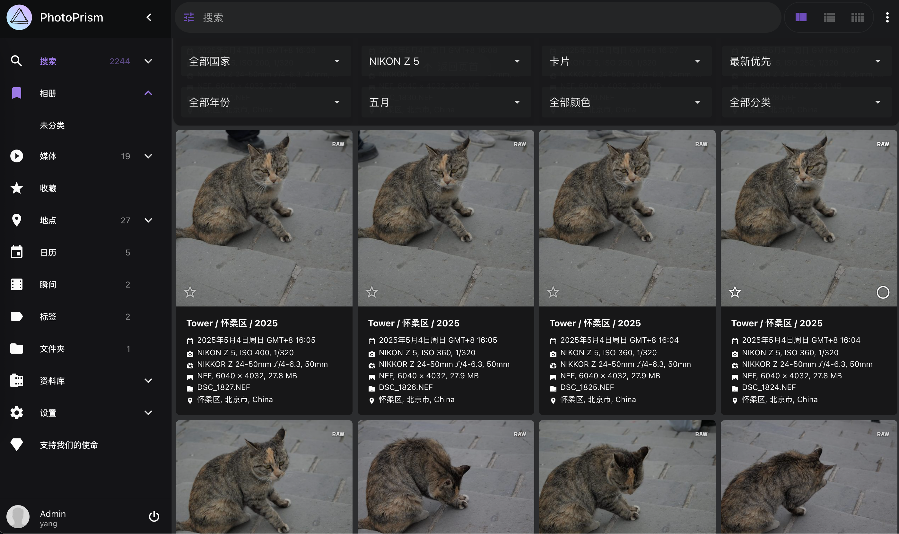

---
tags:
- NAS
- 折腾
- Docker
---

# 自建云相册

买了微单相机和运动相机之后，我也渐渐感受到存储的压力了。很多时候，拍摄最高规格的图像就会导致文件体积爆炸，一张照片五十多MB。如果降低规格，只拍压缩的JPG，那我买微单的意义何在？

所以现在我的策略是全都要。刚好Z5支持双存储卡，一张存RAW，一张存中等规格的JPG。拍完之后我会把选好的JPG照片备份到iCloud，方便随时随地在手机上查看；RAW底片则统一扔到NAS，搞了一个局域网云相册，方便浏览、选片、下载、修图。

## 选型

NAS上的云相册软件还是非常多的，我列举几个热门的如下：

<figure markdown>

</figure>

<figure markdown>

</figure>

<figure markdown>

</figure>

<figure markdown>

</figure>

<figure markdown>

</figure>

<figure markdown>

</figure>

<figure markdown>

</figure>

我一眼就相中了Go语言实现的photoprism。

## 部署

直接按照官方的[文档](https://docs.photoprism.app/getting-started/docker-compose/)即可，用写好的docker-compose配置文件几分钟就可以部署了。

也有更偷懒的[Portrainer](https://docs.photoprism.app/getting-started/portainer/)，直接在WebUI就可以部署。

记得把照片存放的路径（`/photoprism/originals`）、PhotoPrism数据路径（`/photoprism/storage`）和MariDB的`/var/lib/mysql`都映射为本地的Volume，持久化数据。

## 效果

### 地图预览

可以自动读取照片的GPS信息，展示在地图上：

### 支持RAW

Nikon的NEF RAW可以直接识别：

### 支持搜索

可以按照颜色、时间、相机等等来搜索：

!!! info "AI识别"
    PhotoPrism一个重点功能是AI识别，但是我的NAS性能比较弱就懒得开了。我也不是很想要这个功能。
