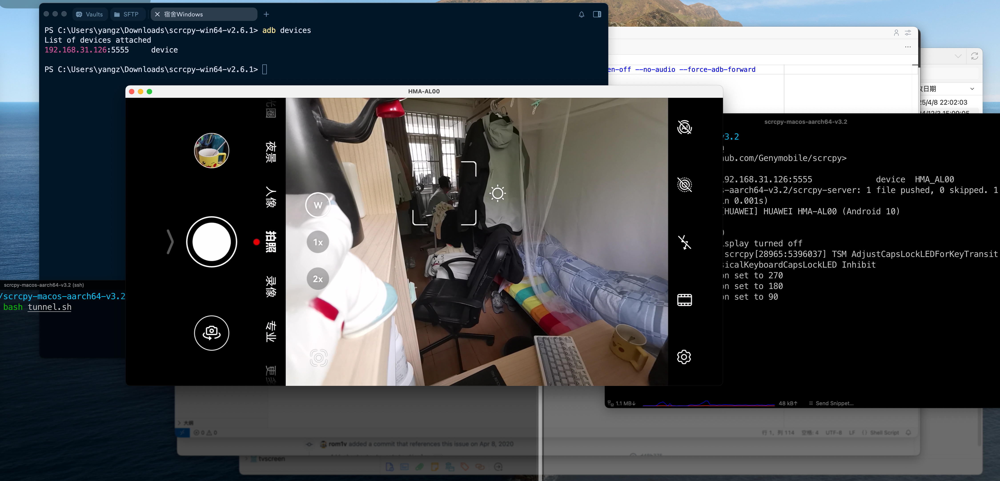

---
tags:
- 折腾
- adb
- SSH
---

# 远程控制安卓手机

adb大家都不陌生，可以用来调试安卓机器，非常强大。

基于adb提供的api，scrcpy（**scr**een **c**o**py**）可以**显示并且控制**安卓屏幕：

<figure markdown>

[](https://github.com/Genymobile/scrcpy)

</figure>

## adb

下载、解压scrcpy仓库[release的压缩包](https://github.com/Genymobile/scrcpy/releases/tag/v3.2)，就可以得到下面这些文件了：

```text
.
├── adb
├── icon.png
├── scrcpy
├── scrcpy-server
├── scrcpy.1
```

先用usb连接adb调试：

<div class='console'>

```console
$ ./adb devices # 确保连接成功
List of devices attached
HJS5T19A10009450 device
```

</div>

然后可以开启wifi调试：

```bash
./adb tcpip 5555         # 打开wifi调试
sudo ./adb start-server  # 开启本地的adb服务
./adb connect ip:port    # adb Wi-Fi连接调试设备
```

!!! warning "No route to host"
    > 不知道是不是我个人网络环境的问题。

    在我的Mac（MacOS 15.4）上，如果不使用sudo开启adb服务，就无法Wi-Fi调试：

    ```bash title="报错信息"
    $ ./adb connect 192.168.31.126
    * daemon not running; starting now at tcp:5037
    * daemon started successfully
    failed to connect to '192.168.31.126:5555': No route to host
    ```

确保Wi-Fi调试连接成功：

<div class='console'>

```console
$ ./adb devices
List of devices attached
192.168.31.126:5555 device

```

</div>

## scrcpy

然后就可以像远程桌面一样，用scrcpy远程访问安卓了：


!!! note "ssh tunnel"
    我这里搭配了ssh tunnel实现了公网远程访问：

    ```bash
    # 远程机器DOM_pc开启了adb server
    ./adb start-server
    ```

    在另外一台电脑，通过ssh访问：

    ```bash
    # 开启隧道，转发两个端口到远程的DOM_pc
    # local  5038 --> remote  5037
    # local 27183 --> remote 27183

    ssh -CN -L 5038:localhost:5037 -L 27183:localhost:27183 DOM_pc

    # 然后就可以用scrcpy连接了
    export ADB_SERVER_SOCKET=tcp:localhost:5038 
    ./scrcpy --video-codec=h265\
        --turn-screen-off\
        --no-audio\
        --force-adb-forward
    ```

算是零成本的网络摄像头了：

<figure markdown>



<figurecaption>web camera</figurecaption>
</figure>

可以远程视奸我的室友Counter Strike，哈哈哈哈：

<figure markdown>

{width=500}

<figurecaption>say hi</figurecaption>
</figure>

可惜的是，我的手机是Android 10，不能串流音频。没法听到他压力队友了😭
