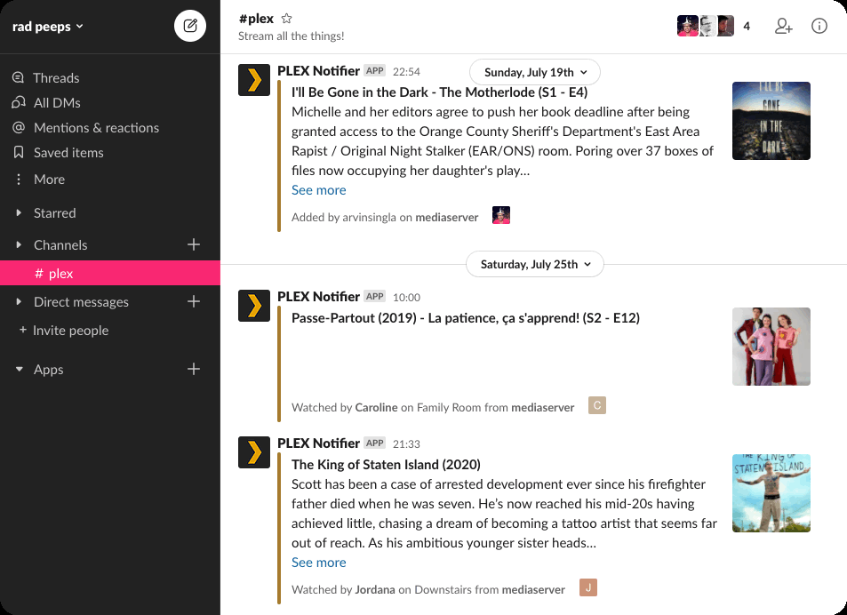

---
tags:
- NAS
- 折腾
- Docker
- VPN
---

# Plex实时活动
> <https://plex.yangz.site>

最终效果：

<iframe
  id="plex"
  title="Plex实况"
  height="500"
  width="100%"
  style="border:none;"
  src="https://plex.yangz.site">
</iframe>

## BroadcastChannel

最近找到了一个新玩具：

<figure markdown>
[](https://github.com/ccbikai/BroadcastChannel)
</figure>

这个项目可以把telegram的频道转换成一个**微博客**。我曾经苦苦寻找了很多类似的微博客项目，例如很热门的[Memos](https://github.com/usememos/memos)：


再比如[Flomo](https://flomoapp.com/)


但都太重了，需要自建服务器或者单独下载一个app。而BroadcastChannel恰好击中了我的全部痛点，得知这个项目的第二天我就部署了一个：<https://whisper.yangz.site>。

## Publier

无独有偶，同时发现了[Publier](https://publier.app/)。它可以通过Plex的Webhook功能把Plex的活动实时发送到Telegram、Discord等平台。和上面的BroadcastChannel搭配起来不就是完美的Plex实况嘛。



但众所周知，Plex pass的价格实在是太贵了，我自然是用不起原生的Webhook功能的，所以我只能自己用Python写一个小程序发送请求（以及使用下面的Tautalli触发Webhook），但是无论如何都不奏效。Publier又不是开源项目，网上实在是没什么资料可查，于是只能放弃。

## Tautalli

好在，我又找到了[Tautalli](https://tautulli.com/)。它是一个开源的Plex监控器。

??? question "What is Tautulli?"

    > verb | tau • tu • li | /taʊ'-tu'-liː/ | To watch or monitor

    Tautulli is a 3rd party application that you can run alongside your Plex Media Server to monitor activity and track various statistics. Most importantly, these statistics include what has been watched, who watched it, when and where they watched it, and how it was watched. The only thing missing is "why they watched it", but who am I to question your 42 plays of Frozen. All statistics are presented in a nice and clean interface with many tables and graphs, which makes it easy to brag about your server to everyone else.


它可以监控Plex的活动，还可以作为把Plex的实时活动推送到其他平台（自然是[支持Telegram](https://github.com/Tautulli/Tautulli/wiki/Notification-Agents-Guide#telegram)的），伟大无需多言！

<figure markdown>
[](https://github.com/Tautulli/Tautulli)
</figure>

题外话：Tautalli是我从下面这个Bangumi自动点格子项目看到的，果然程序员的懒惰是第一生产力。

<figure markdown>
[](https://github.com/SanaeMio/Bangumi-syncer)
</figure>

### webhook payload模板
默认情况下，Tautalli的Telegram消息模板太简陋了。我去找了一个比较丰富的：

<figure markdown>
[](https://github.com/smtdev/tautulli-telegram-notifications)
</figure>

例如每次看完一个剧集，就在频道内发送：

```text
<b>最近在看：{title} ({year}) - {content_rating}</b>

🏢  <b>Studio:</b> <i>{studio}</i>
👷🏻  <b>Directors:</b> <i>{directors}</i>
👫  <b>Actors:</b> <i>{actors:[1:5]}</i>
🕓  <b>Movie length:</b> <i>{duration} minutes</i>
🎭  <b>Genres:</b> <i>{genres}</i>
🔗  <b>Link to TMDb:</b> <a href="{themoviedb_url}">{themoviedb_url}</a>
🔗  <b>Link to Plex library:</b> <a href="{plex_url}">{library_name}</a>
⚙️  <b>Video resolution:</b><i>{video_width}x{video_height} - {video_resolution}p  ({file_size})</i>

<b>Synopsis:</b>
<b>★ {rating} | </b><i>{summary}</i>
<a href="{poster_url}"></a>
```

在Telegram里的效果就是：

<figure markdown>

{width=400}

</figure>

## Linux系统网络代理

上面的Tautulli方案虽然好，但有一个致命的问题：Telegram的api在国内不可访问。而如果使用Publier就没有这个问题了，他们的webhook api在国内是可以访问的。

好在大家都会一点魔法。
### Qv2ray
这是我第一次在Linux上部署网络代理。我本以为很麻烦，所以之前每次需要用到就使用局域网的其他电脑开一下代理服务器。

不过这次是要做自动化方案，得确保一直有代理可用，于是最终选择的方案是Qv2ray GUI + V2ray core Backend。

Ubuntu 20+的话可以直接使用snap下载Qvray GUI：
```bash
sudo snap install qv2ray
```

V2ray core需要从Github下载：

<figure markdown>
[](https://github.com/v2fly/v2ray-core)
</figure>

下载Linux-86的预编译二进制文件，然后解压到Qv2ray指定的位置即可。

### Docker容器内使用代理
Qv2ray代理启动之后，我们首先需要改变代理服务器监听的地址。默认情况下是`127.0.0.1`，这是本地回环地址，Docker容器是访问不到的。

我们可以使用主机的Docker虚拟网地址：`172.x.x.x`，也可以使用主机的局域网地址：`192.x.x.x`，一般情况下容器都可以访问。

设置好后，只需要在容器的构建选项中加上**环境变量**即可：
```
docker build -e http_proxy=192.168.1.99:8001 https_proxy=192.168.1.99:8001 ...
```

设置完之后可以试一下Google的连通性：
```bash
curl google.com
```

祝各位玩的开心~