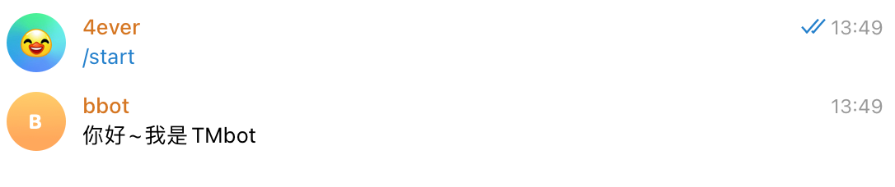
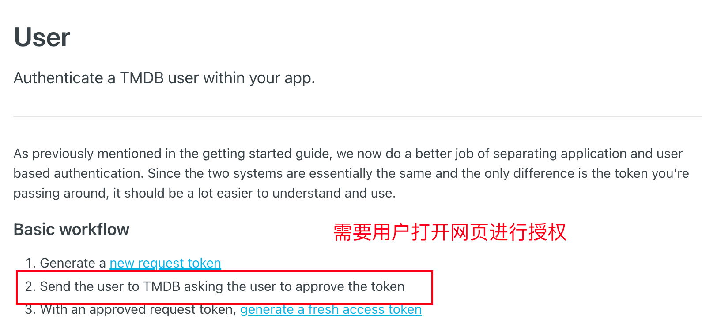
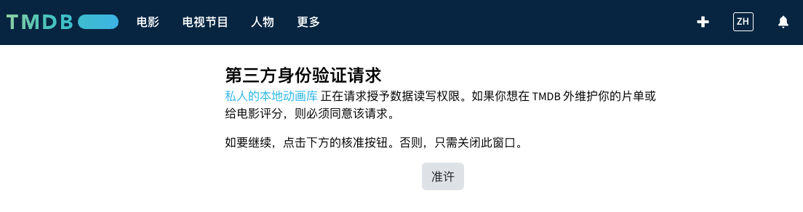

---
tags:
- NAS
- 折腾
- Bot
---

# Telegram Bot

之前搞了一个[Plex实况](../NAS/tautulli.md)，然而没过多久Plex的刮削服务在中国大陆就无法访问了，必须翻墙、非常麻烦。

加上，我唯一的主力PT站`tjupt`也遭遇了事故，何时恢复杳无音信。

于是，最近我加入了网盘大军，开通了VidHub的永久会员，搞了个夸克网盘+Alist，似乎也还不错。

但这样一来我的Plex实况就无法更新了。为此，我做了一个telegram bot，实现手动更新。

## 效果

和之前的tautulli自动更新效果一致：

<iframe
  id="plex"
  title="Plex实况"
  height="500"
  width="100%"
  style="border:none;"
  src="https://plex.yangz.site">
</iframe>

## 功能演示

把bot加入到频道之后，可以发送`最近在看 tmdb_id season_num`来实现打卡，bot会自动生成一条带海报的打卡消息：

<figure markdown>

{width=400}
 
<figurecaption>自动回复</figurecaption>
</figure>

此外，还加入了查询`tmdb_id`的功能，与bot对话，发送`/s name`可以搜索相关的影视：

<figure markdown>
{width=500}
</figure>

点击影视的名称可以显示详细信息：

<figure markdown>
{width=500}
</figure>

点击ok结束查询，点击取消删掉查询的消息。

## 代码分享

项目在：

<figure markdown>

[](https://github.com/AIboy996/TMbot)

</figure>


### telegram bot

本bot使用Python开发，基于`python-telegram-bot`库。


第一个开发要点是`handler`，也就是规定bot接受哪些消息、收到了消息之后如何处理。

我只用到了以下三种handler：
```python
MessageHandler       # 处理消息
CommandHandler       # 处理命令
CallbackQueryHandler # 处理callback
```

- `MessageHandler`一般搭配正则过滤器使用：
    ```python
    watched_reg = filters.Regex("最近在看 (.*?)")
    watched_handler = MessageHandler(watched_reg, watched)
    ```
- `CommandHandler`需要绑定相应的命令：
    ```python
    hello_handler = CommandHandler("start", hello)
    search_handler = CommandHandler("s", search)
    unknown_handler = MessageHandler(filters.COMMAND, unknown)
    ```
- `CallbackQueryHandler`只需要规定回调函数就行了：
    ```
    CallbackQueryHandler(button_callback)
    ```

!!! warning "CallbackQueryHandler"
    这个Handler是特殊的，只会响应`Query`这类消息。也就是我们下面提到的`InlineKeyboard`发送的消息。所以它的回调函数不同于一般的`CommandHandler`和`MessageHandler`

第二个开发要点就是各种回调函数。

例如我们定义命令`/start`的回调函数`hello`：
```python
async def hello(update: Update, context: ContextTypes.DEFAULT_TYPE):
    text = "你好~我是TMbot"
    await context.bot.send_message(chat_id=update.effective_chat.id, text=text)

```
非常简单，就是直接回复一句`"你好~我是TMbot"`：

<figure markdown>
{width=500}
</figure>

!!! note
    注意这里需要使用`async def`来定义一个异步函数，回调函数默认会收到`update, context`两个参数。`update`包含了本次收到的消息，`context`包含了上下文信息。

对于`CallbackQueryHandler`，我们需要额外处理`Query`数据：
```python
async def button_callback(update: Update, context: ContextTypes.DEFAULT_TYPE):
    query = update.callback_query
    if query.data == "cancel":
        await query.answer()
        await query.delete_message()
    elif query.data == "ok":
        await query.answer()
        if update.effective_message.text is not None:
            await query.edit_message_text(update.effective_message.text)
        else:
            await query.edit_message_caption(caption=query.message.caption)
    ...
```

!!! note
    这里可以使用`query.edit_message_text`来直接编辑当前发出`query`的消息。

    也可以使用之前的通用接口`context.bot.edit_message_text(chat_id=..., ...)`，但是需要手动传入`chait_id`。

第三个开发要点是`InlineKeyboardMarkup`，这种telegram提供的一种对message的`markup`，效果就是：
<figure markdown>
{width=500}
</figure>

图中文字`/s 好东西`下方的几个按钮就是`InlineKeyboard`，它可以实现消息内的交互。用过的都说好。

!!! note "如何发送InlineKeyboard"
    ```python
    await context.bot.send_message(
                chat_id=update.effective_chat.id,
                text=effective_message,
                reply_markup=button_markup,
            )
    ```
    需要作为参数`reply_markup`发送。

它的定义方式如下：
```python
def parse_button(search_res: list[dict], query: str, more=True):
    buttons = [
        [
            InlineKeyboardButton(
                text=f"{r.get('title', r.get('name'))} ({r.get('original_title', r.get('original_name'))}, {r.get('media_type')}-{r.get('id')})",
                callback_data=f"{r.get('media_type')}-{r.get('id')}",
            )
        ]
        for r in search_res
        if r.get("media_type") in ["movie", "tv"]
    ] + [
        [
            (
                InlineKeyboardButton(text="更多", callback_data=("more: " + query))
                if more
                else InlineKeyboardButton(text="返回", callback_data=("less: " + query))
            ),
            InlineKeyboardButton(text="OK", callback_data="ok"),
            InlineKeyboardButton(text="取消", callback_data="cancel"),
        ]
    ]
    return InlineKeyboardMarkup(inline_keyboard=buttons)
```

实际上，`InlineKeyboardMarkup`的参数必须是`[[InlineKeyboardButton, ...], ...]`这种形状（list of lists of InlineKeyboardButton）。外层的大列表是所有的行，内层每个列表代表一行的按钮。

在创建按钮的时候可以设置显示的文字和`callback_data`，在用户点击该按钮的时候就会触发`CallbackQueryHandler`，并且把`callback_data`发送过去。
```python
InlineKeyboardButton(text="更多", callback_data=("more: " + query))
```

### tmdb api

为了实现搜索和自动检索海报、简介等信息的功能，本bot使用了tmdb的api。

其实就两个：
```python
f"https://api.themoviedb.org/3/movie/{movie_id}?api_key={TMDB_TOKEN}&language=zh-CN"
```
和
```python
f"https://api.themoviedb.org/3/tv/{tv_id}?api_key={TMDB_TOKEN}&language=zh-CN"
```

未来计划加入自动同步TMDB片单的功能。但是现阶段tmdb list v4的api需要用户手动授权：

<figure markdown>

</figure>

我还在探索当中：
<figure markdown>

<figurecaption>感觉用爬虫模拟一下这个请求应该也能实现</figurecaption>
</figure>


此致