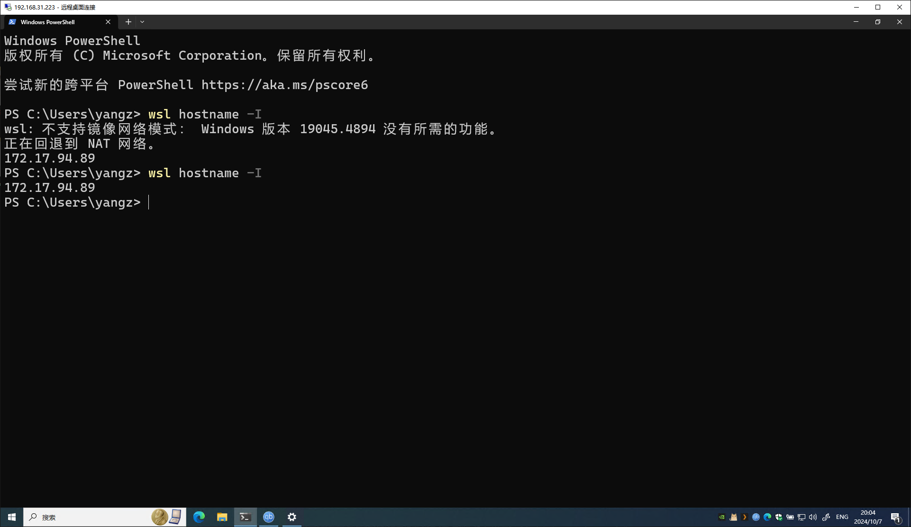

---
tags:
- NAS
- 折腾
- Docker
---

# 在Win上搭建NAS

## 安装Windows
> 参考[官方教程](https://www.microsoft.com/en-us/software-download/windows10%20)

装机不就多说了，Windows的安装还是很简单的。

我还是喜欢用Win10，Win11当然更好，因为微软会不停地有安全补丁，但我不考虑安全。

建议安装Windows**专业版**或者**专业工作站版**。因为只有专业版才有**远程桌面**的功能。

## 安装WSL2
> 参考[官方教程](https://learn.microsoft.com/en-us/windows/wsl/install)

WSL2现在已经很好用了，基本就是原生Linux体验。

我们在Windows的终端输入:
```bash
$ wsl --install
```
确保你安装的是WSL2：
```bash
$ wsl -l -v
  NAME              STATE           VERSION
* Ubuntu            Stopped         2      
```
如果不是你可以手动修改：
```bash
$ wsl --set-version <distro name> 2
```

值得一提的是，现在的WSL2支持[镜像网络模式](https://learn.microsoft.com/en-us/windows/wsl/networking#mirrored-mode-networking)。

默认情况下WSL2系统的网络和宿主机器之前是通过NAT实现联通的，WSL2会得到一个虚拟的IP
```bash
$ wsl hostname -I #你可以查看WSL2的ip地址
172.17.94.89 
```

镜像网络模式下你可以：

- IPv6 support
- Connect to Windows servers from within Linux using the localhost address 127.0.0.1. IPv6 localhost address ::1 is not supported
- Improved networking compatibility for VPNs
- Multicast support
- Connect to WSL directly from your local area network (LAN)

然而这个模式要求系统是Windows 11 22H2以上，只需要在配置文件中加上下面的选项即可：

```toml title="~/.wslconfig"
[wsl2]
networkingMode=mirrored
```
Win10不支持这个选项：

<figure markdown>

 

</figure>

## 安装Docker
> 参考[Docker官方教程](https://docs.docker.com/desktop/wsl/)和[微软官方教程](https://learn.microsoft.com/zh-cn/windows/wsl/tutorials/wsl-containers)

重点是需要打开WSL2 Integration:


这样你在WSL2中就可以正常使用Docker了！

```bash
$ wsl -l -v
  NAME              STATE           VERSION
* Ubuntu            Stopped         2      
  docker-desktop    Stopped         2 
```

## 安装一些服务
由于Windows上的Docker比较卡，而且是基于WSL2的。所以本着能不用就不用的原则，尽量把服务都安装在宿主机。

### Alist
> [参考](https://alist.nn.ci/zh/guide/install/manual.html#%E5%AE%88%E6%8A%A4%E8%BF%9B%E7%A8%8B)，[下载](https://github.com/Xhofe/alist/releases)

Alist的安装非常简单，下载一个二进制文件然后注册成系统服务就可以了。

官方推荐使用[nssm](https://nssm.cc/download)来注册系统服务：
```bash
nssm.exe install alist
```

### Jellyfin
> [下载](https://jellyfin.org/downloads/windows/)

这个更是傻瓜式。下载完之后一路下一步即可。

现在默认版本的Jellyfin已经可以做到很好的刮削了，可以说是开箱即用的级别。

### qBitorrent
> [下载](https://www.qbittorrent.org/download)

qBitorrent也是有Windows版本的，下载安装后开启WebUI即可。

### ddns-go
> [参考](https://github.com/jeessy2/ddns-go?tab=readme-ov-file#%E7%B3%BB%E7%BB%9F%E4%B8%AD%E4%BD%BF%E7%94%A8)，[下载](https://github.com/jeessy2/ddns-go/releases)

ddns-go提供了一键注册系统服务的功能
```bash
ddns-go.exe -s install
```
还可以额外给一些配置:
```bash
ddns-go.exe -s install -f 600 -c /Users/name/.ddns_go_config.yaml
```


### Docker based

例如[docker-easyconnect](https://github.com/docker-easyconnect/docker-easyconnect)

一键开启服务：

```bash title="WSL2内运行"
docker run -it --name easy \
    --device /dev/net/tun \
    --cap-add NET_ADMIN \
    -p 1080:1080 \ # socks5 proxy
    -p 8888:8888 \ # http proxy
    -e EC_VER=7.6.7 \
    -e CLI_OPTS="-d stuvpn.fudan.edu.cn -u USERNAME -p PASSWORD" \
    hagb/docker-easyconnect:cli \
```

上述在WSL2内映射的端口是可以直接在宿主机的对应端口访问到的，局域网也可以直接访问。完美！