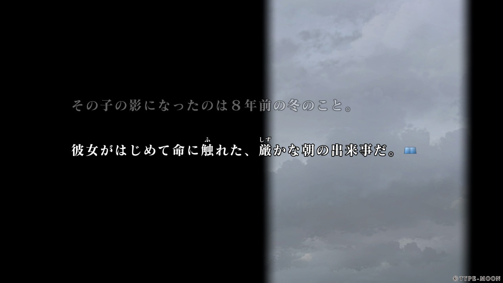
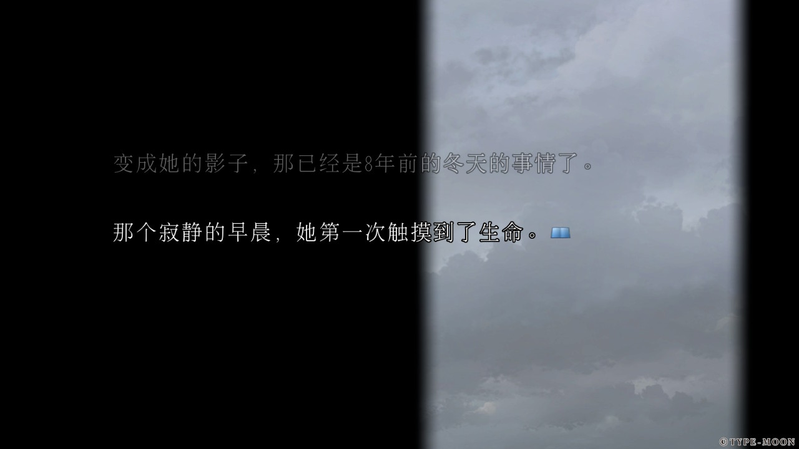
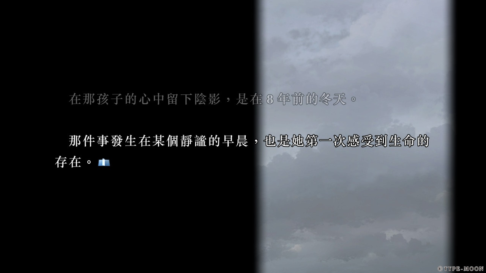
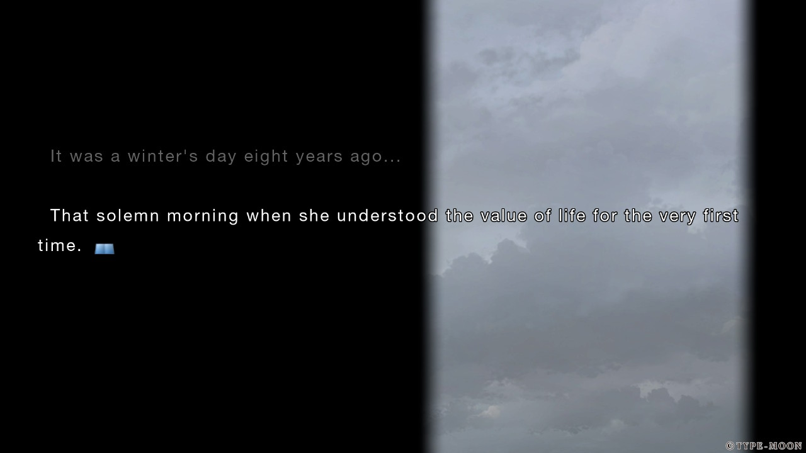
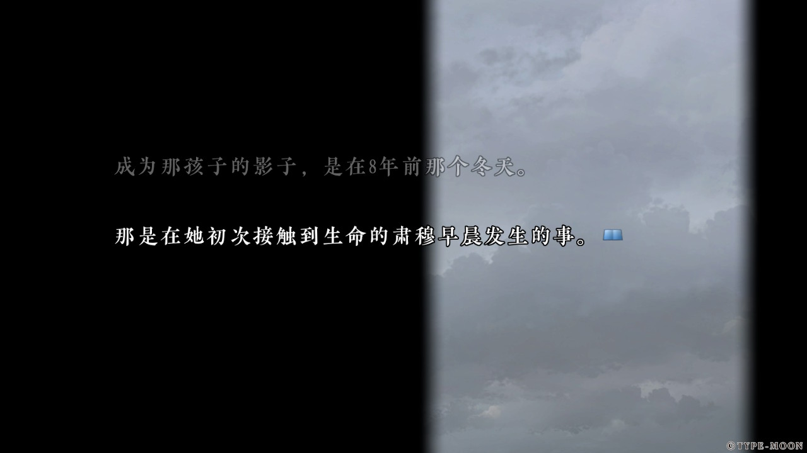
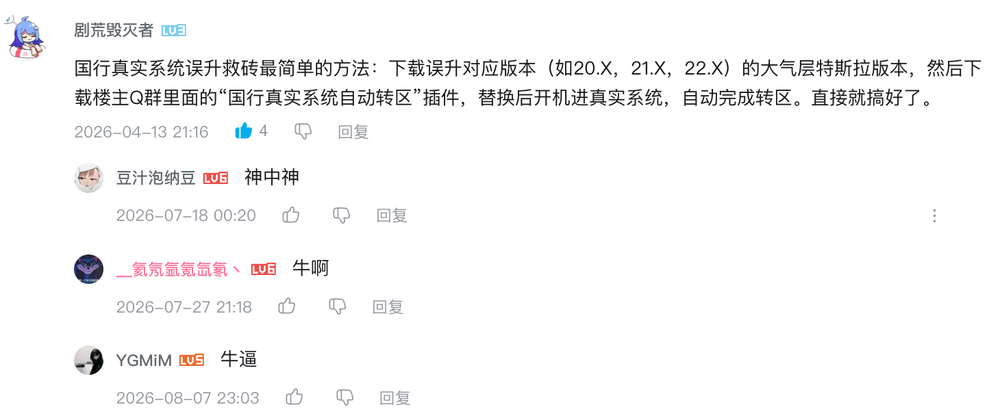

---
tags:
- NS
- 折腾
---

# NS破解

是的，我破解了我的NS。

## 先别骂
但我并不是盗版的支持者。相反，我[购入了大量NS实体版以及电子版游戏](../../About/devices.md/#nsps)，也*几乎不* 从网上下载游戏ROM。破解的这台机器是我20年买入的腾讯引进的国行NS，无奈的是腾讯运营的不是很成功。

## 都怪腾讯
由于海外游戏引进的管制，任天堂第一方的游戏引进缓慢。等了三四年了，塞尔达传说旷野之息都没等到。在国行机器上，只能买卡带，玩单机。

于是我另外买了一台日版的NS，作为主力机使用。自然，国行的NS就越来越吃灰。所以在2023年，跟随着破解的浪潮。我也去淘宝做了破解。

破解的过程非常简单枯燥，NS大体上有两种破解。第一种是针对非常老的机型，它们存在硬件漏洞。可以使用软件注入的方式来破解。第二种则是暴力破解，直接拆机、焊接芯片上去。我的属于后者，直接淘宝氪金即可。

## 破解之后

破解之后，NS的可玩性就多了一些。除了可以从网上下载盗版的ROM试玩，还有很多第三方的开发者做的软件，比如wiliwili：

<figure markdown>

</figure>

再比如存档管理软件：

<figure markdown>

</figure>

甚至可以**串流PS5**，[NS玩血源诅咒](./stream.md)不是梦:

<figure markdown>

</figure>

你还可以动手自己写点小软件，JoyCon和触屏带来了很多的可能性。

最后但同样重要的是各种MOD以及补丁。由于NS的封闭性，Steam那样的创意工坊是想都别想，破解之后万物皆有可能了。你甚至可以玩到林可儿：

以及，对于某些特定的游戏，不打补丁游戏体验断崖下降。例如galgame最高的山之一《魔法使之夜》在NS上的官方汉化简直是一坨：

??? question "一个简单的对比"
    - 日文原文
        - 
    - 官方简中
        - 
    - 官方繁中
        - 
    - 官方英文
        - 
    - 民间翻译（澄空汉化组）
        - 

    当然这只是开篇的第一句话，其实看不出特别大的问题。然而**据说**（我其实只玩过一遍民间汉化）后续官方简中错误百出。相比之下民间汉化倾注了二次元们真挚的情感，质量上乘，实在是不得不品。

## 重装系统

> 这里的「系统」指的是大气层以及引导程序

通常破解的商家会帮我们装好系统，但是偶尔想折腾一下就需要自己重装系统了。

请看：

<figure markdown>

</figure>

当然，也可以去网上直接下载[整合包](https://codeberg.org/rumla34/Atmosphere-Stable/releases)。

## 升级系统

> 这里的系统指的是Switch的操作系统

去网上找到希望安装的特定版本[系统固件](https://prodkeys.net/latest-switch-firmwares-updated-2/)，下载到内存卡里。然后[使用Daybreak](https://www.zhihu.com/tardis/zm/art/680827346?source_id=1003)安装下载好的固件即可。

!!! warning "国行NS需要特别注意"
    国行NS默认情况下**最高支持19.x.x版本**的系统固件，如果贸然升级到更高的版本会导致系统损坏，==变成砖头==。表现为无法引导系统，出现错误代码2162-0002。
    ??? question "我咋知道的？"
        毋庸置疑，这是一次血的教训。

        类似的情况请看：[已升级20.0.0及20.0.1国行设备2162-0002无损报错修复](https://www.bilibili.com/opus/1068335220398227458)

    所以一定要先把机器识别码修改为外服的机器再升级系统。如果你已经升级了、NS变成砖头了，通过下面的方法修改完机器识别码之后就可以救活了。
    
    修改的方法有两种：

    1. 如果你的NS还可以正常进入系统
        - 直接使用一个GUI软件修改即可：
    <figure markdown>
    
    </figure>

    2. 如果你的NS无法正常引导系统了，但是还可以进Hekate
        - 需要在开机的时候快速打开Tesla进行操作，具体教程请看B站这位朋友：
    

    <iframe style="position: absolute; width: 100%; height: 100%; left: 0; top: 0;" src="https://player.bilibili.com/player.html?bvid=BV1pEahzWEYF&page=1&as_wide=1&high_quality=1&danmaku=0&autoplay=0" frameborder="no" scrolling="no">
    </iframe>
    

        - 如果视频里的流程对你不奏效，那么我还有最后一招（QQ群号：927165482）：
    

    3. 如果你的NS连Hekate都无法引导了
        - 这种情况我还没遇到过
