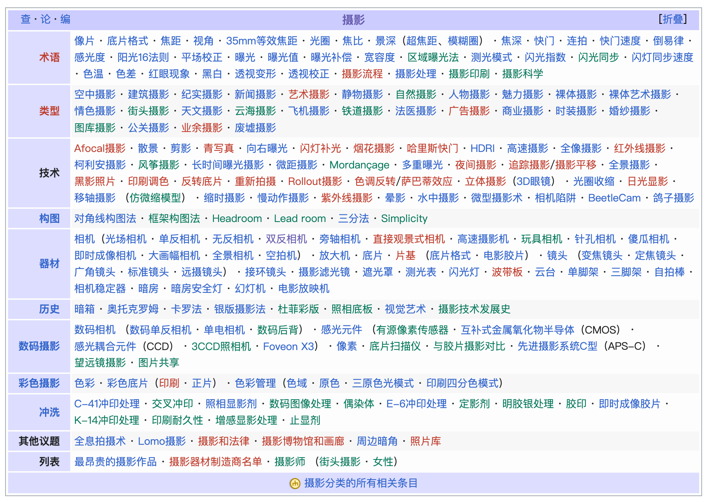
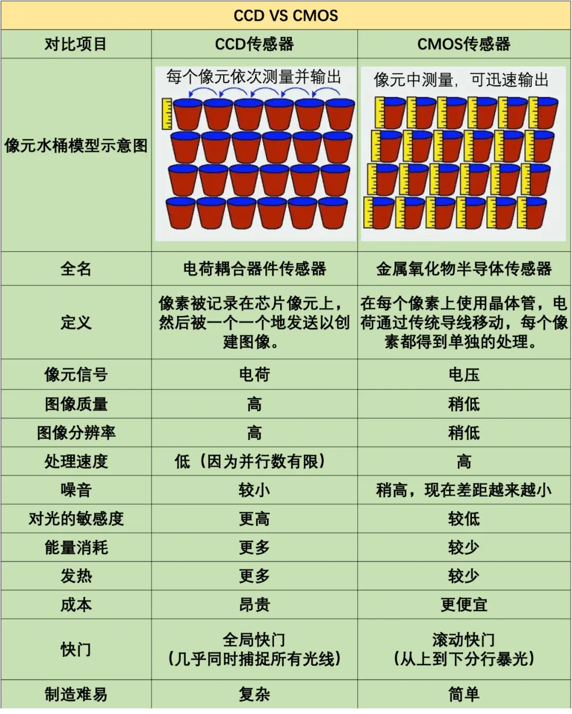
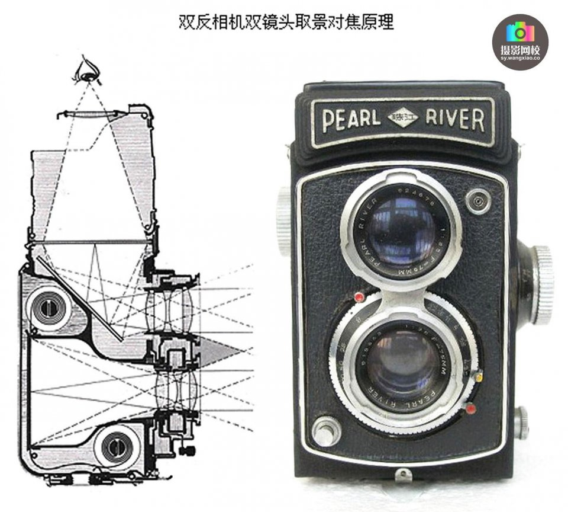
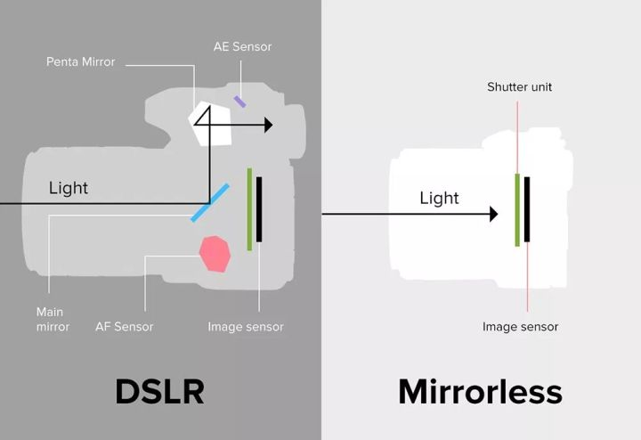
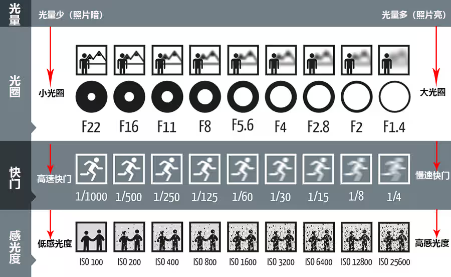
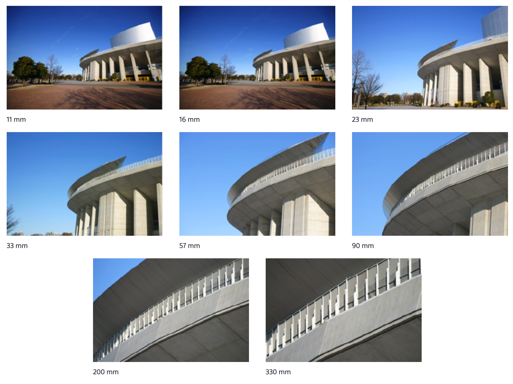

---
tags:
- 摄影
---

# 摄影术语

维基百科上摄影相关的词条有一箩筐：

<figure markdown>
{width=600}
<figurecaption>
唔
</figurecaption>
</figure>

如果你感兴趣，大可以挨个看过去。我这里就摘录、总结一些我看过的内容。

## 摄影史

> 维基百科：[摄影](https://zh.wikipedia.org/wiki/%E6%91%84%E5%BD%B1)

### 暗箱

> obscura

暗箱操作这个成语大家耳熟能详，那么到底什么是暗箱呢？

<figure markdown>
{width=400}
<figurecaption>
暗箱操作你
</figurecaption>
</figure>

简单来说，暗箱是一种辅助**绘画**的装置。利用**小孔成像**的原理，在玻璃上投射影像，而后就可以用纸张来勾勒景物的轮廓了。

### 达盖尔银版法

> daguerreotype

1826年，法国人尼埃普斯使用暗箱拍摄了现存最早的照片：

<figure markdown>
{width=400}
<figurecaption>
隐约可见
</figurecaption>
</figure>

使用的技术是日光蚀刻：尼埃普斯将**犹太沥青**（天然光敏材料）涂在白镴版上，在暗箱中曝光8小时获得此影像。当然，这时候的成像还是很粗糙。

在尼埃普斯技术的基础之上，法国画家达盖尔继续研究，1839年发表了达盖尔银版法，使用**碘化银**感光，用汞显影，用食盐定影。

这时候的成像效果已经非常好了：

<figure markdown>
{width=400}
<figurecaption>
清晰可见
</figurecaption>
</figure>

### 卡罗法

> calotype

同一时代，1835年英国发明家塔尔博特开始使用涂有**氯化银**的图纸作为感光材料，在照相机里拍成负像，然后基于负像二次曝光得到正像。他把自己的方法定名为卡罗法。

> 这大概是最早的“底片”

!!! question "正像和负像"
    盖尔银版法和卡罗法几乎是同一时代的产物。用的材料也都是**卤化银**。但是技术路线却不太相同。

    前者成的是**正像**：碘化银在光照下还原为金属银，然后用汞蒸气显影（汞会和银结合成合金，呈现出高的亮度），最后用食盐水洗掉没显影的碘化银就直接得到照片了。

    卡罗法则不同，成的是**负像**：氯化银纸在光照下分解之后，直接用浓盐水浸泡。这时候得到的就是负像（黑色部分是氧化了的金属银）。然后再叠加一层可感光但未经曝光的纸，二次曝光之后就可以得到正像了。

    盖尔银版法成像精细，但是感光速度慢，并且汞蒸气有剧毒，照片是一次性的。卡罗法纸质载体的内在纹理造成影像粗糙模糊，不过留存的底片可以多次复用。

    算是各有优劣。

### 湿版摄影法

1851年，英国雕塑家弗雷德里克·斯科特·阿切尔发明了湿版摄影法，又称火棉胶摄影法：将硝化棉溶于乙醚和酒精得到**火棉胶**，再把碘化钾溶于火棉胶后马上涂布在干净的玻璃上，装入照相机曝光，经显影、定影后得到一张玻璃底片。

火棉胶调制后须立刻使用，干了以后就不再感光，所以这种摄影方法称为“湿版法”。该工艺兼具达盖尔法的精细和卡罗法的方便复制，这项技术在摄影行业中独领风骚三十余年（1850-1880）。

网上看到了一个文章：[【古典工艺】如何制作一张湿版照片？](https://www.photoworld.com.cn/post/131228)，有点意思。

### 胶片摄影

1888年，美国柯达公司生产出了新型感光材料——柔软、可卷绕的“胶卷”。这是感光材料的一个飞跃。

柯达杀死了比赛。

### 数码摄影

1969年美国AT&T**贝尔实验室**的两位科学家威拉德.博伊尔和乔治.E.史密斯发明了数码相机中广泛使用的CCD（电荷耦合器件）感光组件。二人也因此在2009年荣获诺贝尔物理学奖。

> 顺带一提，2009年华裔科学家高锟因为光纤方面的贡献也一同获得了诺贝尔物理学奖。

1971年，贝尔实验室科学家首次用CCD记录了黑白影像。

1975年，柯达应用电子研究中心工程师史蒂芬·沙森开发出了世界上第一台数码相机，这台数码相机以磁带作为存储介质，拥有1万像素。记录一张黑白影像需要23秒。这台“手持式电子照相机”的出现**颠覆了摄影的物理本质**。

但柯达当时认为，数码相机的发展将威胁到公司赖以维生的底片事业，所以停止研发。

后来，数码相机确实杀死了柯达。

## 数码相机

胶片机咱是玩不起了，聊聊数码相机吧。

### CCD和CMOS

数码相机的核心就是光传感器，有两种：

<figure markdown>
{width=400}
<figurecaption>
CCD和CMOS
</figurecaption>
</figure>

> 随便找了个图，具体的原理我也不懂。

现在也是两种都可以买到，消费电子上CMOS更常见。

### 取景方式

最简单的取景方式就是双反（TLR），用一个额外的镜头单独来取景：

<figure markdown>
{width=400}
<figurecaption>
双反相机
</figurecaption>
</figure>

旁轴（rangefinder camera），可以理解为缩小版的双反，也是利用**单独的光路**来取景：

<figure markdown>
{width=400}
<figurecaption>
旁轴相机
</figurecaption>
</figure>

单反（SLR），只有一个镜头，利用一次反射来取景。

无反（MILC），则是完全没有光学取景器。只能通过数码转换后，屏幕上显示的内容来预览。

<figure markdown>
{width=400}
<figurecaption>
单反和无反
</figurecaption>
</figure>

### 镜头卡口

> 维基百科：[镜头接口](https://zh.wikipedia.org/wiki/%E9%95%9C%E5%A4%B4%E6%8E%A5%E5%8F%A3)

不同厂商设计了不同的镜头卡口。尼康的Z系列无反相机（微单）使用Z卡口：

<figure markdown>
{width=500}
<figurecaption>
Z口镜头群
</figurecaption>
</figure>

参数如下：

- 画幅：35mm（最大传感器尺寸）
- 直径：55mm（内径）
- 固定结构：卡口
- 法兰距：16mm

## 摄影参数

### 曝光三要素

<figure markdown>
{width=400}
<figurecaption>
[图源知乎](https://zhuanlan.zhihu.com/p/134166476)
</figurecaption>
</figure>

光圈（Aperture）很简单，就是镜头内的一道门，可以控制进光量。

快门速度（Shutter speed）指的是按下快门后，快门帘落下的速度。时间越长，进光量就越多。

感光度（ISO）指的是传感器对光的敏感程度，越高就越敏感，成像越亮。

### 焦距

焦距（Focal length）指的是镜头中心到焦点平面（也就是传感器，通常有一个Φ的标记）的距离。

焦距对画面影像非常大：

<figure markdown>
{width=400}
<figurecaption>
不同焦距
</figurecaption>
</figure>

### 景深

景深（Depth of field）指的是影像相对清晰的范围，是一个纵向的深度。

景深的长短取决于三个因素：焦距、摄距和光圈大小。它们之间的关系是：

1. 焦距越长，景深越短；焦距越短，景深越长；
2. 摄距越长，景深越长；
3. 光圈越大，景深越小。

有一个[在线网站](https://jherr.github.io/depth-of-field/)可以计算景深：

<iframe src="https://jherr.github.io/depth-of-field/" width="100%" height="500px" style="border:none;"></iframe>

### 色温

色温（Color temperature）是表示光源光色的尺度，最早是由开尔文勋爵（Lord Kelvin）制定。

在物理学上，以绝对温度K来表示，即把标准黑体加热，温度升高到一定程度时该黑体颜色开始，由深红-浅红-橙黄-白-蓝色，逐渐改变，某光源与黑体的颜色相同时，我们把黑体当时的绝对温度称为该光源的色温。

<figure markdown>
{width=400}
<figurecaption>
色温
</figurecaption>
</figure>

## Reference

- 维基百科
- [最全摄影入门术语大集合，收藏贴！ ](https://www.sohu.com/a/198833973_653557)
- [索尼官网](https://www.sony.com.tw/zh/electronics/support/articles/00267921)
- [知乎：光圈、快门、感光度，弄懂摄影基本算入门了](https://zhuanlan.zhihu.com/p/134166476)
