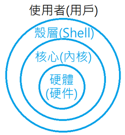
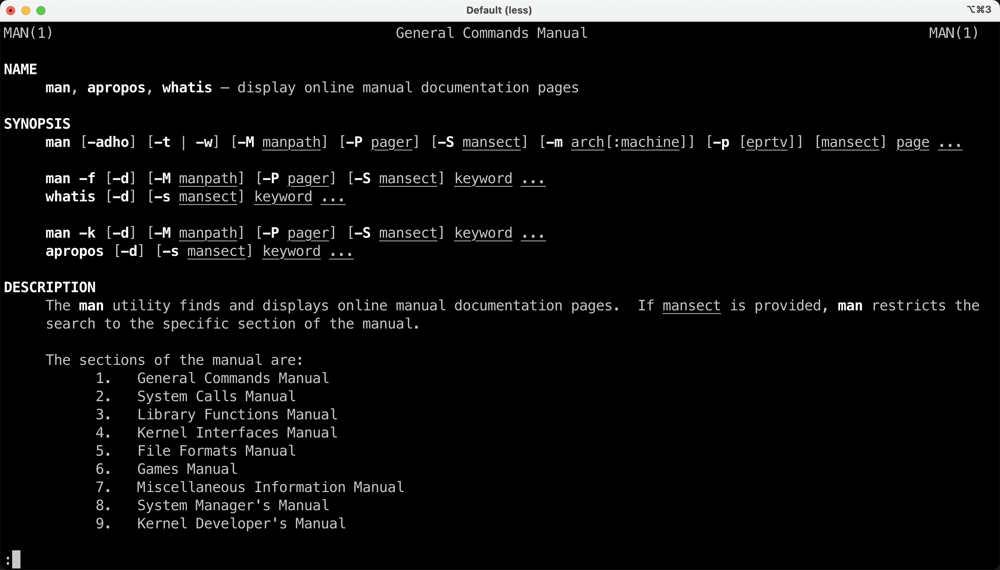

---
tags:
 - Shell
 - Linux
---

# Shell基础

## 什么是Shell

!!! cite "Wikipedia"
    A Unix shell is a command-line interpreter or shell that provides a command line user interface for Unix-like operating systems. The shell is both an interactive command language and a scripting language, and is used by the operating system to control the execution of the system using shell scripts.

简而言之，Shell是Unix-like操作系统（包括各种Linux、MacOS等）的交互界面，是一个最基本的应用程序，是一种命令行工具，同时也可以作为脚本语言。

### 各种版本的Shell

使用`cat /etc/shells`来查看所有可用的Shell。

<div class="console">

```console
$ cat /etc/shells
# List of acceptable shells for chpass(1).
# Ftpd will not allow users to connect who are not using
# one of these shells.

/bin/bash
/bin/csh
/bin/dash
/bin/ksh
/bin/sh
/bin/tcsh
/bin/zsh
```

</div>

使用`echo $SHELL`查看当前使用的Shell。

<div class="console">

```console
$ echo $SHELL
/bin/zsh
```

</div>

下图展示了Shell在操作系统中的地位。

<figure markdown>
{width=200}
</figure>

### 必备技能：RTFM

如果你想要学习Shell（学习Unix-like系统的使用），那么首先要学会的就是RTFM（read the fucking manual）。

使用`man`命令来查看**manual page**：

<div class="console">

```console
$ man
What manual page do you want?
```

</div>

例如，查看`man`自己的手册：

<div class="console">

```console
$ man man
MAN(1)                      General Commands Manual                     MAN(1)

NAME
     man, apropos, whatis – display online manual documentation pages

SYNOPSIS
     man [-adho] [-t | -w] [-M manpath] [-P pager] [-S mansect]
         [-m arch[:machine]] [-p [eprtv]] [mansect] page ...

     man -f [-d] [-M manpath] [-P pager] [-S mansect] keyword ...
     whatis [-d] [-s mansect] keyword ...

     man -k [-d] [-M manpath] [-P pager] [-S mansect] keyword ...
     apropos [-d] [-s mansect] keyword ...
...
```

</div>

通常，终端会进入这样一个**互动的浏览页面**：



你可以按下方向键++arrow-up++和++arrow-down++（或者++j++和++k++）来上下滑动页面，按下++q++来退出这个页面。

## 常用的命令
下面罗列一些常用的Linux命令和案例。

### ls
> list directory contents


`ls`大概是程序员最爱（使用频率意义下的）的命令之一（和`cd`不相上下），他的功能就是列出当前目录的所有文件和文件夹。

`ls`有一些常用的参数，可以复合使用：

- `-a`或者`--all`，显示所有的文件（包括隐藏文件）
- `-l`，显示较为丰富的信息（包括读取权限，修改时间等）
- `-h`，使用Byte, Kilobyte,Megabyte, Gigabyte, Terabyte and Petabyte作为单位。


<div class="console">

```console
$ ls -alh /
total 12K
drwxr-xr-x   1 root root  198 Dec  4 21:23 .
drwxr-xr-x   1 root root  198 Dec  4 21:23 ..
drwxrwxr-x  62 yang yang 2.0K Dec  4 21:23 Applications
drwxr-xr-x  71 yang yang 2.3K Dec  4 21:15 Library
drwxr-xr-x   5 yang yang  160 Dec  4 21:14 Users
drwxr-xr-x   3 yang yang   96 Dec  4 21:16 Volumes
lrwxrwxrwx   1 root root    7 Sep 13 15:44 bin -> usr/bin
drwxr-xr-x   1 root root    0 Apr 18  2022 boot
drwxr-xr-x   7 root root  740 Dec  4 21:23 dev
drwxr-xr-x   1 root root 2.3K Sep 14 20:23 etc
drwxr-xr-x   1 root root    8 Sep 14 10:09 home
lrwxrwxrwx   1 root root    7 Sep 13 15:44 lib -> usr/lib
drwxr-xr-x   1 root root    0 Sep 13 15:44 media
drwxr-xr-x   1 root root   32 Sep 14 10:09 mnt
drwxr-xr-x   1 root root   28 Sep 14 10:09 opt
drwxr-xr-x   6 yang yang  192 Dec  4 21:15 private
dr-xr-xr-x 238 root root    0 Dec  4 21:23 proc
drwx------   1 root root   56 Dec  4 21:24 root
drwxr-xr-x  12 root root  360 Dec  4 21:23 run
lrwxrwxrwx   1 root root    8 Sep 13 15:44 sbin -> usr/sbin
drwxr-xr-x   1 root root    0 Sep 13 15:44 srv
dr-xr-xr-x  11 root root    0 Dec  4 21:23 sys
drwxrwxrwt   8 root root  160 Dec  4 21:24 tmp
drwxr-xr-x   1 root root   84 Sep 13 15:44 usr
drwxr-xr-x   1 root root   90 Sep 13 15:46 var
```

</div>


### echo
> write arguments to the standard output


`echo`顾名思义就是`回响，回声`的意思，你输入什么，他就会返回什么。

<div class="console">

```console
$ echo hello
hello
```

</div>

你可以用`echo`查看很多系统变量，例如`$PATH`：

<div class="console">

```console
$ echo -e ${PATH//:/\\n} # 分行查看PATH
/usr/local/sbin
/usr/local/bin
/usr/sbin
/usr/bin
/sbin
/bin
/usr/games
/usr/local/games
/snap/bin
```

</div>

`*`是一个特殊的输入，`echo *`会输出当前路径下的所有文件和文件夹的名称。

<div class="console">

```console
$ echo *
Applications Library Users Volumes bin boot dev etc home lib media mnt opt private proc root run sbin srv sys tmp usr var
```

</div>


### cat
> concatenate and print files

此`cat`并非🐱，而是concatenate的奇妙缩写。`cat`的功能很简单，就是拼接以及输出文件。

例如我们之前就提到过的`/etc/shells`文件，它记录了当前系统可用的Shell：

<div class="console">

```console
$ cat /etc/shells
# List of acceptable shells for chpass(1).
# Ftpd will not allow users to connect who are not using
# one of these shells.

/bin/bash
/bin/csh
/bin/dash
/bin/ksh
/bin/sh
/bin/tcsh
/bin/zsh
```

</div>

再例如主机hosts：

<div class="console">

```console
$ cat /etc/hosts
##
# Host Database
#
# localhost is used to configure the loopback interface
# when the system is booting.  Do not change this entry.
##
127.0.0.1	localhost
255.255.255.255	broadcasthost
::1             localhost
```

</div>

TBC:Linux常用命令