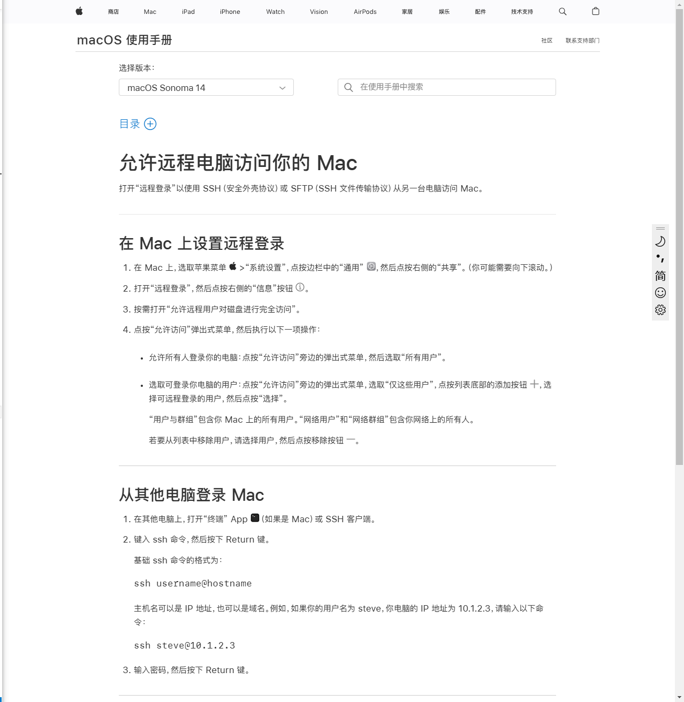
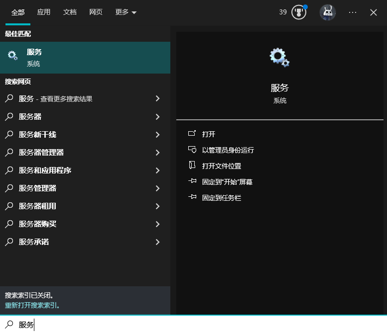
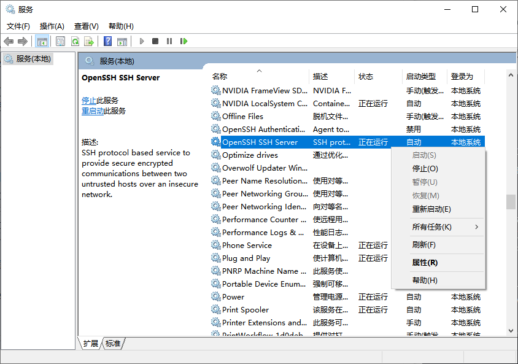
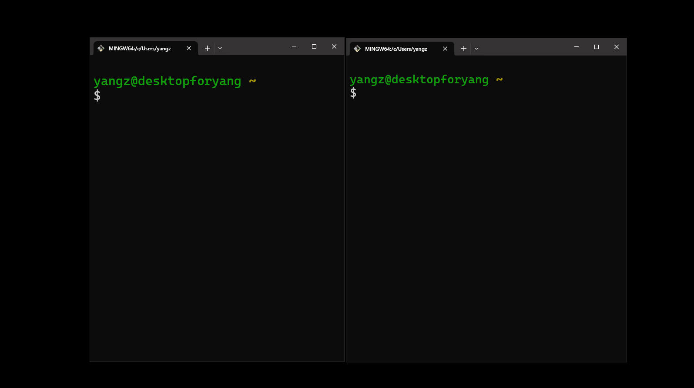

---
tags:
 - Shell
 - Linux
 - SSH
---

# SSH

## 什么是SSH

> from <https://www.cloudflare.com/zh-cn/learning/access-management/what-is-ssh/>

Secure Shell (SSH) 协议是一种通过不安全网络向计算机**安全发送命令**的方法。SSH 使用加密技术对设备之间的连接进行验证和加密。SSH 还可以实现**隧道传输或端口转发**，这是指数据包可以穿越原本无法穿越的网络。 SSH 通常用于远程控制服务器、管理基础设施和传输文件。

也就是说SSH有两大功能：

- 远程Shell
- 端口转发

## 远程Shell

我们知道[Shell](../man)是人机交互的接口。而SSH就实现了一个远程访问的、安全的Shell。可以通过远程连接，向计算机发送指令。

和所有的网络应用一样，SSH需要服务端和客户端配合使用，使用最多的就是[OpenSSH](https://www.openssh.com/)。

我们先来介绍OpenSSH服务端和客户端软件的安装。

### Linux
对于Linux系统我们Ubuntu为例，参考[官方的文档](https://ubuntu.com/server/docs/openssh-server)。

实际上非常简单，直接使用包管理器来安装即可：
```sh title="Ubuntu安装OpenSSH"
sudo apt install openssh-server
sudo apt install openssh-client # 一般情况下这是Ubuntu系统附带的，不用手动安装
```

安装完成之后就会自动注册`ssh`服务，开启一个`sshd`守护进程。

我们可以用`systemctl`查看`sshd`的状态：
```bash
sudo systemctl status sshd.service
```

此时我们也可以使用`ssh`客户端来连接其他ssh服务器了，例如：

<div class='console'>

```console
$ ssh root@192.168.31.223
root@192.168.31.223's password:
Linux yangz 6.8.4-2-pve #1 SMP PREEMPT_DYNAMIC PMX 6.8.4-2 (2024-04-10T17:36Z) x86_64

The programs included with the Debian GNU/Linux system are free software;
the exact distribution terms for each program are described in the
individual files in /usr/share/doc/*/copyright.

Debian GNU/Linux comes with ABSOLUTELY NO WARRANTY, to the extent
permitted by applicable law.
Last login: Sat Oct  5 15:15:09 2024
root@yangz:~#

```

</div>

连接成功之后会开启一个Shell，我们就可以正常使用系统了。

!!! question "如何修改SSH登录时的默认Shell？"

    如果你懒得改任何的配置，可以通过在ssh命令后加命令参数的方式来手动打开一个Shell：

    例如`bash`
    ```bash
    ssh root@192.168.31.223 "bash"
    ```
    再如`powershell`
    ```bash
    ssh root@192.168.31.223 "powershell"
    ```

    在Linux和MacOS上，这里的默认Shell可以通过`chsh`命令来实现。相关的信息都保存在`/etc/passwd`文件中。这个我们[之前提到过](../../Shell/linux/#_4)。

    在Windows上需要[修改注册表](https://learn.microsoft.com/zh-cn/windows-server/administration/OpenSSH/openssh-server-configuration#configuring-the-default-shell-for-openssh-in-windows)：
    ```ps1
    New-ItemProperty -Path "HKLM:\SOFTWARE\OpenSSH"`
        -Name DefaultShell`
        -Value "C:\Windows\System32\WindowsPowerShell\v1.0\powershell.exe"`
        -PropertyType String -Force
    ```
    

OpenSSH服务端默认的配置文件是`/etc/ssh/sshd_config`，我们可以使用文本编辑器修改一些配置。

例如：

```bash
# 服务开放端口
Port 22
# 监听的地址
ListenAddress 0.0.0.0
ListenAddress ::
# 允许root用户ssh登录
PermitRootLogin yes
# 允许使用公钥登录
PubkeyAuthentication yes
# 禁用密码登录
PasswordAuthentication no
```

更多的配置可以查看手册：

<div class='console'>

```console
$ man sshd_config
NAME
    sshd_config — OpenSSH daemon configuration file

DESCRIPTION
    sshd(8) reads configuration data from /etc/ssh/sshd_config (or the file specified with -f on the command line).  The file contains keyword-argument pairs, one per line.  For each keyword, the first obtained value will be used.  Lines starting with ‘#’ and empty lines are interpreted as comments.  Arguments may optionally be enclosed in double quotes (") in order to represent arguments containing spaces.

    Note that the Debian openssh-server package sets several options as standard in /etc/ssh/sshd_config which are not the default in sshd(8):
    •   Include /etc/ssh/sshd_config.d/*.conf
    •   KbdInteractiveAuthentication no
    •   X11Forwarding yes
    •   PrintMotd no
    •   AcceptEnv LANG LC_*
    •   Subsystem sftp /usr/lib/openssh/sftp-server
    •   UsePAM yes
```

</div>

修改完配置重启sshd即可生效：
```bash
sudo systemctl restart sshd.service
```

### MacOS
我们实际上不需要做任何操作，MacOS内置了SSH的客户端和服务端。在终端即可直接使用`ssh`、`ssh-keygen`等客户端工具。

服务端默认不开启，需要在[设置中打开“远程登录”](https://support.apple.com/zh-cn/guide/mac-help/mchlp1066/14.0/mac/14.0)：



打开之后就可以远程访问Mac了。

MacOS上OpenSSH服务端的默认配置文件也是`/etc/ssh/sshd_config`，和Linux完全一致，不再赘述。

如果需要特定的版本，也我们使用Homebrew来安装：
```bash title="MacOS安装OpenSSH"
brew install openssh
```

安装完之后应该可以使用下面这些工具（包含客户端和服务端）：

- Remote operations are done using `ssh`, `scp`, and `sftp`.
- Key management with `ssh-add`, `ssh-keysign`, `ssh-keyscan`, and `ssh-keygen`.
- The service side consists of `sshd`, `sftp-server`, and `ssh-agent`.

### Windows

Windows需要手动安装，可以参考[微软的教程](https://learn.microsoft.com/zh-cn/windows/terminal/tutorials/ssh)：


可以同时安装OpenSSH Server和Client。安装完了之后，Windows也会注册sshd服务（但是不一定会直接启动这个服务），我们可以去服务页面手动开启：

- 先用搜索功能（快捷键：++win+s++）打开“服务”管理器
    

- 然后找到OpenSSH服务，启动即可（建议设置为自启）
    

然后我们就可以用ssh远程访问Windows了。

Windows的OpenSSH服务端配置文件是：
```
%programdata%\ssh\sshd_config
```

默认配置保存在：

```
%systemdrive%\Windows\System32\openssh\sshd_config_default
```
如果你忘掉了修改前的配置文件，可以随时回滚。


### 无密码访问

ssh可以基于非对称密钥来实现无密码访问。我们之前介绍过[RSA算法](../../../SomeMath/number_theory/modulo/#rsa)就是最常见的非对称加密算法。

能使用无密码登录的**前提**是服务端配置（`sshd_config`文件）允许我们使用公钥验证身份：
```bash
PubkeyAuthentication yes
```
确认开启之后，我们再进行客户端的配置。

首先我们要生成一个密钥对(我这里选择RSA算法)：

<div class='console'>

```console
$ ssh-keygen -t rsa

Generating public/private rsa key pair.
Enter file in which to save the key (/c/Users/yangz/.ssh/id_rsa): ./id
Enter passphrase (empty for no passphrase):
Enter same passphrase again:
Your identification has been saved in ./id
Your public key has been saved in ./id.pub
The key fingerprint is:
SHA256:FhCemWz0JdhgAX7mj7Dl3KcWihBBToD5WcHm5kNJEVg yangz@desktopforyang
The key's randomart image is:
<pre>+---[RSA 3072]----+
|o+o+E=B*. .      |
|ooo.==.*.o       |
| ..B..X o        |
|  + ==   .       |
|   =. o S        |
|  . o* =.        |
|   ..o+.o..      |
|    . . .o       |
|       ..        |
+----[SHA256]-----+
</pre>

```

</div>

于是我们就得到了成对的公钥`id.pub`和私钥`id`：

```bash
$ cat id.pub | cut -c-50
ssh-rsa AAAAB3NzaC1yc2EAAAADAQABAAABgQDA72SQFicV6K
```

然后把刚刚生成的公钥发送给服务器：
```bash
ssh-copy-id -i ./id.pub username@ipaddress -p port
```

按照提示输入账号密码进行身份验证，之后就可以通过RSA私钥实现无密码访问了。

如果没有`ssh-copy-id`这个工具（即便有，**这个工具对Windows的SSH服务器也不生效**，因为它是依赖Linux的`echo`等工具的）我们也可以手动把公钥粘贴到服务端的`~/.ssh/authorized_keys`文件中。

> FYI：Windows中的`C:\Users\username`，相当于Linux的用户家目录`~`，ssh客户端的配置文件都在家目录下的`.ssh`文件夹内。

每一行是一个公钥，该文件的访问权限需要是700：

```bash title="文件权限修改" hl_lines="3"
chmod go-w ~/
chmod 700 ~/.ssh
chmod 600 ~/.ssh/authorized_keys
```

!!! warning "Windows上管理员用户的无密码登录"
    > 参考官方教程：<https://learn.microsoft.com/zh-cn/windows-server/administration/openssh/openssh_keymanagement>

    **这是个大坑**。

    上述的过程在Windows只对非管理员用户生效。

    这是因为，Windows的`sshd_config`默认情况下会有一个配置：

    ```bash
    Match Group administrators
        AuthorizedKeysFile __PROGRAMDATA__/ssh/administrators_authorized_keys
    ```
    也就是说，对于管理员用户，需要把公钥添加到指定的目录：
    ```
    __PROGRAMDATA__/ssh/administrators_authorized_keys
    ```

    你可以注释掉这个配置，或者把公钥添加到他指定的目录。

    这样才能实现管理员用户的无密码登录。

    当然，官方的教程也给出了全自动的脚本：
    ```ps1
    # Get the public key file generated previously on your client
    $authorizedKey = Get-Content -Path $env:USERPROFILE\.ssh\id_ed25519.pub

    # Generate the PowerShell to be run remote that will copy the public key file generated previously on your client to the authorized_keys file on your server
    $remotePowershell = "powershell Add-Content -Force -Path $env:ProgramData\ssh\administrators_authorized_keys -Value '''$authorizedKey''';icacls.exe ""$env:ProgramData\ssh\administrators_authorized_keys"" /inheritance:r /grant ""Administrators:F"" /grant ""SYSTEM:F"""

    # Connect to your server and run the PowerShell using the $remotePowerShell variable
    ssh username@domain1@contoso.com $remotePowershell
    ```

    但我实测这个脚本没什么卵用，最后还是注释掉了`Match Group administrators`这个选项。


### 客户端配置文件

每次都输入`ssh root@192.168.31.223 -p 22`这样的配置太麻烦了，我们可以通过配置文件（`~/.ssh/config`）记录服务器的信息：

```bash title="~/.ssh/config"
Host My_debian_server
    HostName 192.168.31.223
    User yang
    Port 22
```

这样我们就可以直接通过Host的名称来访问了：

<div class='console'>

```console
$ ssh My_debian_server
Linux yangz 6.8.4-2-pve #1 SMP PREEMPT_DYNAMIC PMX 6.8.4-2 (2024-04-10T17:36Z) x86_64

The programs included with the Debian GNU/Linux system are free software;
the exact distribution terms for each program are described in the
individual files in /usr/share/doc/*/copyright.

Debian GNU/Linux comes with ABSOLUTELY NO WARRANTY, to the extent
permitted by applicable law.
Last login: Sat Oct  5 15:21:14 2024 from 192.168.31.1
yang@yangz:~$


```

</div>

当然，这个配置文件允许我们写更多的内容，例如：

```bash
Host My_debian_server
    HostName 192.168.31.223
    User yang
    Port 22
    IdentityFile ~/id # 密钥位置
    ProxyCommand "c:\connect.exe" -H 192.168.31.99:8888 %h %p # 代理服务器
```

更多的内容可以RTFM：

<div class='console'>

```console
$ man ssh_config
NAME
    ssh_config — OpenSSH client configuration file

DESCRIPTION
    ssh(1) obtains configuration data from the following sources in the following order:

        1.   command-line options
        2.   user's configuration file (~/.ssh/config)
        3.   system-wide configuration file (/etc/ssh/ssh_config)

    For each parameter, the first obtained value will be used.  The configuration files contain sections separated by Host specifications, and that section is only applied for hosts that match one of the patterns given in the specification.  The matched host name is usually the one given on the command line (see the CanonicalizeHostname option for exceptions).

    Since the first obtained value for each parameter is used, more host-specific declarations should be given near the beginning of the file, and general defaults at the end.

    Note that the Debian openssh-client package sets several options as standard in /etc/ssh/ssh_config which are not the default in ssh(1):

```

</div>

## 端口转发
> 部分转载自<https://www.lixueduan.com/posts/linux/07-ssh-tunnel/>

接下来我们介绍SSH的第二大功能：端口转发。

### 本地转发/远程转发
SSH 端口转发自然需要 SSH 连接，而 SSH 连接是有方向的，从 SSH Client 到 SSH Server 。而我们的应用也是有方向的，比如需要连接 MySQL Server 时，MySQL Server 自然就是 Server 端，我们应用连接的方向也是从应用的 Client 端连接到应用的 Server 端。如果这两个连接的方向一致，那我们就说它是本地转发。而如果两个方向不一致，我们就说它是远程转发。

### 相关参数

- “-L选项”：local，表示使用本地端口转发创建 ssh 隧道
- “-R选项”：remote，表示使用远程端口转发创建 ssh 隧道
- “-D选项”：dynamic，表示使用动态端口转发创建 ssh 隧道
- “-N选项”： 表示创建隧道以后不连接到 sshServer端，通常与”-f”选项连用
- “-f选项”：表示在后台运行ssh隧道，通常与”-N”选项连用
- “-g选项”：表示 ssh 隧道对应的转发端口将监听在主机的所有IP中，不使用”-g选项”时，转发端口默认只监听在主机的本地回环地址中，”-g” 表示开启网关模式，远程端口转发中，无法开启网关功能

### 案例
我们有一个服务器（`192.168.10.100`）在`8888`端口上开启了一个服务：
```bash
python3 -m http.server 8888
```
本地有一台电脑（`192.168.10.36`）想要用浏览器**本地访问**这个服务。

#### 1、本地转发

下面的命令需要在**本地运行**：
```bash
# 语法
ssh -N -L [本地IP:]本地端口:目标服务器IP:目标端口 用户名@SSH服务器 
# 全部参数
ssh -N -L 192.168.10.36:9999:192.168.10.100:8888 root@192.168.10.100
# 远程 IP 改成 localhost
ssh -N -L 192.168.10.36:9999:localhost:8888 root@192.168.10.100
# 省略本地 IP
ssh -N -L 9999:localhost:8888 root@192.168.10.100
```

转发完成之后，在本地服务器的9999端口就可以访问到远程服务器的8888端口了。

```bash title="端口监听情况"
$ ss -tunlp | grep 9999
tcp   LISTEN 0  128   127.0.0.1:9999  0.0.0.0:*  users:(("ssh",pid=2607972,fd=5))
tcp   LISTEN 0  128       [::1]:9999     [::]:*  users:(("ssh",pid=2607972,fd=4))
```

可以看到，`pid=2607972`的进程`ssh`监听了本地的9999端口，如果我们尝试访问这个端口，ssh就会把访问请求转发到远程服务器的8888端口。

#### 2、远程转发

下面的命令需要在**服务器运行**：
```bash
ssh -N -R 192.168.10.36:9999:localhost:8888 root@192.168.10.36
```

和本地转发效果一致。

#### 3、动态转发

下面的命令需要在**本地运行**：
```bash
ssh -N -D localhost:8888 root@192.168.10.85
```

转发完成之后，可以通过socks代理的方式，把本地所有的请求都转发到远程服务器：
```bash
http_proxy=socks5://localhost:8888 curl google.com
```
这就实现了一个“梯子”的功能。

## 极简梯子？

实例演示：



- 本机原本不可以访问`google.com`
- 而远程机器`Azure`可以访问
- 通过SSH隧道功能，转发本地的8888端口作为socks代理服务器
- 最终通过此代理服务器本机可以访问`google.com`