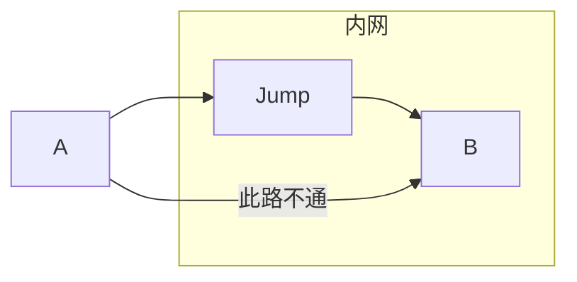
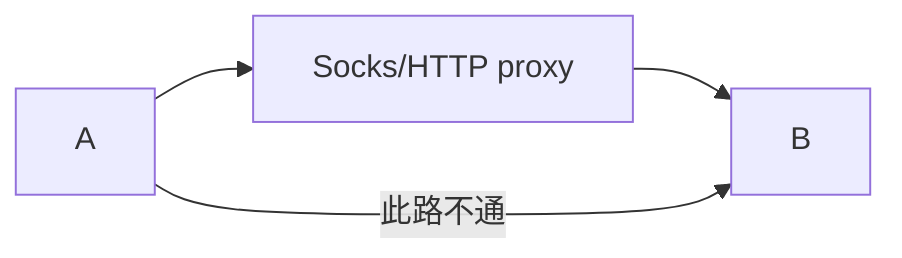
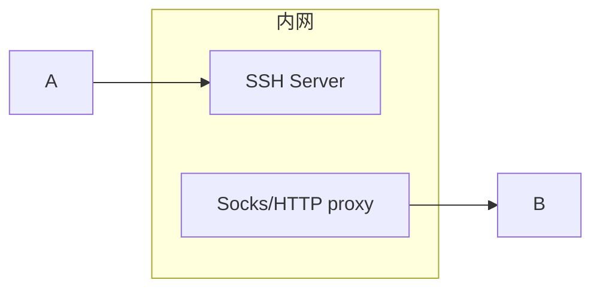
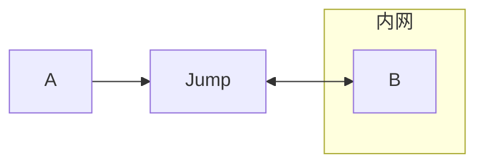

---
tags:
 - Shell
 - Linux
 - SSH
 - 计算机网络
 - VPN
---

# SSH Jump

本篇介绍ssh连接的过程中各种花哨的jump方法（更准确地说是proxy方法，jump可以看作是代理的一种）。

每种场景都包括**终端命令**以及**ssh_config配置文件**两种方式～

!!! info "ssh_config"
    之所以必须要写ssh_config，是因为我用的代码编辑器（[VSCode](https://code.visualstudio.com/docs/remote/ssh)、[Zed](https://zed.dev/docs/remote-development)好像都只支持链接ssh_config里写好的Host，否则很多特性都不支持）

    如果你是终端大侠，不需要GUI编辑器，大可以命令行一把梭。

## 常见的场景

> 仅我遇到过的，其他场景俺也不知道怎么办。但我猜想，这些场景应该可以涵盖绝大部分需求。

### 直连


最简单的场景就是直连啦，这种情况下**A需要可以直接访问到B**：

- 例如B为公网服务器
- 或者A、B在同一个(虚拟)局域网内

配置方法如下：

=== "ssh_config"
    ```apache
    Host target
        HostName 192.168.1.10
        User root
        Port 33
        IdentityFile ~/.ssh/id_rsa
    ```
=== "命令行"
    ```bash
    ssh root@192.168.1.10 -p 33 -i ~/.ssh/id_rsa
    ```

### Jump



这个场景说的是，A可以访问Jump并且Jump可以访问B，然而A不可以直接访问B。Jump被称为跳板机。

这其实是很常见的情况，为了安全考虑很多系统都会设置Jump这样的跳板机（或者叫堡垒机），目标服务B只在它的局域网内暴露。

配置方法如下：

=== "ssh_config"
    ```apache
    Host jump
        HostName 1.2.3.4
        User root
        Port 22
    Host target
        HostName 192.168.1.10
        User root
        Port 33
        ProxyJump jump
    ```
=== "命令行"
    ```bash
    ssh root@192.168.1.10 -p 33 -J root@1.2.3.4:22
    ```

当然还支持多级跳板，只需要用逗号连接即可：

=== "ssh_config"
    ```apache
    Host target
        HostName 192.168.1.10
        User root
        Port 33
        ProxyJump jump1,jump2

    # jump1, jump2配置省略
    ```
=== "命令行"
    ```bash
    ssh username@目标机器IP -p 33 -J username1@跳板机IP1:22,username2@跳板机IP2:22
    ```

??? info "低版本OpenSSH"
    ProxyJump是OpenSSH 7.3才引入的。低版本可以使用ProxyCommand。


    === "ssh_config"
        ```apache
        Host jump
            HostName 1.2.3.4
            User root
            Port 22
        Host target
            HostName 192.168.1.10
            User root
            Port 33
            ProxyCommand ssh jump -W %h:%p
        ```
    === "命令行"
        命令行下，使用`-o`添加选项：
        ```bash
        ssh root@192.168.1.10 -p 33 -o ProxyCommand='ssh -p 22 root@1.2.3.4 -W %h:%p'
        ```

### 代理



代理和Jump差不多，这种情况下代理服务器可以访问B，而我们的主机A无法直接访问B、但是它可以访问代理服务器。

配置方法如下：

=== "ssh_config"
    ```apache
    Host target
        HostName 192.168.1.10
        User root
        Port 33
        ProxyCommand='nc -X connect -x 127.0.0.1:1080 %h %p'
    ```
=== "命令行"
    ```bash
    ssh root@192.168.1.10 -o ProxyCommand='nc -X connect -x 127.0.0.1:1080 %h %p'
    ```

这里的核心是下面这条ProxyCommand：
```bash
nc -X connect -x 127.0.0.1:1080 %h %p
```

- `nc`：The nc (or netcat) utility is used for just about anything under the sun involving TCP, UDP, or UNIX-domain sockets.
- `-X connect`：指定代理协议为http
    - `-X 5`代表socks5协议，一般是默认选项
    - `-X 4`代表socks4协议
- `-x ip:port`：指定代理服务器，这个例子里代理服务器在本机`127.0.0.1:1080`
- `%h %p`：这是目标主机和端口的占位符，实际使用时会**自动替换为具体的主机名/IP和端口号**，也可以直接写死。

??? question "没nc怎么办"
    Mac和Linux大概率都有nc工具，Windows平台大概率没有。

    如果你懒得装一个nc，可以用Git（这个一般大家都安装？）附带的`connect`，你可以去看看[手册](https://github.com/gotoh/ssh-connect)：

    ```apache
    ProxyCommand "c:\Program Files\Git\mingw64\bin\connect.exe" -H 127.0.0.1:8888 %h %p
    ```

    > `-H`是http代理，`-S`是socks代理

### Jump+代理



这个场景说的是，你有一个代理服务器，但是这个**代理服务器只暴露在某个内网**，你需要先跳板连接然后才能访问到这个代理服务器。而后，通过这个代理服务器你可以访问到目标服务器。

??? question "docker-easyconnect"
    你可能会好奇，这个场景是真实存在的吗？为什么这么抽象？

    故事是这样的。之前我发现Easyconnect这个流氓软件可以关进Docker，所以赶紧[部署](../Fudan/stuvpn.md)了一下。用起来还挺爽，但是存在痛点：不是所有的地方都允许我用Docker、多点登陆也会出问题。
    
    因此我希望这个服务常驻在我的NAS、**随时随地**可以连接。但是我又不想直接把这个代理服务器暴露到公网，于是上面的场景就出现了：

    !!! note
        我有一个**代理服务器**（提供复旦校园网的访问），运行在**宿舍的局域网**内的一个Docker容器里。现在我人在外面，想连接**校园网内的一台服务器**跑个实验。那么就需要先通过ssh连接到宿舍的NAS主机，然后才能通过这个代理服务器访问到校园网。

这种情况下依然是一条ProxyCommand就可以解决：

```apache
ProxyCommand ssh -q jump '"c:\Program Files\Git\mingw64\bin\connect.exe" -H 127.0.0.1:8003 %h %p'
```

- `ssh -q`：安静模式
- `jump`：就是我的NAS服务器（Windows系统）
- `"c:\Program Files\Git\mingw64\bin\connect.exe" -H 127.0.0.1:8003 %h %p`
    - 使用NAS的8003端口作为HTTP代理服务器
    - 注意这个命令是作为参数传递给ssh的，所以会**在jump服务器上运行**～

简单来说就是我直接连接到NAS服务器，然后用`connect`开启了一个隧道，强制把`%h %p`的流量通过代理服务器转发。

!!! note "本地转发"
    当然，这个需求使用ssh的本地转发功能也可以完成。我们只需要把Jump服务器的8003端口转发到本地即可。
    ```bash
    ssh -NL 9999:120.0.0.1:8003 jump
    ```
    然后再通过转发过来的9999端口代理连接即可：
    ```bash
    ssh root@192.168.1.10 -o ProxyCommand='nc -X connect -x 127.0.0.1:9999 %h %p'
    ```

    不过麻烦的是，连接的过程中需要保持端口转发一直运行，还是不如我们上面介绍的一条命令就完事儿。

### 内网穿透



这也是很常见的需求：很多朋友没有公网ip，需要搞内网穿透。

**注意这个场景和Jump是不同的**，Jump场景中跳板机是可以直接访问到B的。而内网穿透场景下，我们使用的公网服务器没法直接访问到B，只有B可以访问Jump，拓扑是这样的：

- `A --> Jump <-- B`

这时候就需要在Jump和B之间搭建一个隧道，来转发A的流量：

- `A --> Jump <--> B`

这个需求就很难用一行命令解决了。我这里通过ssh的远程转发实现，远程转发和本地转发我[之前](./ssh.md#_6)也详细介绍过，命令如下：

```bash
# 这条命令需要在B上运行，建立一个隧道，把B的22端口转发到Jump服务器的2222端口
ssh -NR 2222:127.0.0.1:22 jump
```

!!! note
    记得要在jump服务器的sshd_config中打开端口转发的选项：`GatewayPorts yes`

端口转发完毕后，访问跳板机的2222端口即可在A服务器上通过Jump服务器访问B了：

```bash
# 如果2222端口没开放，可以使用 -J 选项访问
ssh -J jump root@localhost -p 2222

# 如果2222端口是开放的，可以直接访问
ssh root@jump_ip -p 2222
```
