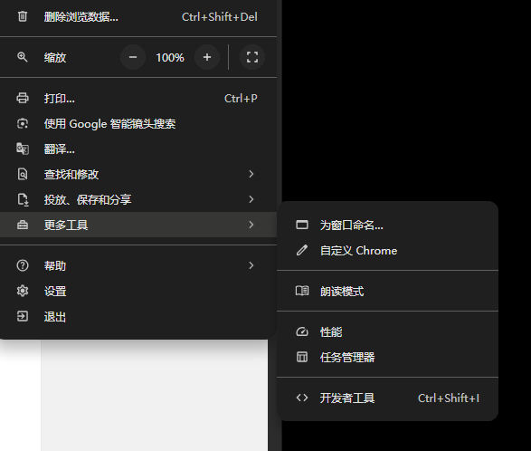
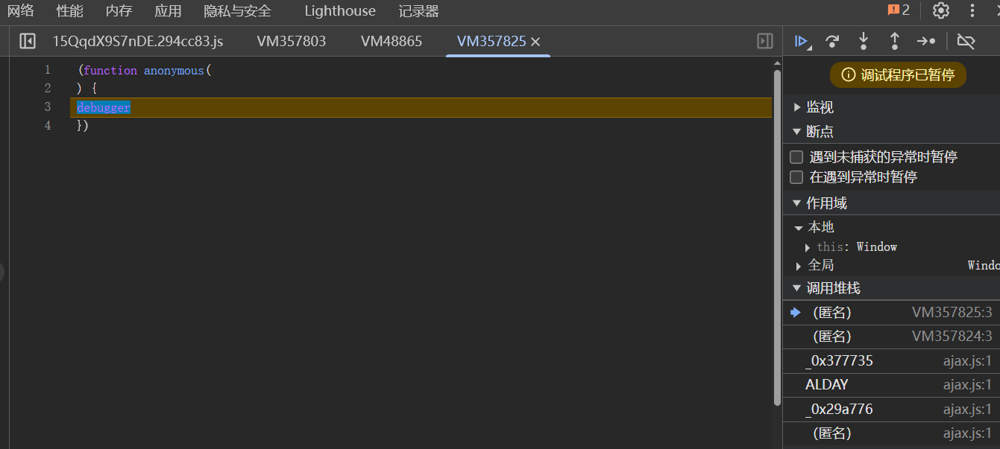
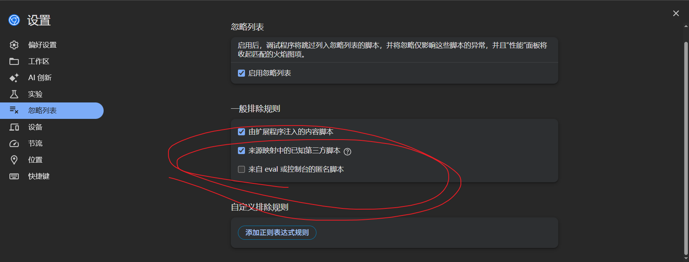
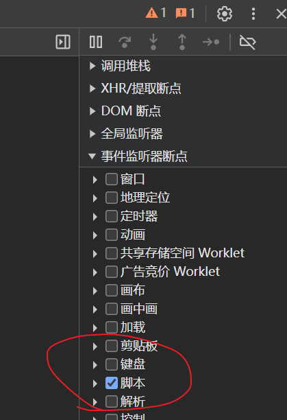

---
tags:
- 爬虫
---

# 反调试和反反调试

其实反调试也算是反爬虫的一种。毕竟要做爬虫就得先分析接口，必定需要在浏览器做调试。

但是只要服务对外开放，就永远会被别人扒出来。反调试只是增加了分析的成本，并非无法调试。这些反调试的方法总归是通过前端实现的，那么我们在前端就总有方法跳过。

## 反调试1：屏蔽快捷键

通常大家打开调试工具都会使用一些快捷方式：

- F12快捷键
- Ctrl+Shift+I快捷键
- 通过右键菜单点击“检查”

那么最简单的反调试方式自然就是禁用这些快捷方式：

> 以下代码来自[^1]

```js
//屏蔽F12
$(document).keydown(function (event) {
    if (event.keyCode == 123) {
        if (event.preventDefault) {
            event.preventDefault();
        } else {
            window.event.returnValue == false;
        }
    }
});
//屏蔽ctrl+shift+i
$(document).keydown(function (event) {
    if (event.ctrlKey && event.shiftKey && event.keyCode == 73) {
        if (event.preventDefault) {
            event.preventDefault();
        } else {
            window.event.returnValue == false;
        }
    }
});
//屏蔽鼠标右键
$(document).ready(function () {
    $(document).bind("contextmenu", function (e) {
        return false;
    });
});
```

!!! success "反反调试"
    很简单，别用快捷方式就完了，手动从菜单栏打开开发者工具：

    

## 反调试2：无限debugger

这种花样就很多了。表现形式都是：我们打开开发者工具之后，就会一直卡在bugger断点，跳过了也不管用，依然会有新的debugger：



实现这种无限debugger的方式有很多：

1. 直接一个死循环，使用`debugger`函数
2. 使用`eval`函数调用含有debugger的代码，例如`eval("debugger")`
3. 使用定时器，每隔一段时间触发debugger（或者是其他操作，例如**弹出alert窗口**等等，以此中断调试）
4. 使用Function prototype触发debugger函数

总之就是通过各种方法不断触发debugger：

> 以下代码来自[^2]

```js
Function("debugger").call()/apply()

xxx.constructor("debugger").call("action")

Fuction.constructor("debugger").call("action")

(function(){return !![];}["constructor"]("debugger")["call"]("action"))

eval('(function() {}["constructor"]("debugger")["call"]("action"));')
```

!!! success "反反调试"
    要跳过无限debugger，就是要见招拆招了。

    可以先尝试禁用断点：

    

    如果这样能跳过就最好了。

    还不行就得查看调用堆栈，看看debugger到底是怎么触发的。如果是`eval`函数触发的，就可以注入下面的代码：

    ```js
    // 保留内置函数
    eval_ = eval;
    // 覆盖内置的eval函数
    eval = function(a){
        if(a=='debugger'){
            // 如果是eval debugger函数，就直接跳过
            return
        } else {
            return eval_(a)
        }
    }    
    ```

    如果是通过某些函数构造实现的，可以这样写：
    ```javascript
    var __constructor = constructor;//(1)!
    Function.prototype.constructor = function (s) {
        if (s == "debugger") {
            console.log(s)
            return
        }
        return __constructor(s);
    }

    Function.prototype.__constructor_back = Function.prototype.constructor;
    Function.prototype.constructor = function () {
        if (arguments && typeof arguments[0] === 'string') {
            if ("debugger" === arguments[0]) {
                console.log(arguments[0])
                return
            }
        }
        return Function.prototype.__constructor_back.apply(this, arguments);
    }

    var __Function = Function;
    Function = function (s) {
        if (s == "debugger") {
            console.log(s)
            return
        }
        return __Function(s);
    }
    ```

    1. 代码来自：https://www.bilibili.com/video/BV1EJ4m1e7ew/，是针对药监局瑞数6代的反debugger hook。有点刑。

    我还看到过一些重写`toString`函数的方法：[过瑞数中的高级debugger](https://www.cnblogs.com/lyt263/p/17902906.html)

    > 哦对了，这种反调试系统有很大可能性是[瑞数](https://www.riversecurity.com/)做的。

    具体代码什么作用问一问AI就行啦。

## 反调试3：内存爆破

上面各种花里胡哨的debugger触发方式，我们其实可以通过忽略功能直接跳过：



如果无事发生那自然是好的。

但通常情况下这时候一般就会触发内存爆破，你的浏览器会被大量无意义的运算直接卡死。

!!! success "反反调试"
    和之前类似的思路，但这次需要先断住（不然就卡住无法调试了），可以在开发者工具中添加script监听器：

    

    然后找到内存爆破的地方进行跳过。

参考文献：

[^1]: [几种常见的前端反调试方法及突破方式](https://tree.moe/anti-debug-and-solution/#%E6%AC%BA%E8%B4%9F%E6%88%91%E6%B2%A1%E6%9C%89%E9%BC%A0%E6%A0%87%E9%94%AE%E7%9B%98%EF%BC%9F)
[^2]: [解决浏览器调试无限debugger](https://zhuanlan.zhihu.com/p/584684377)
