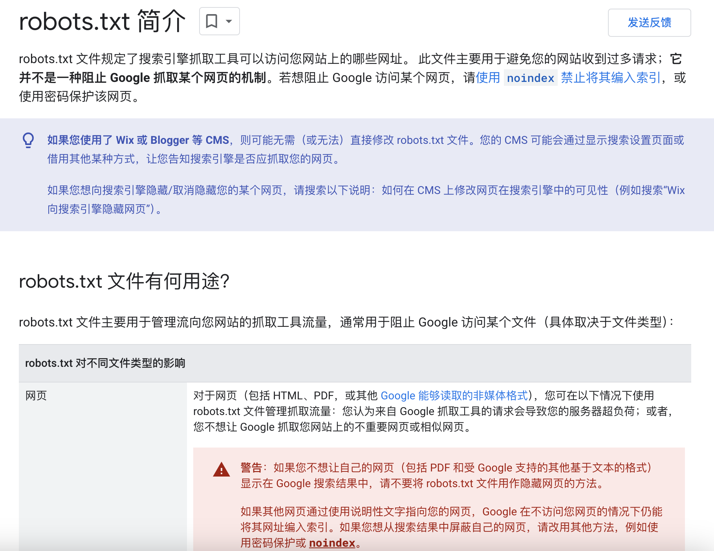
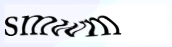
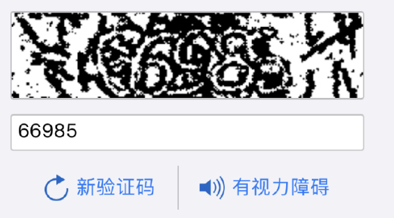
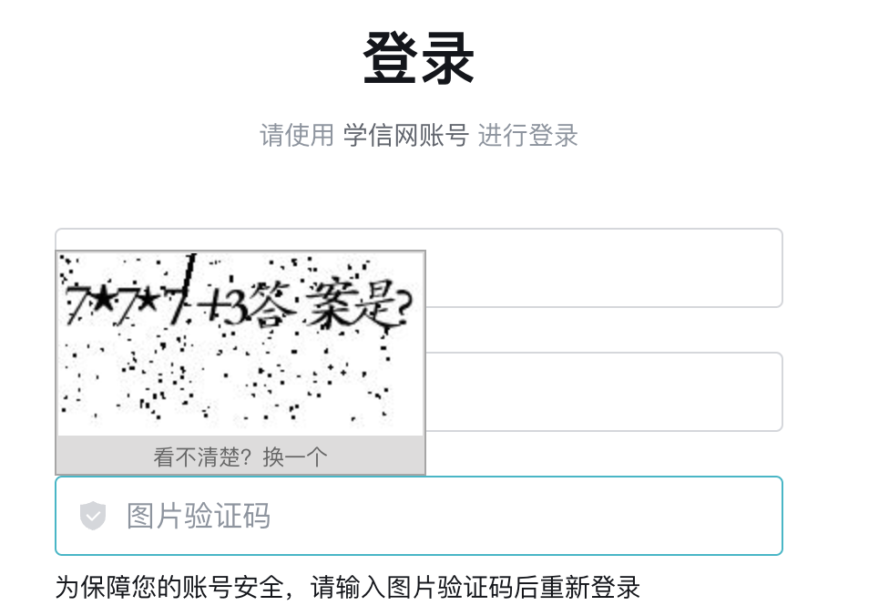
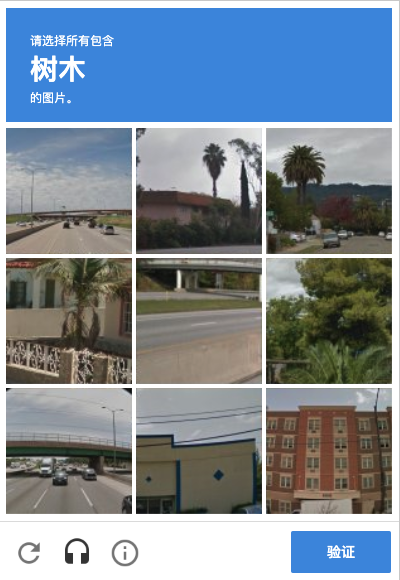
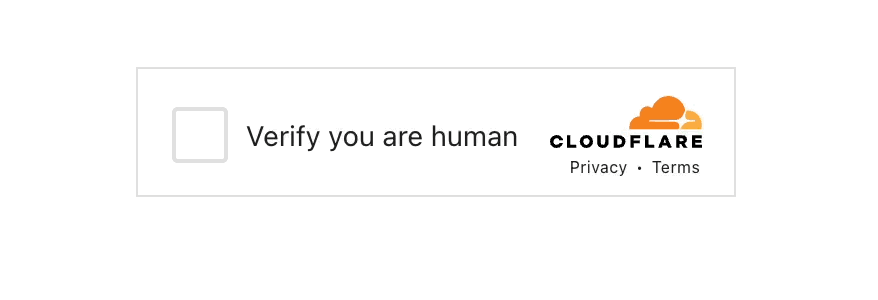
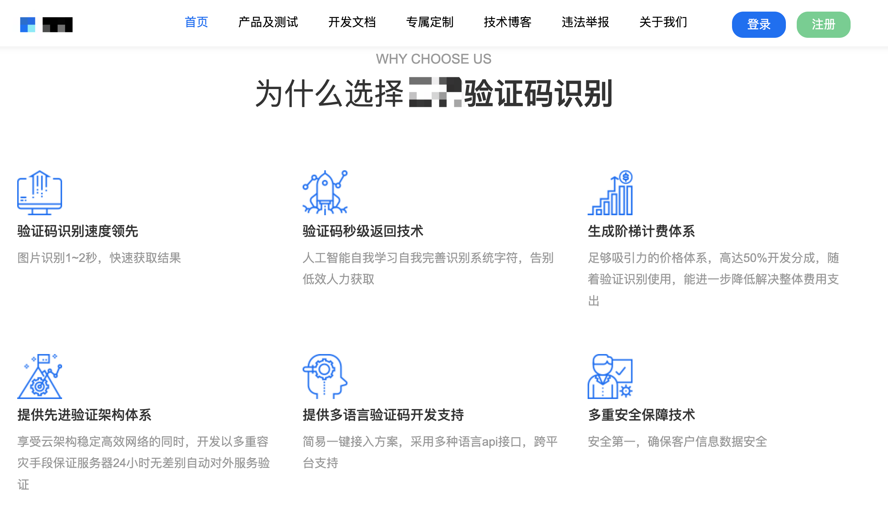
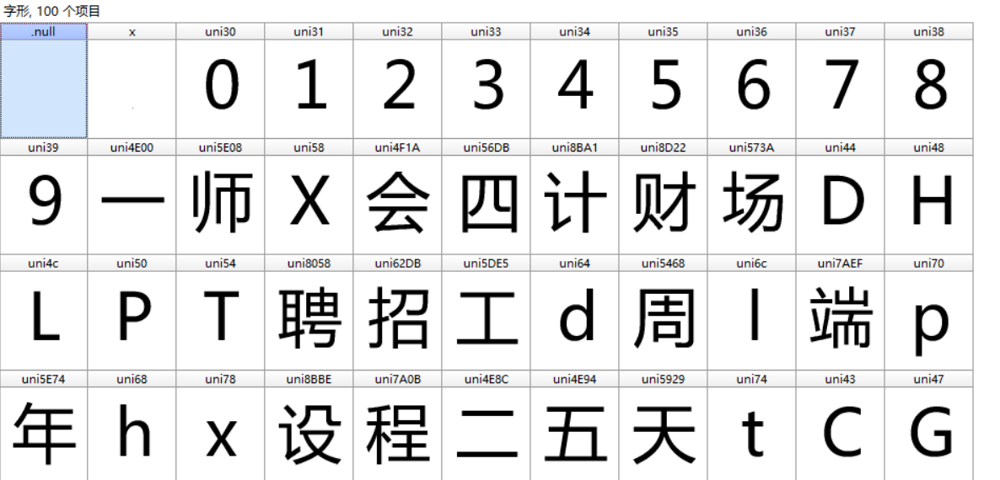

---
tags:
- 爬虫
---

# 反爬和反反爬

> 题外话：AI时代，不知道大家现在有了问题是习惯性的在搜索引擎检索，还是先问问AI呢？我个人还是更喜欢搜索引擎，我始终觉得，互联网上有大量优质的内容，AI的最佳做法是帮助我们更快、更准地发现这些优质内容，而不是用自己的内在逻辑去生成内容（说实话生成的内容想要打败资深大佬的博客还是差得远呢）。
> 
> 当然，现在的AI已经逐渐强化了联网搜索的能力，未来可期啊。

今天要谈的是反爬虫和反反爬虫，问了一下GPT，也得到了一个不错的答案，但就算是我也能看出有待提升的地方（<s>不然我写的内容也就没有价值了？</s>）：

??? chatgpt-summary "Ask GPT: 常见的反爬虫和反反爬虫技术"
    在网络爬虫和反爬虫的对抗中，双方使用了多种技术来实现各自的目标。下面是一些常见的反爬虫和反反爬虫技术：

    #### 反爬虫技术

    1. **机器人排除标准（robots.txt）**:
        - 网站通过`robots.txt`文件声明哪些部分允许或不允许被爬虫访问。
        - 虽然这个标准依赖于爬虫的自愿遵守，但很多合法爬虫会尊重这个文件的指示。

    2. **IP 阻止和速率限制**:
        - 根据爬虫的访问频率和行为，动态地阻止特定 IP 地址。
        - 实施速率限制，以防止频繁的请求超出设定的阈值。

    3. **<s>用户代理</s>Headers检查**:（AI的说法很奇怪，我感觉这里想表达的意思是Headers信息的检查，例如`User-Agent`等）
        - 检查请求中的用户代理字符串，识别和阻止常见的爬虫标识。
        - 有些网站会通过分析用户代理字符串的细微差别来判断请求是否来自爬虫。

    4. **JavaScript 复杂化**:
        - 使用复杂的 JavaScript 来加载内容，使爬虫难以直接获取页面内容。
        - 动态加载和渲染内容，以避免静态爬虫的抓取。

    5. **CAPTCHA**:
        - 使用图形验证码、音频验证码等方式，要求用户（或爬虫）进行交互，以确认其为真人。
        - 常用于登录页面、注册页面和其他敏感操作。

    6. **行为分析**:
        - 监控用户的行为模式，识别异常行为，如连续大量请求、非人类行为等。
        - 利用机器学习模型来检测和区分正常用户和爬虫。

    7. **隐藏陷阱链接**:
        - 在页面中添加对正常用户不可见的链接或内容，专门用于识别爬虫。
        - 如果爬虫访问了这些隐藏链接，就可以被标记并阻止。

    #### 反反爬虫技术

    1. **IP 轮换和代理**:
        - 使用大量的代理服务器，定期轮换 IP 地址，避免被单一 IP 封锁。
        - 使用代理池来模拟来自不同地理位置的访问。

    2. **模拟人类行为**:
        - 模拟人类的浏览行为，如随机的点击、鼠标移动、键盘输入等。
        - 引入随机等待时间，模拟真人用户的操作习惯。

    3. **伪造用户代理**:
        - 伪造用户代理字符串，模仿常见浏览器的标识，以逃避基于用户代理的检测。
        - 动态更改用户代理，以增加检测难度。

    4. **绕过 CAPTCHA**:
        - 使用 OCR 技术或图像识别算法破解图形验证码。
        - 使用音频识别技术破解音频验证码。
        - 人工验证码破解服务，通过人力解决验证码。

    5. **动态解析 JavaScript**:
        - 使用无头浏览器（如 Puppeteer、Selenium）来执行和解析 JavaScript，以获取动态加载的内容。
        - 分析和还原 JavaScript 代码，直接获取其中包含的数据。

    6. **分布式爬虫**:
        - 将爬虫任务分散到多个节点，减小单个节点的抓取频率，避免被检测到。
        - 使用 P2P 网络或其他分布式计算技术来分担爬虫负载。

    7. **数据缓存和重用**:
        - 对已经抓取的数据进行缓存，避免重复请求，减小被发现的风险。
        - 使用增量更新的方式，仅抓取新增或更新的内容。

    通过上述技术，爬虫和反爬虫在不断地演化和对抗，双方都在不断改进自己的方法，以达到各自的目标。

## 反爬1: `robots.txt`
这一点AI说的基本没问题，如果网站通过`robots.txt`文件声明了不想被爬虫访问的页面，确实可以规避掉一些（合法的?有道德感的?）爬虫。

但这也是看情况的。例如对于[Google搜索引擎的爬虫](https://developers.google.com/search/docs/crawling-indexing/robots/intro)，这个文件就是无效的。需要采取其他的措施才能保证页面不被爬取：

<figure markdown>

{width=500}

</figure>

!!! solution "反反爬"
    这个文件只是一个软约束，纯道德规范。**如果你不想做一个有道德感的爬虫直接忽视即可**。

## 反爬2: 异常访问限制

常见的策略，如果服务器检测到了异常的访问，完全可以把这个访问的IP直接BAN掉。

所谓**异常访问**是网站自己定义的，常见的包括但不限于：

- Headers信息看起来不像正常的访问
- 高频率的网络请求
- 高并发的网络请求
- 短时间内大量的数据传输
- 短时间内同一用户快速的IP变动
- 可疑的IP
- 可疑的行为模式
    - 访问间隔完全相同
    - 没有鼠标键盘活动
    - 加载了正常访问本该看不到的内容（陷阱链接）

这些手段不一而足，一般情况下这是一个权衡的难题：极致的反爬虫代表了很差的用户体验。

!!! solution "反反爬"
    见招拆招即可：

    - 网站监测Headers，那你就伪造Headers
    - 网站不允许高并发、高频率访问，那你就不要并发、限制访问频率
    - 网站会监测用户行为是不是像正常人，那你就模拟正常用户的行为
    - IP被禁了就用代理服务器

    总之，这些应对策略是很灵活的，需要具体分析。

## 反爬3: 验证码（CAPTCHA）
> 喜闻乐见？深恶痛绝！

验证码全称**全自动区分计算机和人类的图灵测试**，英文是CAPTCHA（Completely Automated Public Turing test to tell Computers and Humans Apart，简称CAPTCHA）。是2002年CMU的几个家伙提出来的，最常见的就是这种扭曲的文字验证码：

<figure markdown>

</figure>

想法非常简单美好，由于当时的技术限制，爬虫想要正确通过验证码是非常困难的。然而随着计算机技术的发展，深度学习使得自动化验证码识别成为可能。这样的验证码太简单了！

于是人们想出来了更多的验证码：

- 基础的识别类验证码
    - 好吧我承认，我确实有视力障碍
    - {width=300}
- 滑块缺口类验证码
    - 简单且无趣的验证码，我也经常过不去
    - {width=300}
- 计算题验证码
    - 只在学信网见过
    - {width=300}
- 点选类验证码
    - 我一点也不想点
    - {width=300}
- Google验证码
    - 💩啊
    - {width=300}
- Cloudfare验证码
    - 唯一可以接受的无感验证码
    - {width=300}

!!! solution "反反爬"
    但是，这么多天才发明的验证码最终也只是**机器大战**罢了，这一点也不低碳：

    <figure markdown>

    {width=400}

    </figure>

    提供验证码在线识别的商家应运而生，赚麻了。

## 反爬4: 复杂JS逻辑
这种反爬方式是最有技术含量的了。也是我们反反爬的主要技术难点。

古早的时候，网页都是静态的`html`文件，爬虫想看啥看啥。而现在很多网站的静态文件全是`js`脚本，必须经过正确的请求才能从后端拿到页面。这个脚本就可以做得很复杂了。包括但不限于：

- 复杂的请求参数（Cookie？通过ajax的参数？加密算法？）
- JS反调试（禁止F12调试，就等于断了爬虫工程师的一只手）
- 跨域验证等等

!!! solution "反反爬"
    写这类网站的爬虫往往是非常痛苦的（也非常考验技术）。通常有两条路可以走：

    1. JS逆向，理清楚前端的处理逻辑即可。可见就是可爬虫的，慢慢来总归能搞清楚。最后把相关的代码摘出来，用`node.js`来运行即可（如果能用Python等其他模拟也可以）。
        - 劣势：分析非常耗时，网站更新了可能就失效了
        - 优势：这样完成的爬虫效率高

    2. 你JS再复杂，总归自己是能执行的。那我就搞个无头浏览器（Selenium、Puppeteer等）让你执行呗。
        - 劣势：占用更多的资源
        - 优势：分析的过程很简单

    PS：如果网页的F12调试被禁用了（或者有无限Debugger等反调试），可以考虑使用Proxyman、Wireshark等代理软件抓包。

## 反爬5: 加密

这种反爬就是不讲武德了，写爬虫的毕竟处于被动地位。加密只要三行代码，解密可能需要三搓头发。

常见的加密包括但不限于：
- 数据传输加密（这样抓包就无效了，必须找到解密的方法）
- 参数加密（常见的是AES、RSA等算法）
- JS混淆加密
- 字体加密（pdd的后台软件就喜欢搞这个）
    - 类似于凯撒加密，实现的方式是在前端使用**自定义的字体**，这样收到的数据看起来是乱码，实际上通过字体文件的映射就是人类可以识别的正常语句了
    - 

!!! solution "反反爬"
    解密吧。