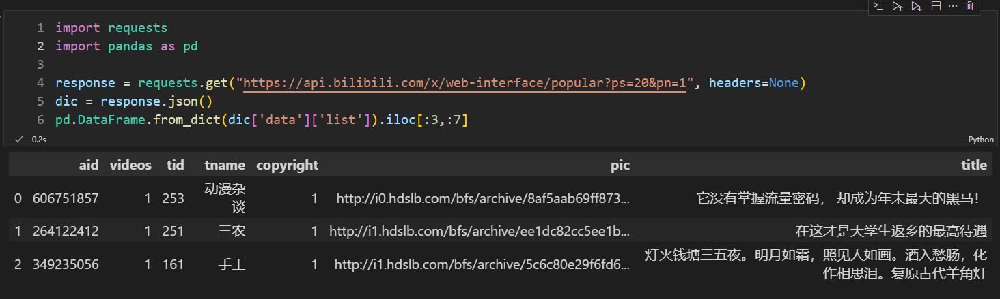
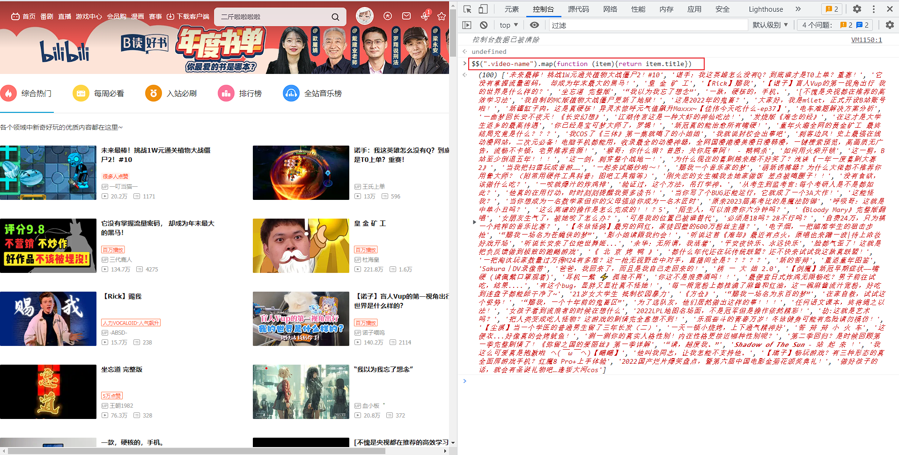
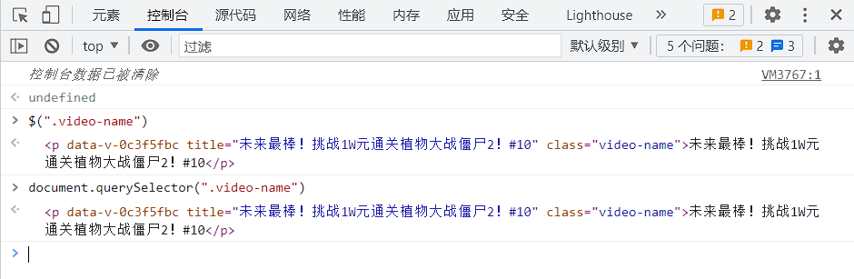
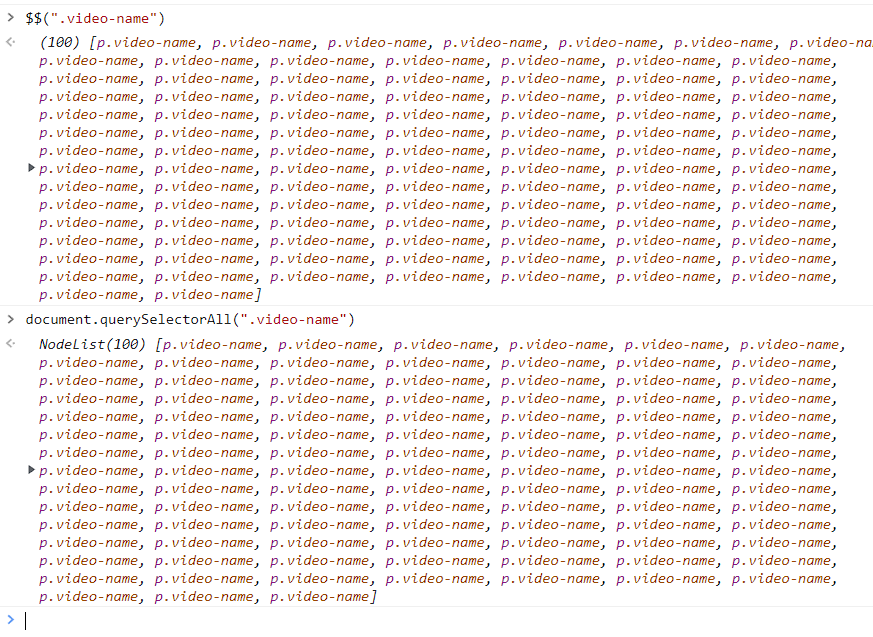
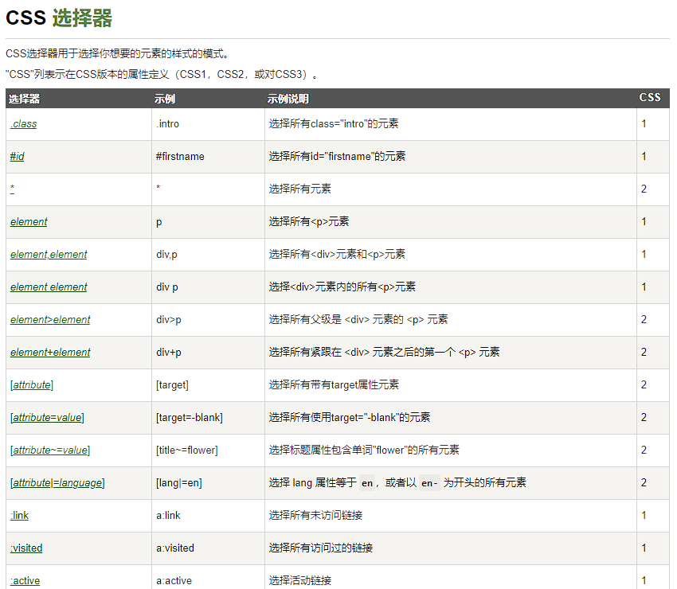
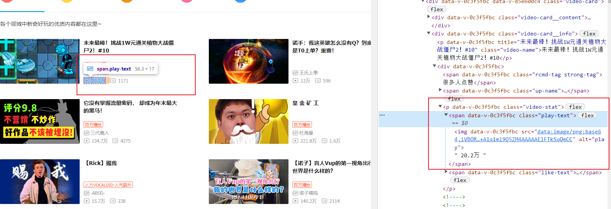
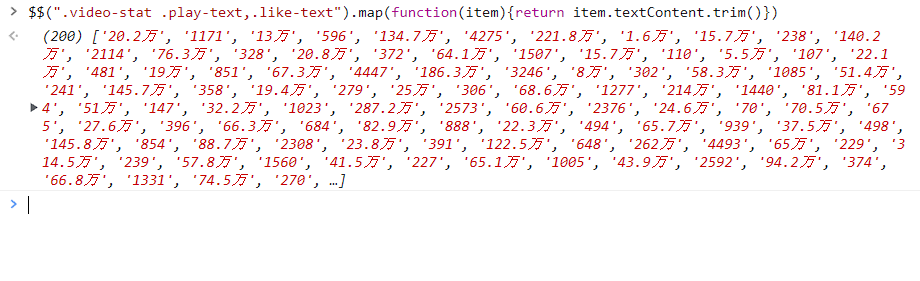

---
tags:
- 爬虫
---

# 极简爬虫

本文介绍一些**批量获取网页上信息**的小技巧！我们用一个任务作为引导，分别介绍用Python（requests库）的实现方法和JavaScript（jQuery）的实现方法。

## 任务描述

我们的任务是在下面的页面获取所有上榜视频的链接、标题、播放量信息等信息。


## Python写法

先整点老本行：



从结果来看，我们只需要简单的几行就可以获取到全套的信息。但是这是建立在我们找到了哔哩哔哩的api：**<https://api.bilibili.com/x/web-interface/popular?ps=20&pn=1>** 的基础之上，它直接返回了`json`数据文件。如果我们找不到api就可能需要写一些正则表达式来提取页面信息了。

上图的代码也贴在下面：

```python
import requests
import pandas as pd

# 发送网页请求
response = requests.get(
    "https://api.bilibili.com/x/web-interface/popular?ps=20&pn=1", 
    headers=None
)
# 把返回的json文件转换成字典
dic = response.json()
# 把字典里的数据转换成dataframe
pd.DataFrame.from_dict(dic['data']['list']).iloc[:3,:7]
```

Python的写法虽然已经足够简单了，但是普适性不强，如果遇到一些身份认证比较麻烦的网站就不怎么好用，需要花费很大的精力来搞。而且还需要配置Python环境，不能随时随地用。

下面我们来介绍更加简单得多但一点也不弱的JavaScript方法。

## JavaScript写法

借助浏览器的`调试工具`（一般浏览器都自带这个功能，按下F12即可打开），我们可以便捷地在页面上运行`JavaScript`：



如图所示我在控制台输入了一行代码：

```js
$$(".video-name").map(function (item){return item.title})
```

然后控制台就返回了所有视频的标题。Amazing！

下面我们分步骤拆解这行代码：

> 如果你懒得看可以直接去看[jQuery的文档](https://jquery.com/)

### 1、获取`NodeList`

```js
$$(".video-name")
```

这句话是一个**语法糖**（所谓语法糖就是程序员为了少敲几个字母发明的简便写法），它完全等价于下面的函数：

```js
document.querySelectorAll(".video-name")
```

类似的还有一个美元符号的写法：

```js
$(".video-name")
```

它就相当于单个元素的选择器：

```js
document.querySelector(".video-name")
```

他们运行的效果如图所示，是完全相同的

- querySelector



- querySelectorAll



`querySelectorAll`函数接受一个CSS选择器作为输入，返回的结果是一个`NodeList`，里面存储了若干个`Node`，每一个`Node`就相当于html的一个切片。

### 2、获取每个`Node`的标题

然后我们就可以用map函数对每个node提取他们的标题：

```js
$$(".video-name").map(function (item){return item.title})
```

这里面`.map`是`NodeList`对象的一个函数，它接受一个函数作为参数，然后传入的这个函数作用到每一个`Node`上。这个用法和python里面的map函数是一致的，有python基础的话应该不难理解。

### 3、CSS选择器

那么这里面最关键的参数`".video-name"`是怎么得到的呢？

这其实是一个[CSS选择器](https://developer.mozilla.org/zh-CN/docs/Web/CSS/CSS_selectors)，如果你想完全掌握需要进一步的学习：



简单来说，我们可以用特定的语法选定页面上的一类元素，用起来和正则表达式差不多。

### 4、小小运用一下

例如，我想获取哔哩哔哩热门页面所有视频的播放量和弹幕数量：



可以看到，这两个数据都在同一个`p`标签之下，它的class是`video-stat`。

播放量这个数字在一个`span`标签内部，它的class是`play-text`，我们想要的内容是他的文本内容；

弹幕数量类似，它的class是`like-text`，我们想要的也是它的文本内容。

于是我们就可以这么写：

```js
$$(".video-stat .play-text,.like-text").map(function(item){return item.textContent.trim()})
```

它的返回结果：



这里面用了一个字符串的处理函数`.trim()`，就相当于python的`.strip()`，作用只是把前后的空格去掉。
