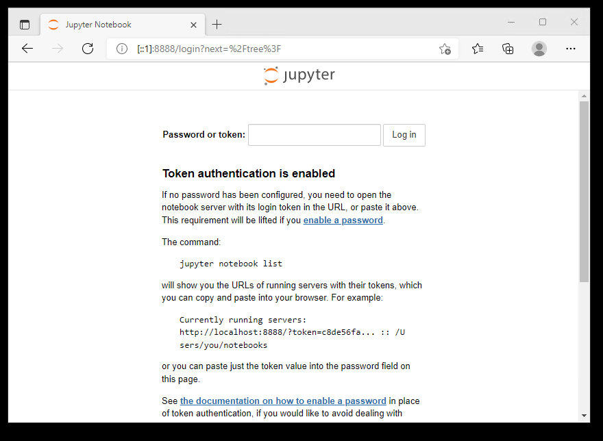
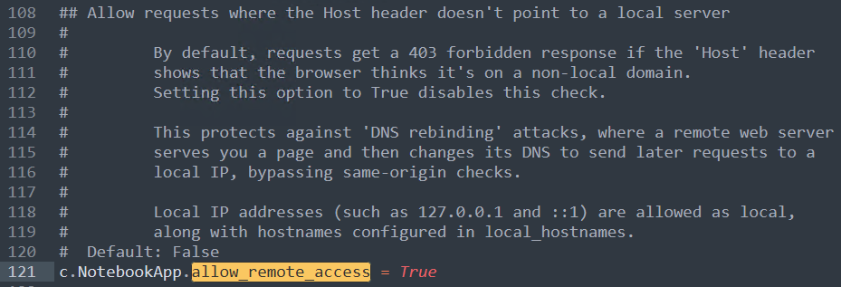
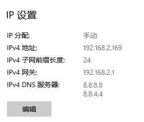
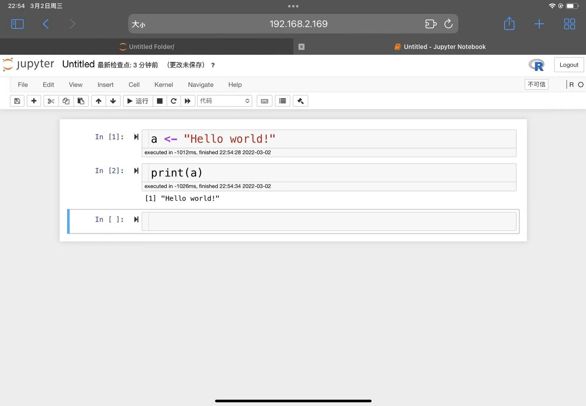

---
tags:
 - Jupyter
---

几天不见，今天我们继续传销Jupyter Notebook

之前的推文提到过，jupyter是一个“web服务器”，那么它理所应当的可以远程访问。

## 本地环回
通常我们都是在本地运行jupyter notebook server，然后在本地访问，这就可以理解为是一个本地环回。

当你运行一个jupyter nb，你能在命令行看到一些提示消息：

<figure markdown>

</figure>
最后一条尤为重要：
```shell
[C 05:23:24.768 NotebookApp]

To access the notebook, 
open this file in a browser:

file:///C:/Users/dou/AppData/Roaming/-
jupyter/runtime/nbserver-1372-open.html

Or copy and paste one of these URLs:
http://localhost:8888/?token=xxx
or http://127.0.0.1:8888/?token=xxx
```
这里提示我们进入notebook界面的方法，三种：打开一个`.html`文件，或者输入两个网址。

这个`.html`文件的内容如下：

<figure markdown>

</figure>

里面只是写了一个函数，点开就会redirect到后面两个对应的地址。

关于这两个网址，这里贴一下维基百科相关词条的科普：
> **localhost**是一个在计算机网络中用于表示“此计算机”的主机名。它被用于通过本地环回网络接口，来访问本机运行的服务，并且将会绕过任何物理网络接口硬件。在设置好本地安装的网站后，可通过http://localhost这一网址，来访问本地网站。localhost这个主机名称一般会解析为**IPv4**本地环回地址127.0.0.1和**IPv6**本地环回地址[::1]。

也就是说我们在浏览器输入IPv6网址`[::1]:8888`也是可以访问的：

<figure markdown>

</figure>

这里输入token即可访问。


## 局域网连接
而如果我们不仅仅想在本地访问，想要跨设备**远程访问**，那么最简单的一种远程访问就是在**局域网**啦（如果你不懂局域网是什么，简单理解就是**连着同一个路由器**的网），我们首先修改配置文件。

配置文件的路径是`C:\Users\Username\.jupyter\jupyter_notebook_config.py`，如果你的路径下没有这个文件，可以在命令行运行以下命令：
```shell
jupyter notebook --generate-config
```
然后用任意文本编辑器打开生成的文件。

第`121行`，设置允许远程访问

<figure markdown>

</figure>

第`297`行，修改监听的IP地址

<figure markdown>

</figure>

这里修改为`'*'`代表任一IP地址都可访问，如果只想在特定的IP地址访问（也就是白名单），输入相应的地址即可。

至此我们应该已经可以在局域网访问到我们的服务器了！！但是为了（完全没必要的）安全起见，我们还是设置一个密码。

第`412`行，修改密码（可选

<figure markdown>

</figure>

注意密码需要使用一定算法加密过的密钥，例如：
```python
C:\Windows\system32>python
Python 3.9.7 (tags/v3.9.7:1016ef3, Aug 30 2021, 20:19:38) 
>>> from notebook.auth import passwd
>>> passwd('10')
'argon2:$argon2id$v=19$m=10240,t=10,p=8$JTyGxNjBo8aBkFyR0a/ISg$WCk2NXHKe3IdP41z1bqOw5BW86mSL07C30Tj0AWjdvU'
>>> passwd('10', 'sha1')
'sha1:444901b2b894:e17dda7448814342f920cf9f86e434eceae6de98'
```

然后，我们在接入局域网的任意设备的浏览器`服务器局域网ip:8888`即可访问。

### 效果展示
我的电脑在局域网的IP为`192.168.2.169`：

<figure markdown>
{width=300}
</figure>

于是只要在局域网内访问`192.168.2.169:8888`即可使用电脑上的jupyter notebook程序，例如在手机：

<figure markdown>
{width=300}
</figure>

再如在**听说读写模拟器**上：

<figure markdown>
{width=300}
</figure>
<center><s>iPad生产力指日可待！！</s></center>
<br>

甚至在**泡面盖**上：

<figure markdown>
{width=300}
</figure>
<center><s>编程更护眼！！</s></center>
<br>

不过Kindle上虽然能显示登录界面，但是登录之后不能正常渲染CSS，进去之后什么都看不到。可恶，又失去了一个写代码利器。

这些可不是空架子，你真的可以在上面痛快地写代码，它们都会**运行在服务端**，并且可以多个用户同时连接，进而实现**某种意义上的协同**。

在iPad上写代码

<figure markdown>
{width=400}
</figure>

手机上也能看到在运行中的笔记本！

<figure markdown>
{width=300}
</figure>

## 广域网连接
可局域网连接听起来也挺**鸡肋**的，毕竟都在家（or宿舍）了，我为什么不直接用电脑干活呢？如果能在随时随地访问我的jupyte服务器就好了。

而想要实现这样的效果，这里提供三个解决方案：

### 使用公网IP访问
如果你拥有一个公网IP，那么一切迎刃而解。只要你按照上述操作，设置好jupyter服务器，然后在**防火墙**开放相应的端口，即可在任何联网的设备上通过公网IP访问了！

没有任何附加的操作，公网IP真的非常方便，但是很多人（比如我）就没有公网IP，于是只能另求它法。
> 什么是公网IP？<br>广域网IP是指以公网连接Internet上的非保留地址。广域网、局域网是两种Internet的接入方式，广域网的计算机和Internet上的其他计算机可随意互相访问。摘自百度百科，公网IP词条。

### 内网穿透
公网IP那么好用，可很多人却没有公网IP，于是催生了这样一种服务：内网穿透。
> 什么是内网穿透？<br>举个栗子就是你想和外国友人A打跨国视频电话，但是你的网络状况不好，没法直接打过去。于是你找了个网很好的B，你打给B，然后B再打给A，这样就实现了你和A的通信。

而B这样的工具人服务商有很多，例如`花生壳`、`Sakura Frp`等等，他们的官方都给出了详细的教程，我这里不赘述，这里贴上他们的官网：
```
花生壳：https://hsk.oray.com/
Sakura：https://www.natfrp.com/
```
### 钞能力
既然我的电脑获取不到公网IP，那我买一个有公网IP的云服务器不就得了。我本人就在阿里云买了一个乞丐版的服务器：

<figure markdown>

</figure>
不贵（一年100差不多），但是很好玩。

点击**阅读原文**可以查看我搭建整个云服务器的过程，这里也不再赘述。


此致。