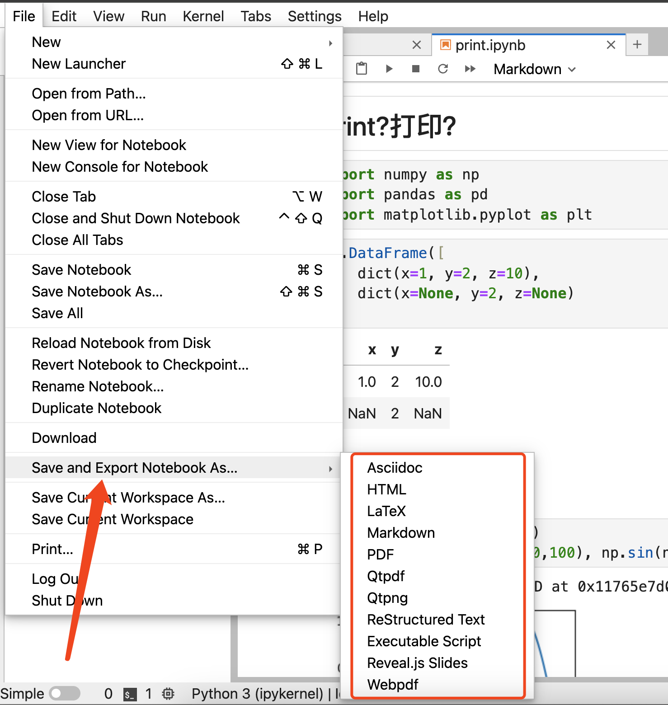
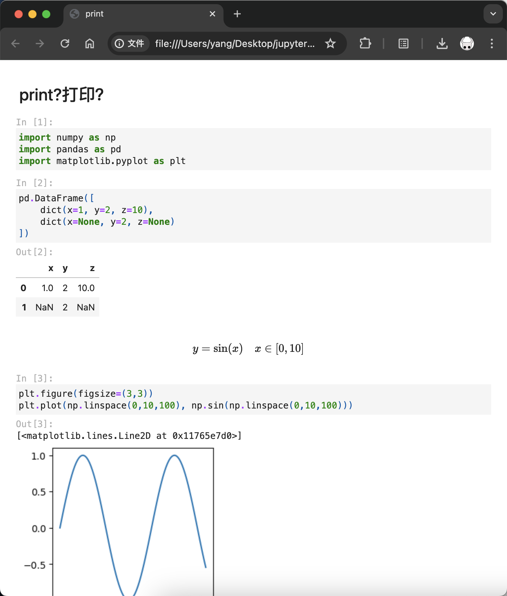

# 如何优雅地打印Jupyter文档

!!! note "省流"
    [效果最好的方法](#pdf)：使用nbconvert转换
    ```bash
    jupyter nbconvert --to pdf print.ipynb
    ```

    [最简单的方法（除了截图）](#nbviewer)：使用Jupyter的官方服务nbviewer

人生苦短，我用Jupyter。

但是别人不一定用，那么应该如何把Jupyter文档打印成为可读的PDF文档方便我们分享出去呢？

例如这样一个包含公式、图像、表格的Jupyter文档：
<figure markdown>

{width=400}

</figure>

## 截图
最简单的方法自然就是网页截图，就像我们上面这张图。直接截取自Jupyter Lab，效果也还可以。

如果文档比较长，还可以使用网页长截图的工具，例如我在用的[FireShot](https://getfireshot.com/)，效果也还可以。

## 浏览器打印
如果你尝试直接使用浏览器的，大概率会得到一个500: Internal Server Error
<figure markdown>

{width=400}

</figure>

你需要安装依赖才可以：
```bash
pip install -U nbconvert
```

不过，我虽然安装了但还是在后台看到如下的报错：
```
ValueError: No template sub-directory with name 'lab' found in the following paths:
    ~/Library/Jupyter
    ~/Library/Python/3.11/share/jupyter
    /usr/local/share/jupyter
    /usr/share/jupyter
...
```

这大概是因为我的python是用`homebrew`安装的，模版文件都在这个文件夹：
```
/opt/homebrew/share/jupyter/nbconvert
```

只要把模版文件复制过去就行了：
```bash
cp -r /opt/homebrew/share/jupyter/nbconvert ~/Library/Jupyter/nbconvert
```

然后就可正常打印了：
<figure markdown>

{width=400}

</figure>

但是这里面的数学公式还是没有正常渲染。

## Export
不过无伤大雅，我们使用`Export`就可以正常渲染了：
<figure markdown>

{width=400}

</figure>

不过我在这里还是会遇到一些bug

```
500 : Internal Server Error
The error was:

nbconvert failed: xelatex not found on PATH, if you have not installed xelatex you may need to do so. Find further instructions at https://nbconvert.readthedocs.io/en/latest/install.html#installing-tex.
```

推测还是`homebrew`的问题。

## jupyter nbconvert
不过无伤大雅，我可以用命令行来完成这个操作。

### pdf

使用这个命令需要安装依赖：
```bash
brew install mactex
```
确保`xelatex`可用。

<div class='console'>

```console
$ jupyter nbconvert --to pdf print.ipynb
[NbConvertApp] Converting notebook print.ipynb to pdf
[NbConvertApp] Support files will be in print_files/
[NbConvertApp] Making directory ./print_files
[NbConvertApp] Writing 22069 bytes to notebook.tex
[NbConvertApp] Building PDF
[NbConvertApp] Running xelatex 3 times: ['xelatex', 'notebook.tex', '-quiet']
[NbConvertApp] Running bibtex 1 time: ['bibtex', 'notebook']
[NbConvertApp] WARNING | bibtex had problems, most likely because there were no citations
[NbConvertApp] PDF successfully created
[NbConvertApp] Writing 32570 bytes to print.pdf

```

</div>

效果不错：
<figure markdown>

{width=400}

</figure>

但是会有一个问题，中文消失了。

这也好办，我们只需要参考[使用LaTeX排版中文文档](../latex/latex_cn.md)的操作。给模版文件添加一个宏包即可：
<figure markdown>

{width=400}

</figure>

然后再次转换就可以正常渲染中文啦：
<figure markdown>

{width=400}

</figure>

### markdown
<div class='console'>

```console
$ jupyter nbconvert --to markdown print.ipynb
[NbConvertApp] Converting notebook print.ipynb to markdown
[NbConvertApp] Support files will be in print_files/
[NbConvertApp] Making directory print_files
[NbConvertApp] Writing 1064 bytes to print.md

```

</div>

转换成markdown的效果一般：
<figure markdown>

{width=400}

</figure>
可以用`typora`二次加工一下。

### html

<div class='console'>

```console
$ jupyter nbconvert --to html print.ipynb
[NbConvertApp] Converting notebook print.ipynb to html
[NbConvertApp] WARNING | Alternative text is missing on 1 image(s).
[NbConvertApp] Writing 293572 bytes to print.html

```

</div>
这个渲染出来也很好看，`.html`文件也很适合放到网上：
<figure markdown>

{width=400}

</figure>

### python script

<div class='console'>

```console
$ jupyter nbconvert --to script print.ipynb
[NbConvertApp] Converting notebook print.ipynb to script
[NbConvertApp] Writing 370 bytes to print.py

```

</div>

这个也很有用。

```python title="print.py"
#!/usr/bin/env python
# coding: utf-8

# ## print?打印？

# In[1]:


import numpy as np
import pandas as pd
import matplotlib.pyplot as plt


# In[2]:


pd.DataFrame([
    dict(x=1, y=2, z=10),
    dict(x=None, y=2, z=None)
])


# $$
# y = \sin(x) \quad x\in [0,10]
# $$

# In[3]:


plt.figure(figsize=(3,3))
plt.plot(np.linspace(0,10,100), np.sin(np.linspace(0,10,100)))


```

### 自定义模版
前面我们也提到了模版文件夹，其实你完全可以仿照`nbconbert`给出的模版自己写一个模版。

## nbviewer
如果你懒得搞这些，就想方便快捷地展示一下。可以考虑使用Jupyter官方提供的在线预览服务[nbviewer](https://nbviewer.org/)：


输入文件的地址即可：
> 本文的案例我贴在了gist：<https://gist.github.com/AIboy996/48df0f723cfd921613ceab8590e35ef0>

<figure markdown>

{width=400}

</figure>

效果也是不错的。

你也可以在这个网页打印你的文档：

<figure markdown>

{width=400}

</figure>

风格就比较素。