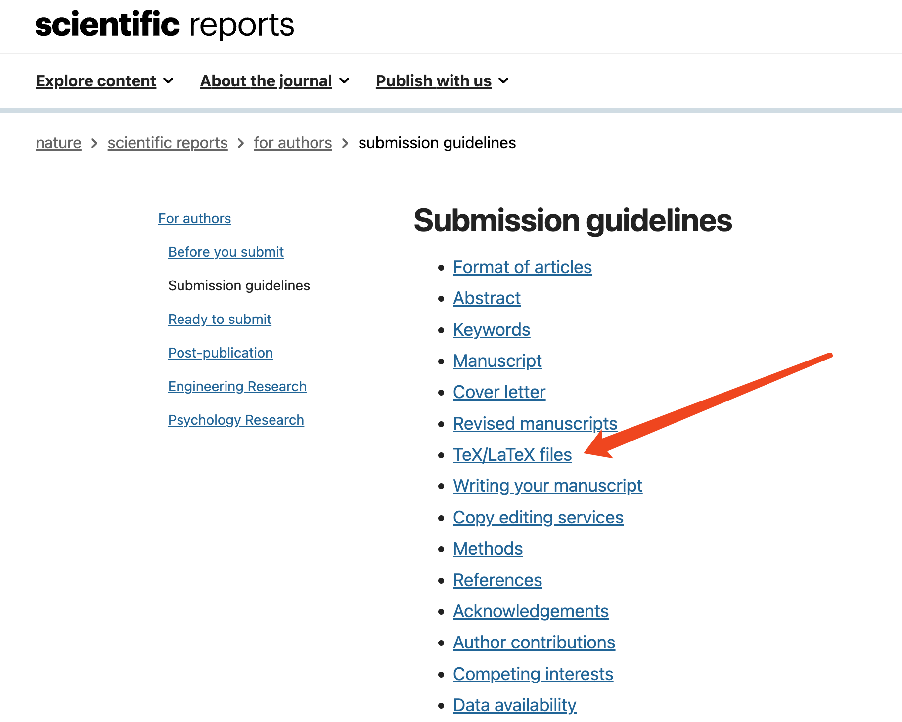
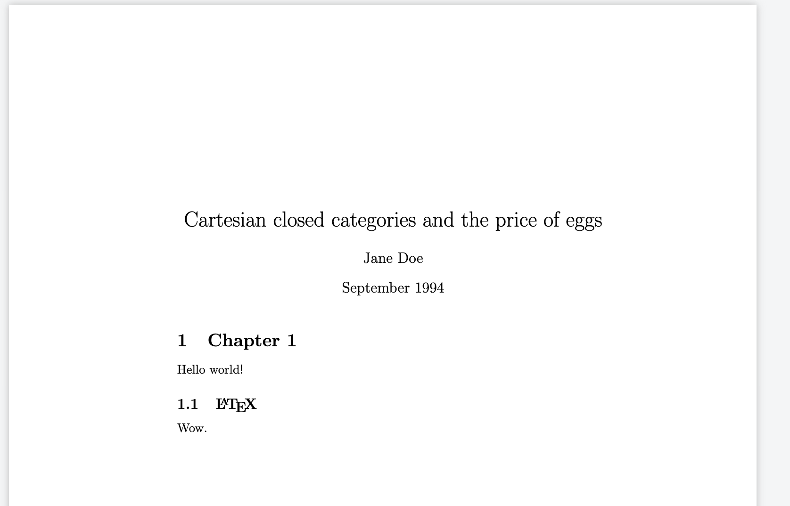
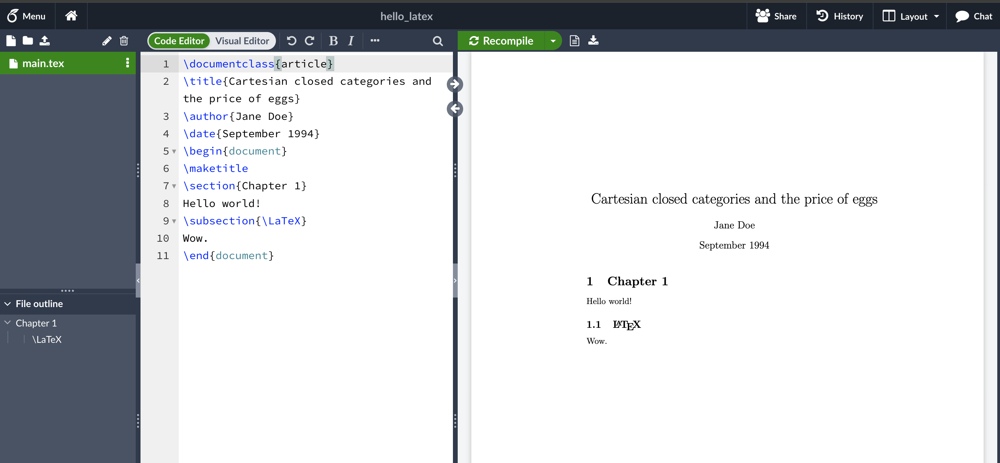

## LaTeX是什么

!!! cite "official intro"
    LaTeX is a high-quality typesetting system; it includes features designed for the production of technical and scientific documentation. LaTeX is the de facto standard for the communication and publication of scientific documents. LaTeX is available as free software.

简而言之LaTeX（pronounced “LAY-tek” or “LAH-tek”）是一种为了制作高质量**理工科文书**而设计的**排版系统**，实际上成为了很多**学术期刊**的标准解决方案。

这里有三个关键词：

- 理工科文书：例如数学、物理、计算机科学等学科的文书，通常会涉及到*文字、数学公式、图表、伪代码* 等元素的混排。这些都是LaTeX擅长的工作。与之相对的就是一般文科类的文书，例如历史、中文、英语。大多都是纯粹的文字和图片，这些内容Microsoft Word也能轻松胜任。
- 排版系统：和Microsoft Word这样所见即所得的软件不同，LaTeX是一种标记语言，它是通过**编程语言的描述**来按照一定的规则生成文稿的，我们写的是LaTeX代码，最后得到的PDF文稿。
    - 例如：`$\sqrt{\pi}$`对应数学公式：$\sqrt{\pi}$，这样的对应关系由**LaTeX编译器**来自动转换。
    - 所有的格式也都是手动申明的，一切*有迹可循*，例如：`\textit{Hello} \textbf{World}`对应斜体和黑体：*Hello* **World**. 而不像Microsoft Word里那样是通过菜单栏来操作的，设置好了之后根本无迹可寻。
- 学术期刊：这就不用多说了，如果你想给Science投稿一篇论文，最好使用他们提供的**LaTeX template**来写论文，来确保格式的正确无误。
    - 

## LaTeX代码
LaTeX作为一个标记语言，它的语法是非常简单明了的。我们通过一个例子来简单展示一下：
```latex title="hello.tex"
\documentclass{article}
\title{Cartesian closed categories and the price of eggs}
\author{Jane Doe}
\date{September 1994}
\begin{document}
\maketitle
\section{Chapter 1}
Hello world!
\subsection{\LaTeX}
Wow.
\end{document}
```
上面这段代码可以渲染出下面的页面：


### 序言（preamble）
LaTeX文档的第一部分就是序言，它申明了这个文档使用的**模版**（也就是`document class`，在我们的例子里是`article`，这是一般LaTeX都支持的一个模版。你也可以使用其他的模版，例如Science提供的模版），以及标题、作者、日期等信息。

我们例子的前四行就是这些内容：
```latex
\documentclass{article}
\title{Cartesian closed categories and the price of eggs}
\author{Jane Doe}
\date{September 1994}
```
### 命令（commands）
或许你已经注意到了，latex文档中的反斜杠（backslash）`\`是一个特殊符号。这是latex的command语法：
```latex
\command[some options]{some content}
```
例如数学公式$\sqrt[4]{3}$就是：
```latex
\sqrt[4]{3}
```
我们前面的序言部分也使用了这些命令，例如：
```latex
\author{Jane Doe}
```
### 环境（environments）
一个特殊的命令是`\begin`和`\end`，它们必须成对出现：
```latex
\begin[some options]{environment}
some content
\end{environment}
```
这组命令用于创建一个环境。

我们最开始的例子就使用了`document`环境：
```latex
\begin{document}

\end{document}
```

再如`equation`是一种常用的数学公式环境：
```latex
\begin{equation}
\sin^2 x + \cos^2 x =1
\end{equation}
```
渲染的结果是：
$$
\begin{equation}
\sin^2 x + \cos^2 x =1
\end{equation}
$$

至此，我们基本就讲完了LaTeX代码的基本组织形式。下面我们来介绍如何把这些代码渲染成PDF文稿。

## LaTex编译器
这一步就需要使用LaTeX编译器，例如`tex`，`pdflatex`，`xelatex`等等。

### overleaf
当然，如果你是纯小白。看到这里就足够了，下面请直接前往[overleaf.com](https://overleaf.com)，使用他们提供的免费在线编译服务即可。谁用谁说好：




当然你也可以[自己搭建overleaf服务器](../../../Blog/2024/self-hosted-overleaf/)。
### 本地环境
如果你想在自己的电脑上编译，那么就需要去安装LaTeX编译器以及LaTeX代码编辑器如TeXworks、TeXstudio。当然一般安装编译器都会附带一个编辑器，或者你用VSCode、SublimeText这样的文本编辑器也可以。

- MacOS可以使用`homebrew`快速安装：
```bash
brew install mactex
```
- Windows用户可以下载[TeX Live](https://www.tug.org/texlive/windows.html)或者[MikeTeX](https://miktex.org/howto/install-miktex)。我更推荐MikeTeX，因为它更现代化，不会安装多余的宏包。如果编译的时候需要他也提供了包管理器可以自动安装需要的宏包。

安装完之后可以在终端确认一下，是否安装成功：

<div class='console'>

```console
$ tex --version
TeX 3.141592653 (TeX Live 2023)
kpathsea version 6.3.5
Copyright 2023 D.E. Knuth.
There is NO warranty.  Redistribution of this software is
covered by the terms of both the TeX copyright and
the Lesser GNU General Public License.
For more information about these matters, see the file
named COPYING and the TeX source.
Primary author of TeX: D.E. Knuth.

```

</div>

### 编译

然后你就可以编译LaTeX代码啦，我这里使用`pdflatex`编译了本文开头的`hello.tex`文件：
<div class='console'>

```console
$ pdflatex hello.tex
This is pdfTeX, Version 3.141592653-2.6-1.40.25 (TeX Live 2023) (preloaded format=pdflatex)
 restricted \write18 enabled.
entering extended mode
(./hello.tex
LaTeX2e <2022-11-01> patch level 1
L3 programming layer <2023-02-22>
(/usr/local/texlive/2023/texmf-dist/tex/latex/base/article.cls
Document Class: article 2022/07/02 v1.4n Standard LaTeX document class
(/usr/local/texlive/2023/texmf-dist/tex/latex/base/size10.clo))
(/usr/local/texlive/2023/texmf-dist/tex/latex/l3backend/l3backend-pdftex.def)
No file hello.aux.
[1{/usr/local/texlive/2023/texmf-var/fonts/map/pdftex/updmap/pdftex.map}]
(./hello.aux) )</usr/local/texlive/2023/texmf-dist/fonts/type1/public/amsfonts/
cm/cmbx12.pfb></usr/local/texlive/2023/texmf-dist/fonts/type1/public/amsfonts/c
m/cmbx8.pfb></usr/local/texlive/2023/texmf-dist/fonts/type1/public/amsfonts/cm/
cmr10.pfb></usr/local/texlive/2023/texmf-dist/fonts/type1/public/amsfonts/cm/cm
r12.pfb></usr/local/texlive/2023/texmf-dist/fonts/type1/public/amsfonts/cm/cmr1
7.pfb>
Output written on hello.pdf (1 page, 52941 bytes).
Transcript written on hello.log.


```

</div>

编译完成之后，工作目录会生成很多文件：
```
hello.aux
hello.log
hello.pdf
hello.tex
```

这里`hello.pdf`就是我们想要的PDF文件啦，`hello.log`记录了编译的日志。`hello.aux`文件是辅助（auxiliary）文件，我们的例子里它记录了文档的章节（section）结构：
```latex title="hello.aux"
\relax
\@writefile{toc}{\contentsline {section}{\numberline {1}Chapter 1}{1}{}\protected@file@percent }
\@writefile{toc}{\contentsline {subsection}{\numberline {1.1}\LaTeX  }{1}{}\protected@file@percent }
\gdef \@abspage@last{1}
```