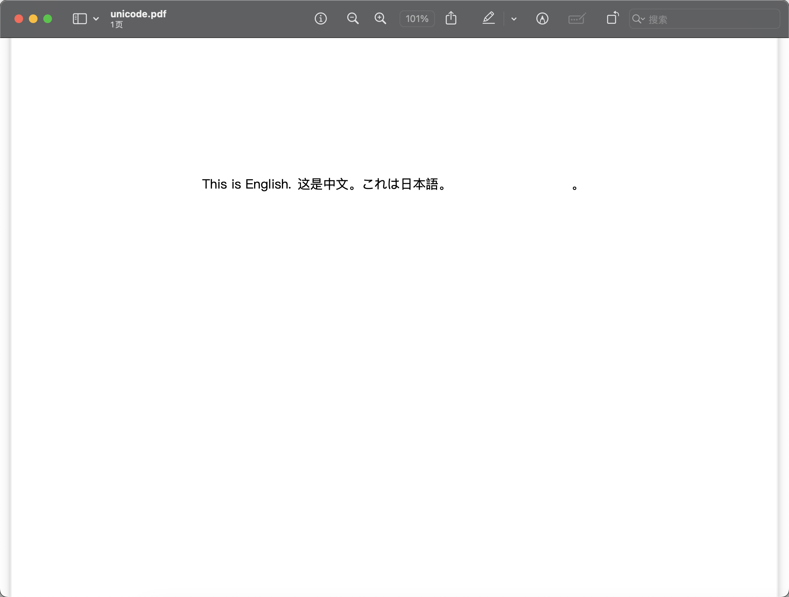
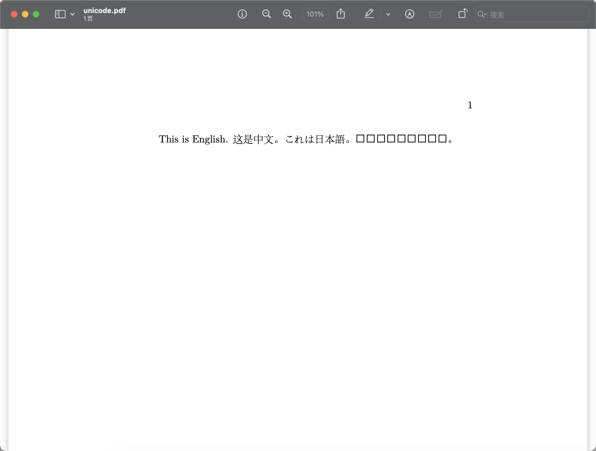
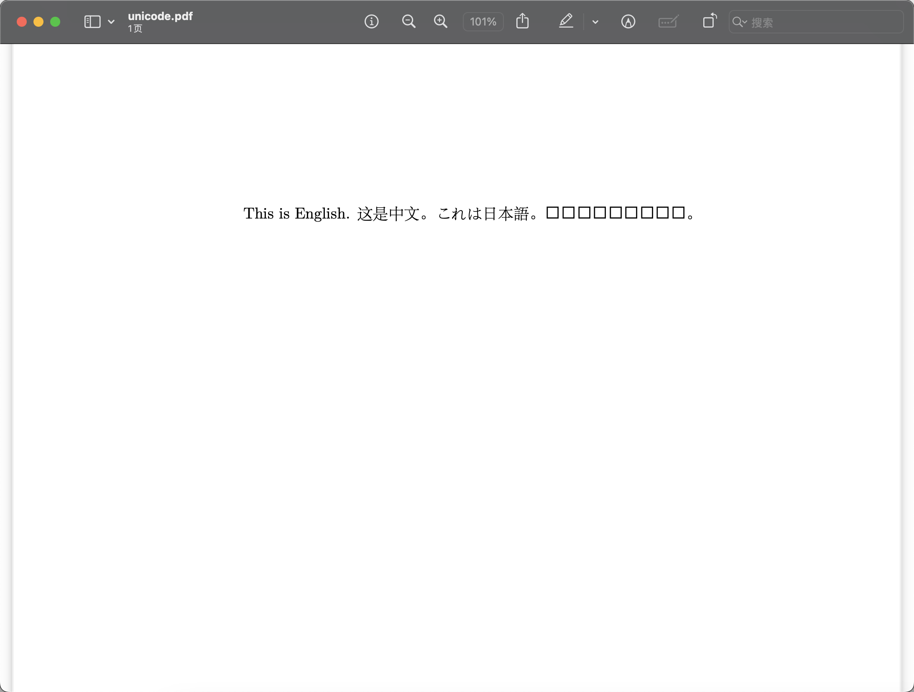
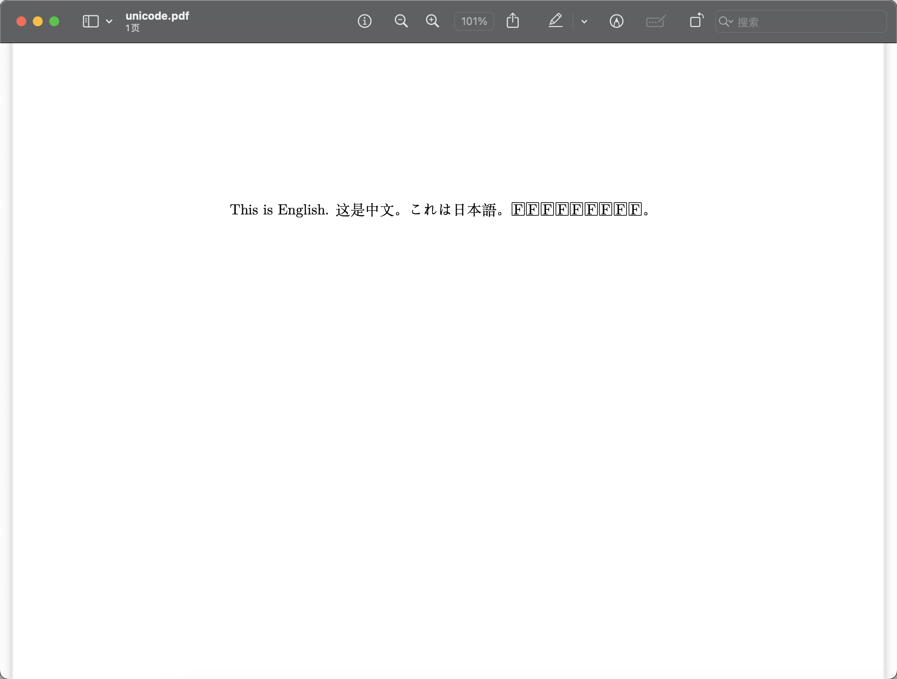

# 使用LaTeX排版中文文档

默认情况下，`pdflatex`是无法识别unicode字符的，而`xelatex`可以识别unicode字符。所以我推荐使用`xelatex`编译器来编译含有中文字符（当然也包括其他unicode字符，例如日文、韩文等）的LaTeX文档。

不过，虽然`xelatex`可以识别unicode字符，但默认情况下任然没法编译中文文档。因为它使用的**默认字体**没有定义中文的字形。

例如：
```latex title="unicode.tex" hl_lines="3"
\documentclass{article}
\begin{document}
This is English. 这是中文。これは日本語。이것은 한국어입니다。
\end{document}
```

如果你直接编译会引发错误：
<div class='console'>

```console
$ xelatex unicode.tex
This is XeTeX, Version 3.141592653-2.6-0.999995 (TeX Live 2023) 
...
Missing character: There is no 中 (U+4E2D) in font [lmroman17-regular]:mapping=tex-text;!
...
```

</div>

编译出来的PDF中文、日文、韩文会全都消失：


## 使用中文字体
解决方法很简单，换个字体不就行了。

```latex title="unicode.tex" hl_lines="2 3"
\documentclass{article}
\usepackage{fontspec}
\setmainfont{PingFang SC}
\begin{document}
This is English. 这是中文。これは日本語。이것은 한국어입니다。
\end{document}
```
我们引入了`fontspec`宏包，然后使用`setmainfont`命令把主字体改成了苹方字体。就可以正常渲染中文和日文啦：



看来这个字体下韩文还是不行，但我不在乎韩文，我也懒得试其他字体了。

## 使用中文模版
我们还可以使用[ctex](https://ctex.org/)提供的中文模版：`ctexart`、`ctexrep`、`ctexbook`、`ctexbeamer`等。

我们的例子可以改成：
```latex title="unicode.tex" hl_lines="1"
\documentclass{ctexart}
\begin{document}
This is English. 这是中文。これは日本語。이것은 한국어입니다。
\end{document}
```

这样就可以使用`xelatex`直接编译了（注意，这个模版的页码在右上角！）：



韩文还是炸裂了。

## 使用`ctex`宏包
如果你不方便更改模版（<s>你想投稿Science，必须它提供的模版</s>），还可以把`ctex`作为宏包引入：
```latex title="unicode.tex" hl_lines="2"
\documentclass{article}
\usepackage{ctex}
\begin{document}
This is English. 这是中文。これは日本語。이것은 한국어입니다。
\end{document}
```

效果和替换模版是类似的：


当然，你也可以用其他的包，例如`xeCJK`
```latex title="unicode.tex" hl_lines="2"
\documentclass{article}
\usepackage{xeCJK}
\begin{document}
This is English. 这是中文。これは日本語。이것은 한국어입니다。
\end{document}
```

效果也差不多：


本质上都是换了字体。