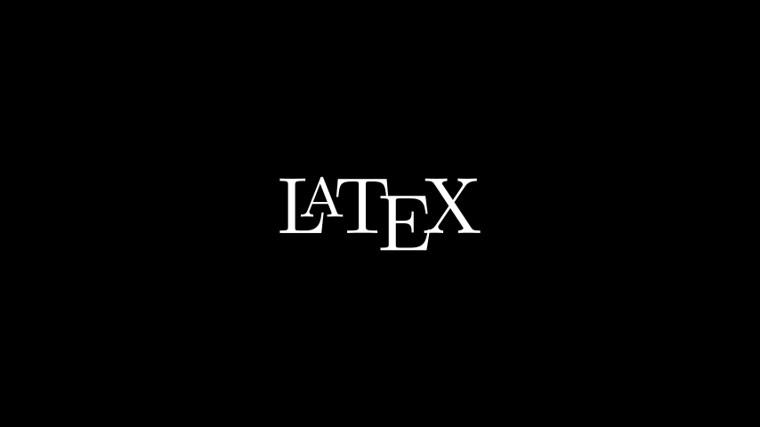

---
tags:
- manim
---

# 初见manim
!!! info "manim的版本"
    我使用的是[社区版的manim](https://docs.manim.community)，此外还有一个3Blue1Brown维护的版本[manimgl](https://3b1b.github.io/manim/index.html)。
## 配置环境
Mac上需要用`homebrew`安装一些依赖：
```bash
brew install py3cairo ffmpeg
# py3cairo 换成 cairo 似乎也可以
```
我的电脑是AppleChip的MacBook，所以需要额外安装：
```bash
brew install pango pkg-config scipy
```
最后就搭建虚拟环境啦：
```bash
python -m venv venv
source venv/bin/activate
python3 -m pip install manim
```
## hello world!

```python
from manim import *

class SquareToCircle(Scene):
    def construct(self):
        circle = Circle()
        circle.set_fill(PINK, opacity=0.5)
        square = Square()
        square.rotate(PI / 4)
        self.play(Create(square))
        self.play(Transform(square, circle))
        self.play(FadeOut(square))
```

渲染结果：


## Latex

如果需要在视频里渲染Latex需要额外安装tex：
```bash
brew install mactex
```

然后就可以渲染公式啦：
```python
from manim import *

class HelloLaTeX(Scene):
    def construct(self):
        tex = Tex(r"\LaTeX", font_size=144)
        self.add(tex)
```

渲染结果：

