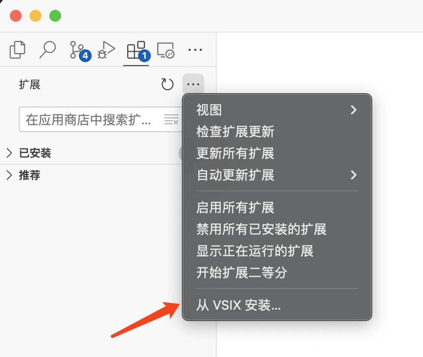

---
tags:
 - vscode
---

# 如何修改vscode扩展

vscode默认支持的markdown语法比较少，我日常使用的几个扩展语法都不支持。有个插件可以部分兼容，但总是有一些不满意的地方：
<figure markdown>
[](https://github.com/qjebbs/vscode-markdown-extended)
</figure>

好在它是开源的，那我就自己改一改。

一番搜索发现需要使用`node.js`工具链，没咋用过于是记录一下。

## 安装nvm

nvm（Node Version Manager）是node.js的版本管理器，可以安装不同版本的node。

> 为什么Python官方不做一个这样的工具呢！

安装也很简单，在Linux上只需要执行：
```bash
# installs NVM (Node Version Manager)
curl -o- https://raw.githubusercontent.com/nvm-sh/nvm/v0.39.7/install.sh | bash
```

## 安装node
使用之前安装的nvm，安装`node.js v18`（最新版本是`v20`，但是这个扩展要求`v18.x`）。
```bash
# download and install Node.js
nvm install 18

# verifies the right Node.js version is in the environment
node -v # should print `v18.20.2`

# verifies the right NPM version is in the environment
npm -v # should print `10.5.0`
```

## 安装项目的依赖
接下来就可以把项目的源代码clone下来，在项目的根目录使用命令：
```bash
npm install
```

即可安装项目的依赖包。

!!! info "package.json"
    node项目的所有信息都写在`package.json`中，类似于Python项目的`pyproject.toml`。

## 打包扩展
修改完代码后，使用`vsce`来打包扩展：
```bash
# 全局安装vsce
npm install --global vsce
```
```bash
# 使用vsce打包项目
vsce package
```

然后项目根目录就会生成打包好的`.vsix`文件了。

## 安装扩展
最后，直接安装`.vsix`文件即可。
